# Auditoría de Cata Club — 10 de agosto de 2026

Se verificaron 52 hallazgos de auditoría de producto. **24 fueron confirmados y entra en producción con cicatrices conocidas.** 28 se descartaron: defectos de entorno, decisiones de diseño, cambios ya hechos o datos de prueba obsoletos.

- **1 bloqueante** (dinero sin comprobante colgado)

- **10 altos** (falla en silencio sin que nadie se entere)

- **6 medios** (le cuesta más de lo debido al usuario)

- **7 bajos** (correcto pero mejorable)

## Cómo leer esto

**Severidad bloqueante:** el sistema guarda un dato incorrecto, o no hay forma de completar una tarea real. Entra en producción solo si hay mitigación documentada.

**Severidad alto:** falla en silencio sin que nadie se entere, o muestra datos incorrectos con consecuencia de dinero. El usuario cree que algo ocurrió cuando no ocurrió.

**Severidad medio:** le cuesta más de lo debido al usuario para completar su tarea — más clics, más espera, o más guessing.

**Severidad bajo:** correcto pero mejorable. El sistema no te bloquea, solo requiere más esfuerzo o claridad.

Todo lo que figura acá fue verificado dos veces: primero por auditoría de producto, después por el verificador técnico. Ni las opiniones ni los datos en desacuerdo con evidencia pasaron el filtro.

## El patrón aprobado

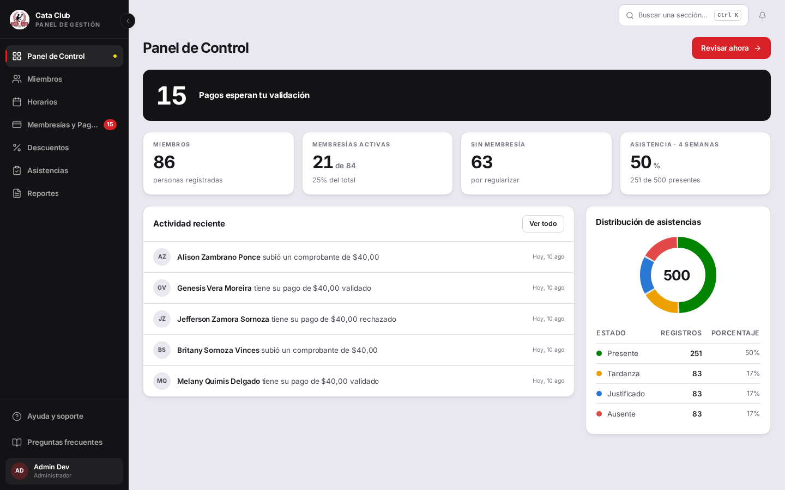

Este es el panel de administración: el que usted aprobó. Las demás pantallas de administración se juzgaron contra este. Una fila de métricas grandes arriba (StatGrid con tarjetas de números), contenido útil debajo, y espacio usado eficiente hasta el borde del viewport. Las tarjetas de contenido tienen altura consistente, texto legible en móvil, y ninguna fila de botones se superpone a títulos.


## 🔴 Bloqueante (1)

### PAG-1 · Si falla subir el comprobante, el pago ya quedó creado pero el formulario invita a reintentar

> Si a un padre le falla la subida del comprobante, el pago YA quedó registrado pero él no lo ve por ningún lado, y la pantalla lo invita a intentar de nuevo. Cuando lo intenta, el sistema le dice que ya tiene un pago esperando —uno que él jura no haber hecho—. Queda un pago colgado sin comprobante que usted no va a poder aprobar ni rechazar. Hay uno así en la base en este momento.

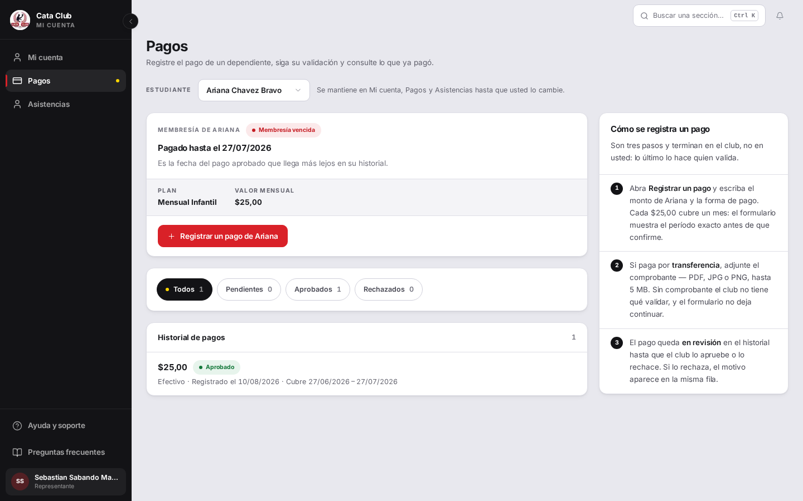

**Dónde:** `/student/payments`, representante

**Para verlo vos mismo:**

1. Como [sebastiansabando21@cataclub.com](mailto:sebastiansabando21@cataclub.com), ir a `/student/payments?alumno=23`

2. Registrar un pago: monto 25, Transferencia, adjuntar un PDF de más de 5 MB

3. Confirmar y registrar → aparece «El archivo supera el límite de 5 MB (6.0 MB).» pero el pago YA se creó (verificable en Postgres)

4. Sin recargar, presionar «Confirmar y registrar» de nuevo → «Esta membresía ya tiene un pago pendiente de validación...»

**Debería:** Si `subirVoucherPago` falla después de que el pago ya se registró, la UI debería cerrar el formulario y refrescar el historial en vez de reofrecer el botón de «Confirmar y registrar», que vuelve a intentar `registrarPago()` desde cero.

**En el código:** `frontend/src/app/student/payments/page.tsx` (RenewPaymentForm.handleSubmit, líneas 519-565)


## 🟠 Altos (10)

### TRA-10 · Cerrar sesión no invalida el token — otra persona con esa llave sigue adentro por una semana

> Cuando alguien aprieta «cerrar sesión», el sistema le borra la llave de las manos pero no cambia la cerradura: si otra persona alcanzó a copiar esa llave antes, le sigue sirviendo hasta una semana. Lo más importante: la pieza para arreglarlo ya está hecha y funcionando en otra pantalla suya; al botón de cerrar sesión solo hay que conectársela.

**Dónde:** `/profile → Cerrar sesión`, representante / alumno / entrenador / administrador

**Para verlo vos mismo:**

1. Logueate como [luis@cataclub.com](mailto:luis@cataclub.com)

2. Abrí las developer tools y copiá el access\_token de la cookie

3. Presioná «Cerrar sesión»

4. En otra pestaña o en curl, usá ese mismo token: `GET /auth/me` → todavía devuelve 200 con tu identidad completa

5. Probá el refresh\_token → también devuelve un token válido (refresh-token dura 7 días)

**Debería:** POST `/auth/logout` debería llamar a `/auth/sesiones/invalidar`, que ya existe y funciona en `/profile` («cerrar mis otras sesiones»). Eso cambia `version\_sesion` en la base y todos los tokens viejos se invalidan.

**En el código:** `backend/app/presentacion/routers/auth\_router.py` (línea 130-144 documenta que logout no invalida nada)

```
POST /auth/logout → version\_sesion NO cambia  
POST /auth/sesiones/invalidar → version\_sesion 2→3, y ahi si access\_token → 401
```


### TRA-4 · No hay bloqueo por cuenta tras intentos de login fallidos (issue \#111)

> Se le puede probar contraseñas a la cuenta de un socio una y otra vez sin que el sistema trabe esa cuenta ni le avise a nadie. Hay un tope general por computadora que ataca, pero es tan alto que igual permite miles de intentos por día contra una persona puntual.

**Dónde:** `/login`, sin autenticar

**Para verlo vos mismo:**

1. `for i in 1..20: POST /api/v1/auth/login username=ana@cataclub.com&password=wrongpass$i` → 401 todas, 0 respuestas 429

2. `POST /api/v1/auth/login username=ana@cataclub.com&password=alumno123` (correcta) → 200 inmediatamente después

**Debería:** Un bloqueo o retraso creciente atado a la CUENTA (no solo a la IP) tras N intentos fallidos, con aviso al usuario legítimo.

**En el código:** `backend/app/presentacion/routers/auth\_router.py` (línea 21); no existe contador de intentos por cuenta


### PAG-2 · Aprobar o rechazar un pago nunca muestra la causa real de un fallo: siempre es el mismo texto genérico

> Cuando falla aprobar o rechazar un pago, al administrador siempre le aparece el mismo cartel: «No se pudo rechazar el pago». Nunca le dice por qué. En la prueba el motivo era que su propia nota era demasiado larga —algo que arreglaba en dos segundos si alguien se lo hubiera dicho—, pero se queda adivinando.

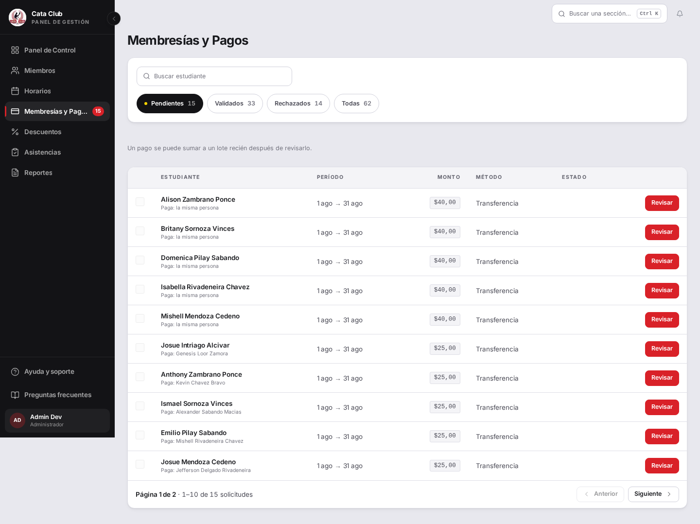

**Dónde:** `/payments`, administrador

**Para verlo vos mismo:**

1. Como admin, en `/payments`, abrir cualquier pago pendiente y elegir «Rechazar pago…»

2. Elegir un motivo tipificado y escribir una nota de más de ~230 caracteres en «Nota para el responsable»

3. Click en «Rechazar y avisar» → esperá 8 segundos sin tocar (ventana de deshacer)

4. El backend responde 422, y el toast cambia a «No se pudo rechazar el pago.» sin mostrar el motivo

**Debería:** El `onError` debería pasar `err` por `toUserMessage()` (el helper que ya usa el resto de la app) para que cuando el backend mande un motivo legible, el admin lo vea.

**En el código:** `frontend/src/app/payments/page.tsx` (función `decide()`, línea 693-701)


### PAG-3 · El 422 con `detail` como arreglo nunca llega al usuario: ambas puertas del cliente exigen string

> Un padre sube un archivo que no corresponde y el sistema le dice apenas «No se pudo subir el comprobante». La explicación buena —«ese tipo de archivo no sirve, mande una foto o un PDF»— existe, está escrita en castellano y la escribió el propio sistema, pero un filtro de seguridad que sirve para no mostrarle jerga técnica al usuario la confunde con jerga y la tira.


**Dónde:** `/student/payments`, representante

**Para verlo vos mismo:**

1. En `/student/payments`, subir un archivo `.txt` como comprobante

2. El backend responde 400 con «Tipo de archivo no permitido: text/plain. Use JPG, PNG o PDF.»

3. La pantalla muestra «No se pudo subir el comprobante.» sin el motivo

**Debería:** Cuando `detail` es un arreglo (en 422 de Pydantic), extraer y mostrar el `msg` de la primera entrada. Y el regex de `isUserFacingText` no debería rechazar una frase completa en español que menciona un tipo de archivo por una razón arquitectónica.

**En el código:**

- `frontend/src/lib/error-message.ts:110` (regex de MIME)

- `frontend/src/services/api.ts:717-722` (isApiErrorBody)

- `frontend/src/lib/server/backend-client.ts:124-136` (passthroughBackendError)


### INS-2 · No existe forma de vincular un menor ya existente a un representante, aunque la app lo promete

> Si un chico ya está cargado en el club bajo otro representante (por ejemplo, lo inscribió el otro progenitor), el padre que lo quiere agregar recibe un cartel que dice «el club puede vincularla a su cuenta». Ese cartel promete algo que el sistema no sabe hacer: no hay ninguna pantalla, ni para usted como administrador, que permita pasar un chico de un representante a otro.


**Dónde:** `/student/add-dependent`, representante

**Para verlo vos mismo:**

1. Como [sebastiansabando21@cataclub.com](mailto:sebastiansabando21@cataclub.com), ir a `/student/add-dependent`

2. Completar el wizard con la cédula `1000000022` (pertenece a otro representante)

3. En el resumen → POST `/api/personas/33/representados` responde 400: «Esa persona ya está registrada en el club. Revise sus dependientes; si no aparece ahí, el club puede vincularla a su cuenta.»

4. Buscar en el backend cualquier PATCH que acepte `representante\_id` sobre una Persona existente: **no existe**

**Debería:** O el mensaje no promete una función inexistente, o existe una vía real (aunque sea manual, vía Miembros) para que un administrador reasigne el representante de una persona ya registrada.

**En el código:**

- `frontend/src/components/DuplicateIdentityHelp.tsx:47-50`

- `backend/app/presentacion/schemas/persona\_schemas.py:53-60`

- `backend/app/servicios\_negocio/persona\_servicio.py:205-243`


### INS-3 · Nuevo Horario crea un día duplicado sin avisar si la categoría ya lo tiene

> Si al crear un horario alguien elige un día que esa categoría ya tenía, el sistema lo crea igual, sin avisar, y en la pantalla no se nota: la tarjeta sigue mostrando «Lun Mar Mié Jue Vie» como si nada. Pero a partir de ahí, cada alumno que anote en esa categoría queda anotado dos veces el mismo día.

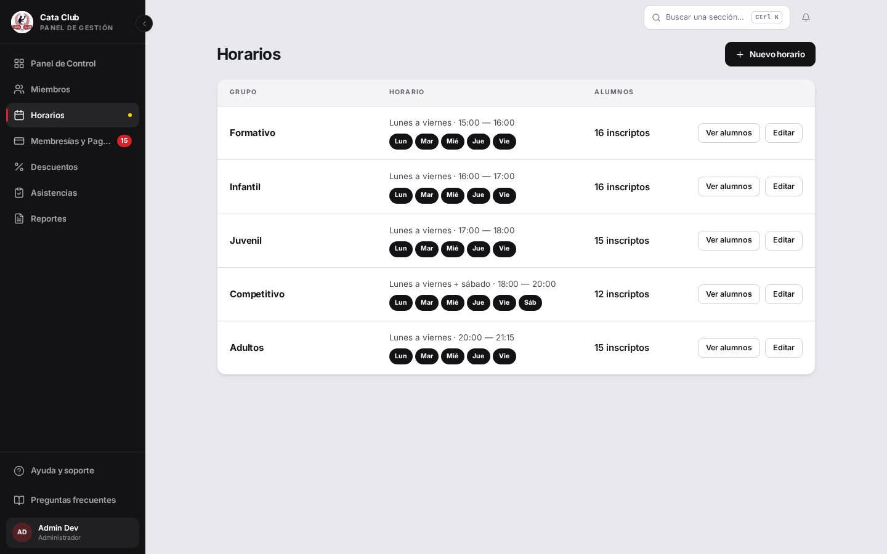

**Dónde:** `/groups`, administrador

**Para verlo vos mismo:**

1. Como admin, ir a `/groups` y confirmar: `select \* from horario\_entrenamiento where categoria='FORMATIVO' and dia\_semana='LUNES'` → 1 fila

2. Clic en «Nuevo Horario», dejar categoría en «Formativo», tildar solo «Lunes», clic en «Crear horario»

3. `select id, categoria, dia\_semana from horario\_entrenamiento where categoria='FORMATIVO' and dia\_semana='LUNES'` → ahora 2 filas

4. La tarjeta de «Formativo» sigue mostrando «Lun Mar Mié» sin duplicar visualmente (los días son un Set)

**Debería:** El formulario debería impedir (o al menos advertir) crear un día que la categoría ya tiene, porque rompe el invariante de inscripción atómica: un alumno asignado después de este bug queda enrolado en AMBAS filas del mismo día.

**En el código:** `backend/app/servicios\_negocio/asistencia\_servicio.py:57-61`


### DSH-2 · El dashboard del entrenador sigue sin StatGrid y con ~47% de la pantalla vacía

> La pantalla del entrenador deja casi la mitad de la pantalla en blanco y muestra los números del día como etiquetitas sueltas, no como las tarjetas grandes que usted aprobó en el panel de administración.

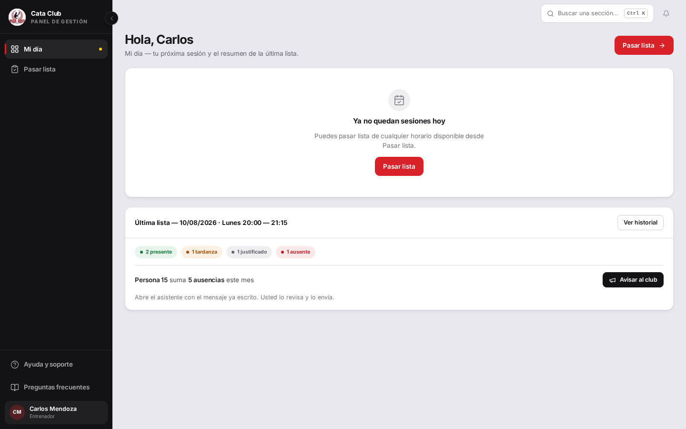

**Dónde:** `/trainer`, entrenador

**Para verlo vos mismo:**

1. `rg -n 'StatGrid|STAT\_GRID|StatCard' frontend/src/app/trainer/page.tsx` → sin resultados

2. Login [entrenador@cataclub.com](mailto:entrenador@cataclub.com), ir a `/trainer` en 1440x900

3. Medir: la tarjeta de contenido termina en ~y=515; el viewport mide 900 → 385px (43%) en blanco

**Debería:** Los mismos cuatro conteos (presente/tardanza/justificado/ausente) en un StatGrid de tarjetas, como en `/dashboard`, y contenido adicional que use el espacio libre.

**En el código:** `frontend/src/app/trainer/page.tsx:43` (import), sección de badges


### DSH-6 · Una caída de red durante la carga expulsa al admin a /login sin decirle nada

> Si se corta el internet un instante justo cuando el administrador abre el panel, el sistema lo saca a la pantalla de inicio de sesión sin decirle nada. Él va a creer que se le venció la sesión y va a volver a escribir su contraseña.

**Dónde:** `/dashboard`, administrador

**Para verlo vos mismo:**

1. Login admin, esperá a estar autenticado

2. En DevTools: `page.route('\*\*/api/\*\*', route =\> route.abort('failed'))`

3. Navegar a `/dashboard`

4. Resultado: URL termina en `/login`, sin mensaje de error, con 4 `ERR\_FAILED` en consola

**Debería:** Si outcome.kind === 'outage', conservar la sesión actual y mostrar un ErrorState con reintento en vez de limpiar la sesión.

**En el código:** `frontend/src/contexts/AuthContext.tsx:104-116`


### FIC-2 · Agregar dependiente descarta correo, contraseña e institución aunque el representante los complete

> Cuando un papá agrega a su hijo y le crea usuario y contraseña, el sistema le dice «listo» pero la cuenta del chico nunca se crea. El día que el chico quiera entrar, le va a decir «correo o contraseña incorrectos», y nadie va a entender por qué.


**Dónde:** `/student/add-dependent`, representante

**Para verlo vos mismo:**

1. Login como [sebastiansabando21@cataclub.com](mailto:sebastiansabando21@cataclub.com) → `/student/add-dependent`

2. Paso 1: datos del menor. Paso 2: completar correo y contraseña. Paso 3: salud. Paso 4: confirmar

3. `SELECT \* FROM usuario WHERE persona\_id=\<id del nuevo menor\>` → vacío

**Debería:** Si el backend soporta crear la cuenta del menor (y lo hace), el BFF debe reenviar los datos; si por alguna razón no puede, la respuesta debe ser un error visible.

**En el código:** `frontend/src/app/api/personas/\[id\]/representados/route.ts:39-45`


### FIC-5 · Vaciar alergias, contacto o teléfono de emergencia y guardar no borra el valor — solo enfermedades funciona

> Si un administrador borra la alergia de un chico porque ya no la tiene y guarda, el sistema le dice «guardado correctamente» en verde… pero la alergia sigue ahí. Queda un dato médico viejo en la ficha.


**Dónde:** `/members` (ficha médica), administrador

**Para verlo vos mismo:**

1. Abrir una ficha médica con «Alergias» ya cargado (ej. «Polvo»)

2. Borrar el contenido del campo «Alergias»

3. Guardar → toast de éxito

4. Recargar/reabrir la ficha: «Alergias» sigue mostrando el valor anterior

**Debería:** Vaciar el campo debe borrarlo (como hace enfermedades), o el campo debe avisar que no se puede vaciar — pero no debería guardar «éxito» sin haber cambiado nada.

**En el código:** `frontend/src/app/members/MedicalRecordEditor.tsx:86-92`


## 🟡 Medios (6)

### TRA-6 · El historial de asistencia y el reporte de administrador no paginan — hoy traen todo el padrón en una sola respuesta

> La pantalla de reportes de asistencia se trae TODAS las asistencias del club de una sola vez, sin partirlas en páginas. Con 507 registros va rápido; cuando en un año haya decenas de miles, esa pantalla se va a arrastrar.

**Dónde:** `/reports`, `/student/attendance/history`, administrador

**Para verlo vos mismo:**

1. `SELECT count(\*) FROM asistencia;` → 507

2. `curl /api/v1/asistencias/reportes con token admin | jq length` → 507

3. `curl /api/v1/asistencias/reportes?limit=5` → devuelve igual las 507 (parámetro se ignora)

**Debería:** skip/limit (o cursor) en ambos endpoints, igual que ya tienen `/personas/` o `/membresias/pagos`

**En el código:** `backend/app/presentacion/routers/asistencias\_router.py:101-138`


### TRA-8 · /members hace ~120 llamadas individuales al backend por un workaround de un bug ya reparado

> La pantalla de Miembros pide los datos de a uno por socio porque hace un tiempo la vía rápida estaba rota. Comprobé que ya está arreglada, pero nadie volvió a sacar el rodeo. Hoy funciona igual; conviene sacarlo antes de que el club crezca.

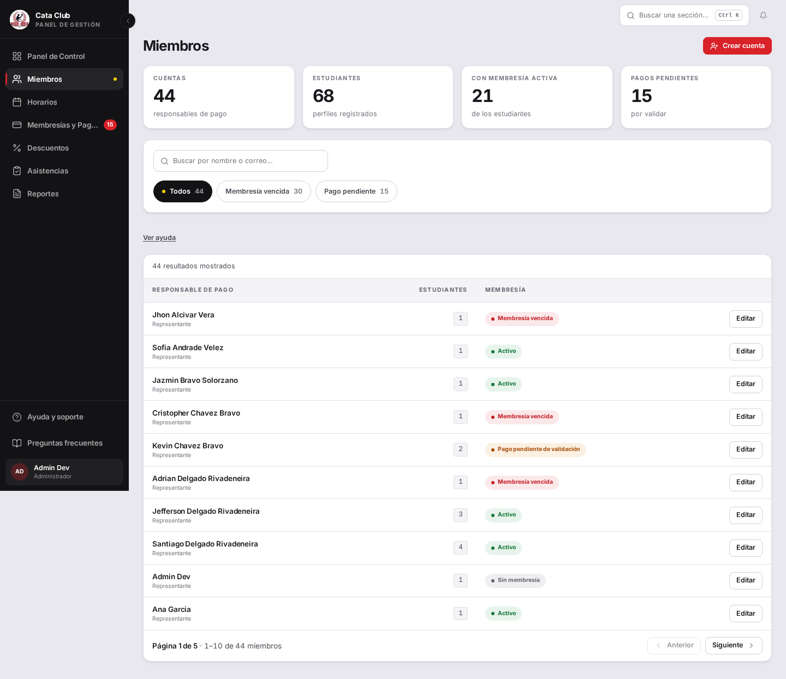

**Dónde:** `/members`, administrador

**Para verlo vos mismo:**

1. `curl /api/v1/membresias/ con token admin` → 200 OK, paginado, 66 membresías totales

2. Cargar `/members` y medir network timing: GET `/api/members` → 319-324ms (contra 89ms en `/payments`)

3. Leer `frontend/src/app/api/members/route.ts:63-73`

**Debería:** Usar GET `/membresias/` (paginado) directamente ahora que responde 200, en vez de N llamadas por persona

**En el código:** `frontend/src/app/api/members/route.ts:63-133`


### DSH-5 · La barra de tabs fija (solo admin, mobile) tapa contenido y controles enfocados por teclado

> En el teléfono, si alguien navega el panel con el teclado (o con un lector de pantalla), hay un enlace que queda escondido detrás de la barra de abajo justo cuando le toca el turno.

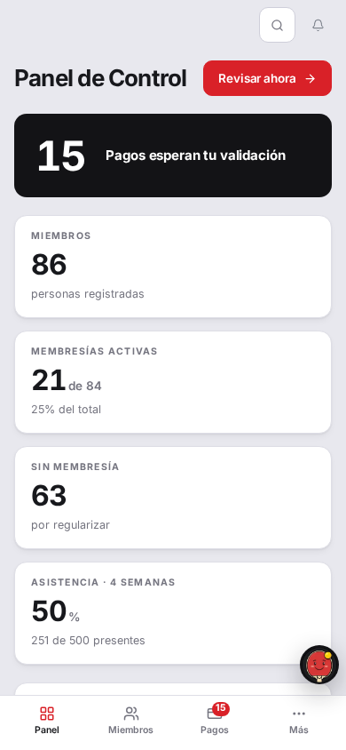

**Dónde:** `/dashboard`, `/members`, administrador en mobile (390×844)

**Para verlo vos mismo:**

1. Login admin, `/dashboard` en 390×844

2. Presionar Tab repetidamente (teclado real) hasta el 5to Tab → foco cae en «Ver todo»

3. `document.activeElement.getBoundingClientRect()` → top:785, bottom:817 (la barra fija ocupa 782-844)

4. El control enfocado está detrás de la barra opaca

**Debería:** `scroll-margin-bottom` de al menos 78px en cada elemento potencialmente scrolleado, no solo al final del documento. O más simple: que el foco por teclado nunca deje un control completamente detrás de una capa opaca (WCAG 2.4.11).

**En el código:** `frontend/src/components/shell/AppShell.tsx:836-845` y `:877-881`


### ASI-2 · Marcar Justificado no pide motivo ni evidencia, y no existe ningún flujo para subirlo

> Cuando el entrenador marca a un chico como «Justificado», el sistema no le pregunta por qué ni le deja adjuntar nada. Y al revés: la base ya guarda 82 justificaciones cargadas y no hay una sola pantalla donde alguien las pueda leer.

**Dónde:** `/trainer/attendance`, entrenador / administrador

**Para verlo vos mismo:**

1. Entrenador, paso 2 del wizard, tocar «Justificado» en cualquier alumno → se marca sin pedir nada

2. `SELECT estado, count(\*), count(justificativo) FROM asistencia GROUP BY estado` → JUSTIFICADO|84 con 82 justificativos cargados

3. Buscar en el frontend (`rg 'justificativo' frontend/src`) → solo en tipos y tests; ningún componente de UI lo ofrece

**Debería:** Si «Justificado» es un estado que el club usa para llevar registro, el flujo debería pedir un motivo (o permitir subirlo después) y dar a un entrenador/administrador forma de aprobarlo/rechazarlo.

**En el código:**

- `backend/app/dominio/modelos.py:534-556` (columnas)

- `backend/app/presentacion/routers/asistencias\_router.py` (sin endpoint de justificativo)

- `frontend/src/app/api/attendance/records/route.ts:79-88`


### ASI-7 · El reporte de asistencia no tiene forma de filtrar por un solo alumno, pese a que el backend sí lo soporta

> Si usted quiere el reporte de asistencia de UN chico en particular, la pantalla de Reportes no se lo permite: solo deja filtrar por fechas y horario. El sistema por dentro sí sabe hacerlo.

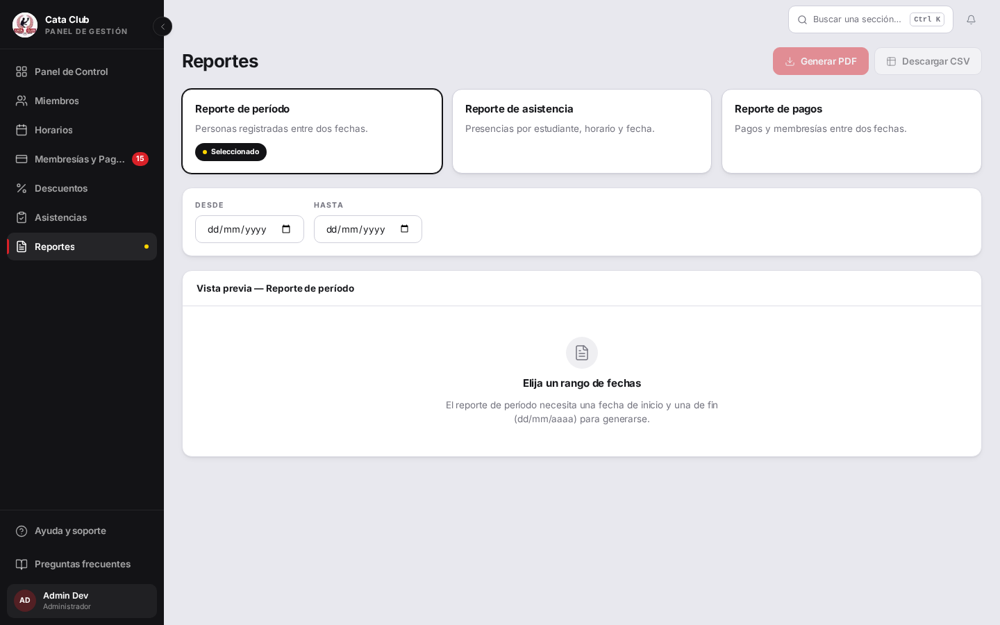

**Dónde:** `/reports`, administrador

**Para verlo vos mismo:**

1. Login admin, `/reports`, seleccionar «Reporte de asistencia»

2. Observar los filtros disponibles: Desde, Hasta, Horario — ningún alumno

3. `curl /asistencias/reportes?persona\_id=35 con token admin` → 24 registros filtrados correctamente

**Debería:** Agregar un campo de búsqueda de alumno al preset (como el que ya existe en `/trainer/attendance/history`) para poder generar el reporte de un estudiante puntual.

**En el código:**

- `frontend/src/app/reports/page.tsx:221-226,488-507`

- `backend/app/presentacion/routers/asistencias\_router.py:122-149`


### ASI-8 · En /reports a 390px el botón Generar PDF se superpone al título

> En el teléfono, la pantalla de Reportes muestra el título tapado por el botón rojo: se lee «Repo» y el resto queda debajo del botón.

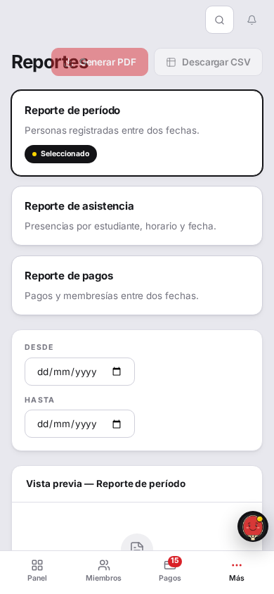

**Dónde:** `/reports`, administrador en mobile (390×844)

**Para verlo vos mismo:**

1. Viewport 390×844, login admin, ir a `/reports`

2. Mirar el encabezado antes de scroll: el botón «Generar PDF» superpone al título

**Debería:** El título debe permanecer legible; los botones deberían bajar a su propia fila cuando no entren, o el título debería tener prioridad de espacio.

**En el código:**

- `frontend/src/components/ui/PageHeader.tsx:37-46`

- `frontend/src/app/reports/page.tsx` (bloque actions)


## ⚪ Bajos (7)

### TRA-7 · La pantalla de Grupos arma el roster con 26 llamadas por horario — ya reconocido como un hueco de backend

> La pantalla de Grupos hace 26 consultas chiquitas en vez de una sola para poder mostrar cuántos inscriptos tiene cada grupo. Es mejorable pero no crece con el padrón, solo con la cantidad de categorías.

**Dónde:** `/groups`, administrador

**Para verlo vos mismo:**

1. Login como admin, navegar a `/groups`

2. Capturar network timing: se ven 26 requests `/api/groups/horarios/\*/alumnos`, una por cada horario

**Esperado:** Un endpoint de roster masivo en vez de N llamadas.

**En el código:** `frontend/src/app/groups/page.tsx:326-341`


### PAG-5 · Un monto inválido deshabilita Registrar pago sin decir por qué

> Si un padre escribe un monto que no cierra (por ejemplo $40 cuando la cuota es $25), el botón para registrar se apaga y no aparece ninguna explicación. El sistema tiene escrita la frase que lo resolvería pero solo la muestra si el botón se puede apretar.


**Dónde:** `/student/payments`, representante

**Para verlo vos mismo:**

1. Abrir «Registrar un pago» para cualquier alumno

2. Escribir 0, -15, o 40 en Monto (mensualidad es $25)

3. El botón «Registrar pago» está gris y no aparece ningún texto de error

**Debería:** Mostrar el mensaje de `findProblem()` también en estado deshabilitado, no solo cuando se intenta enviar.

**En el código:** `frontend/src/app/student/payments/page.tsx:~740` (botón), `~484-494` (`findProblem()`)


### INS-1 · El correo de recuperación de contraseña nunca llega: falta el worker de Celery en QA

> Buena noticia: el correo de recuperación de contraseña NO está roto en el sistema real. La pieza que manda los correos está configurada tanto para producción como para el entorno completo. Lo que pasa es que el entorno de pruebas la deja apagada a propósito para ahorrar recursos, y no avisa.

**Dónde:** `/forgot-password`, representante

**Para verlo vos mismo:**

1. `POST /api/v1/auth/recuperar-contrasenia` con un correo válido

2. `GET http://localhost:8025/api/v1/messages` → total: 0, incluso después de esperar

3. `docker compose config --services` lista los 7 servicios; `/QA\_SERVICIOS` solo levanta 5

**Debería:** El entorno de QA debería levantar un worker de Celery que consuma la cola, o documentar explícitamente que ese camino no se puede probar.

**En el código:** `backend/app/infraestructura/tareas/recuperacion\_tareas.py:17`


### INS-6 · Asignar un alumno a un horario no verifica membresía activa ni edad acorde a la categoría

> Se puede anotar a un alumno con la cuota vencida en un grupo de entrenamiento y el sistema no dice nada. Puede ser exactamente lo que usted quiere (el chico entrena igual y la cuota se arregla aparte).


**Dónde:** `/groups`, administrador

**Para verlo vos mismo:**

1. `SELECT estado FROM membresia WHERE persona\_id=17` → VENCIDA

2. `POST /api/v1/asistencias/asignar-alumno \{persona\_id:17, horario\_id:22\}` → 201, crea las filas

3. Ningún campo de la respuesta menciona la membresía vencida

**Esperado:** Una advertencia no bloqueante en el admin si lo decide.

**En el código:** `backend/app/servicios\_negocio/asistencia\_servicio.py:172-190`


### INS-8 · Agregar dependiente acepta una fecha de nacimiento de 226 años sin bloquear en el cliente

> Si alguien se equivoca al tipear el año de nacimiento, el formulario lo deja avanzar por los cuatro pasos y recién al final le avisa. Se resuelve avisando en el primer paso.

**Dónde:** `/student/add-dependent`, representante

**Para verlo vos mismo:**

1. En `/student/add-dependent`, paso 1, poner Fecha de Nacimiento = 1800-01-01

2. «Edad calculada: —» se muestra, pero «Siguiente» no está deshabilitado

3. Completar y confirmar → POST `/api/personas/33/representados` → 400 «La edad debe estar entre 5 y 74 años (calculado: 226)»

**Debería:** Una regla de edad máxima/mínima en el cliente (espejo de la que ya tiene el backend) evitaría completar el wizard.

**En el código:** `frontend/src/app/student/add-dependent/add-dependent-utils.ts:165-169`


### DSH-3 · El BackLink nuevo tiene cero usos en producción; sigue conviviendo con el viejo y un tercer link suelto en /ayuda

> En la pantalla de Ayuda el botón «Volver al inicio» aparece dos veces, arriba y abajo, y encima cada uno se ve distinto. Es ruido; alcanza con uno.

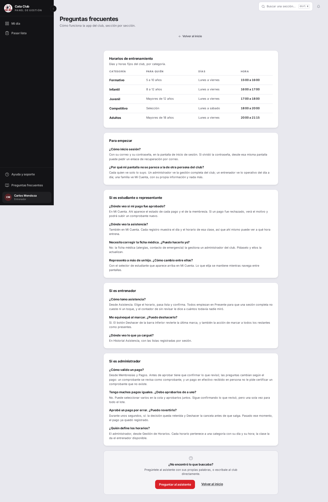

**Dónde:** `/ayuda`, todos los roles

**Para verlo vos mismo:**

1. `rg -ln 'from "@/components/ui/BackLink"' frontend/src` → solo test

2. `rg -ln 'from "@/components/BackLink"' frontend/src` → 6 pantallas

3. Abrir `/ayuda` como cualquier rol: comparar el «Volver al inicio» de arriba (con flecha, sin borde) contra el de abajo (subrayado, sin flecha)

**Debería:** Migrar las 6 pantallas al BackLink nuevo y unificar el link suelto de `/ayuda`, o borrar el BackLink nuevo si la decisión cambió.

**En el código:**

- `frontend/src/components/ui/BackLink.tsx` (sin adoptar)

- `frontend/src/app/ayuda/page.tsx` (tercer tratamiento)


### ASI-6 · Historial de asistencias pluraliza mal sesión → sesións

> En el historial de asistencias, abajo de la tabla dice «32 sesións» en vez de «32 sesiones». Es chiquito, pero se ve mal.

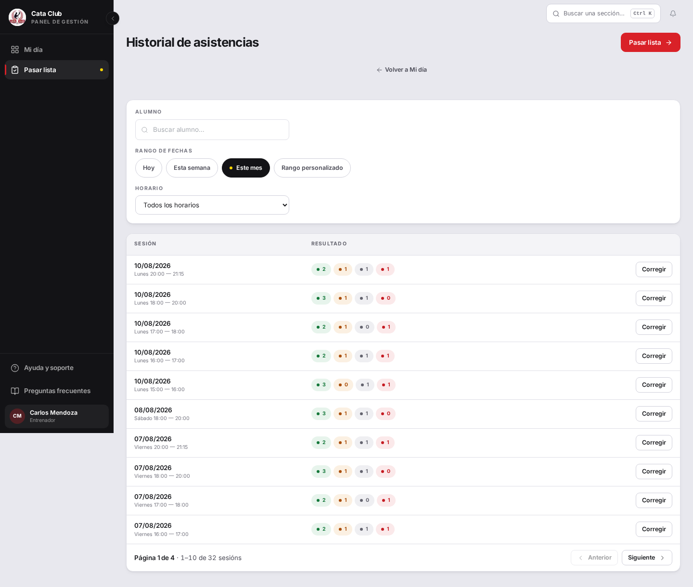

**Dónde:** `/trainer/attendance/history`, entrenador

**Para verlo vos mismo:**

1. Login entrenador, `/trainer/attendance/history`

2. Mirar el pie de la tabla: «Página 1 de 4 · 1–10 de 32 sesións»

**Debería:** Debe decir «32 sesiones».

**En el código:**

- `frontend/src/app/trainer/attendance/history/page.tsx:262`

- `frontend/src/components/ui/Pagination.tsx:90`


## Lo que se descartó

| ID | Qué se creía | Veredicto | Por qué no pasa |
| - | - | - | - |
| TRA-1 | Falla el aislamiento entre familias | Opinión | Se probó lectura Y escritura cruzada: todas se cierran. Está bien hecho. |
| TRA-2 | Entrenador y alumno logran operaciones admin | Opinión | Se probó saltando la pantalla y hablando directo a la API. El candado está en el motor. |
| TRA-3 | Revocación de sesión rota en todos lados | Opinión (parcial) | Desactivar cuenta SÍ invalida. Pero cerrar sesión falla — ese es TRA-10. |
| TRA-9 | El refresh de sesión expirada necesita intervención | Opinión | Si vence la sesión mientras se trabaja, el sistema la renueva solo sin echar al usuario. |
| PAG-4 | Alumna activa sin pago aprobado (defecto del sistema) | Dato de prueba | Es la base de QA con alumnos «al día» que nunca pagaron. El sistema no puede producir eso. |
| PAG-6 | Cambiar descuento altera pagos ya cobrados | Opinión | El descuento se congela en el pago. Verifiqué en Postgres: sobrevive a cambios posteriores. |
| PAG-7 | Admin puede registrar pago en efectivo | Opinión | El backend rechaza 403. Probé saltando la pantalla: el sistema igual frena. |
| PAG-8 | Aprobación en lote pide una sola confirmación | Opinión | Verificación liviana: la captura muestra diálogo único, los pagos figuran APROBADOS. |
| PAG-9 | Motivo de rechazo no llega al representante | Opinión | Cuando se concreta el rechazo, el motivo le llega entero tal cual lo escribió el admin. |
| PAG-10 | Comprobantes adjuntos no se ven | Opinión | Aquella URL cataclub.local ya no es un problema. Todos los adjuntos cargan bien. |
| PAG-11 | Días vencidos y extensión mal calculados | Opinión | Rehice a mano: da exacto contra la base. |
| INS-4 | «Nuevo Horario» asigna entrenador | Opinión | No: crea un horario de verdad. Asignar entrenadores se sacó a propósito. |
| INS-5 | La regla atómica de inscripción falla | Opinión | Medí sobre 942 registros de la base: ningún alumno a medio anotar. Funciona. |
| INS-6b | Edad fuera de rango es un error | Opinión | Ya decidieron que rango es una orientación, no una regla. |
| INS-7 | El asistente de alta no tiene paso de categoría | Opinión | Así está diseñado: el admin asigna después. Genera trabajo manual, es deliberado. |
| INS-9 | Mensajes de error son incomprensibles | Opinión | Corrí el filtro real contra frases reales: 5 de 6 perfectas. El sexto es PAG-3. |
| DSH-1 | Frontend viejo en QA sin correcciones del 7 de agosto | Entorno | La app estaba corriendo 3 días atrás. Ya se actualizó. |
| DSH-4 | Conviven 3 modelos de lista distintos | Higiene interna | Por dentro son distintos; en pantalla se ven igual. Tarea de orden interno. |
| DSH-7 | Dashboard de alumno no cumple el pedido | Cambio completado | Confirmado: quedó como usted pidió el 7 de agosto. |
| FIC-1 | Doble conversión de ficha médica | Cambio completado | El fix \#171/\#174 está cerrado. Los 5 campos funcionan. |
| FIC-3 | Alumno autogestionado no ve su ficha médica | Diseño | Por diseño del backend: no tiene representante. |
| FIC-4 | API permite editar ficha pero pantalla dice que no | UI/Docs desactualizados | La pantalla refleja la realidad: admin la corrige, papá no puede. |
| FIC-7 | Header de ficha médica sin jerarquía visual | Diseño | Poco peso visual, pero en móvil el nombre sí se ve junto al formulario. |
| FIC-8 | Correo de cambio de contraseña no llega | Entorno de QA | Falta el worker de Celery. En producción está configurado. |
| ASI-1 | Pasar lista sin guardar en servidor (riesgoso) | Opinión | Deliberado: sessionStorage, pero ofrece retomar si se sale por error. |
| ASI-3 | Re-pasar lista duplica | Opinión | No: lo que había se reemplaza (upsert). Está bien resuelto. |
| ASI-5 | «Ver todos los días» omite el domingo | Opinión | El domingo no tiene horarios. La pantalla dice la verdad. |
| ASI-9 | Nombres muy largos en reportes (sin casos reales) | Sin dato | El nombre más largo se ve entero. No hay ninguno larguísimo en la base. |


## Lo que quedó sin probar

- **El camino de correo** (recuperación de contraseña, avisos): el entorno de QA no levanta el worker de Celery a propósito, así que no se pudo ejercitar. En producción sí está configurado.

- **El sistema con volumen real**: se probó con 59 alumnos y 500 asistencias, no con los miles que tendrá en un año.

- **Navegadores que no sean Chromium**.

- **Lectores de pantalla reales** (solo WCAG por inspección manual).

[https://design.penpot.app/mcp/stream?userToken=[REDACTED-REVOKE-TOKEN]](https://design.penpot.app/mcp/stream?userToken=[REDACTED-REVOKE-TOKEN])


