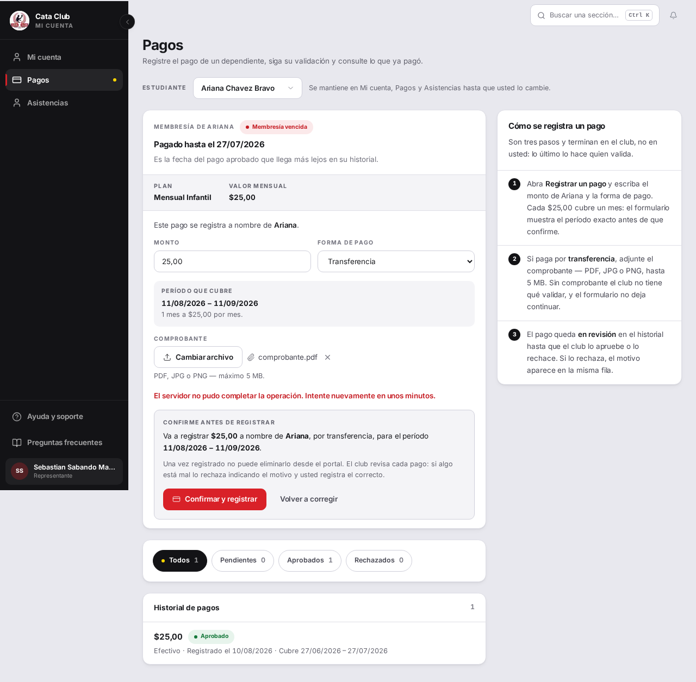
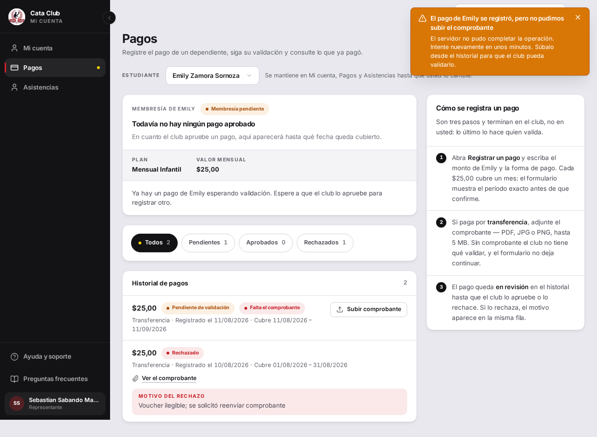

# Fix 01 · El pago que queda sin comprobante

- **Cierra:** PAG-1
- **Decisión que lo gobierna:** el pago no se revierte si falla el comprobante; sobrevive en el historial marcado «falta el comprobante», con botón para subirlo ahí mismo (decisiones-de-negocio-2026-08-11.md §7)
- **Rama:** fix/pago-sin-comprobante
- **Commits:** e362c7e — fix(payments): survive a failed voucher upload instead of a ghost pago

## El problema

Cuando un padre registraba un pago por transferencia y la subida del comprobante fallaba (archivo de más de 5 MB, el servicio caído), el pago ya había quedado creado en la base — pero el formulario seguía abierto ofreciendo el mismo botón «Confirmar y registrar». Al tocarlo de nuevo, el sistema respondía que ya había un pago pendiente: uno que el padre no veía por ningún lado y no podía completar.



## Qué se hizo

`handleSubmit` ahora trata el registro del pago y la subida del comprobante como dos pasos con consecuencias distintas. Si `registrarPago` falla, nada cambió: el formulario sigue abierto con el error, porque no se creó nada. Si `registrarPago` tiene éxito pero `subirVoucherPago` falla, el pago ya existe y no se revierte (decisión del dueño): el formulario se cierra, aparece un aviso explícito («Su pago se registró, pero no pudimos subir el comprobante…») con el motivo real del fallo, y el historial se refresca solo.

En el historial, esa fila ahora lleva una marca — «Falta el comprobante» — cuando es una transferencia pendiente de validación sin comprobante adjunto. La marca es una función pura (`pagoFaltaComprobante`) acotada a ese caso exacto: un pago en efectivo nunca necesita comprobante, y uno aprobado o rechazado ya tiene su propia resolución.

El botón «Subir comprobante» sobre esa fila y el endpoint que lo atiende (`POST /membresias/pagos/{id}/voucher`) ya existían en el código — quedaron de una entrega anterior y nunca se habían conectado a este escenario. No hizo falta backend nuevo: se reutilizó tal cual, y el candado en la fila es lo único que faltaba para que el padre supiera que ese botón está ahí para esto.

## El candado

`closes the form, states the payment survived, and refreshes the history instead of reoffering the same button` — `frontend/src/app/student/payments/__tests__/StudentPaymentsPage.test.tsx`

```
# Antes del fix (código de producción revertido, test tal cual queda)
❯ src/app/student/payments/__tests__/StudentPaymentsPage.test.tsx:680:57
    678|     // again and create the ghost-payment collision.
    679|     await waitFor(() => {
    680|       expect(screen.queryByTestId("renew-confirm")).not.toBeInTheDocum…
       |                                                         ^
    681|       expect(screen.queryByRole("button", { name: /confirmar y registr…
    682|     });
 Test Files  1 failed (1)
      Tests  1 failed | 31 skipped (32)

# Después del fix
✓ src/app/student/payments/__tests__/StudentPaymentsPage.test.tsx (32 tests | 31 skipped) 259ms
 Test Files  1 passed (1)
      Tests  1 passed | 31 skipped (32)
```

Suite completa de la pantalla, después del fix: `StudentPaymentsPage.test.tsx` (32/32) y `payments-utils.test.ts` (32/32).

## La prueba



El formulario ya no está: en su lugar, un aviso arriba dice que el pago se registró pero el comprobante no se pudo subir, y la fila nueva del historial aparece marcada «Falta el comprobante» con su propio botón «Subir comprobante».

## Lo que NO cambió

El pago sigue sin poder eliminarse desde el portal, y sigue sin haber «Deshacer» — a propósito, es la misma decisión que ya regía el registro exitoso. Tampoco se tocó el backend: el endpoint de subida de comprobante, su límite de 5 MB y su validación de formato son los mismos de antes. La subida real contra Cloudinary no se pudo verificar en el sandbox de QA porque ese entorno no tiene configurada la API key (`ValueError: Must supply api_key`, confirmado en el log del backend) — es una limitación del entorno, no del código: la ruta ya estaba cubierta por los tests con mocks, que sí pasan.
