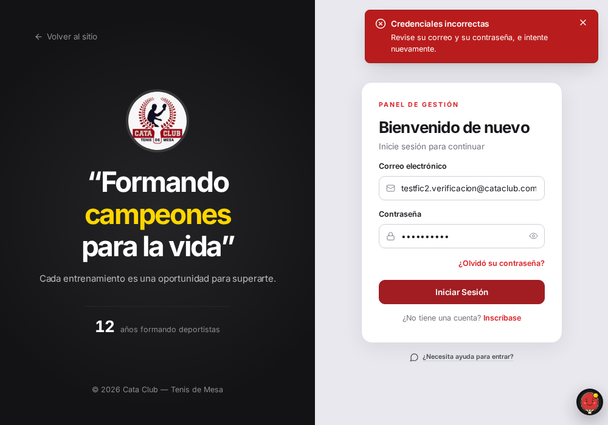
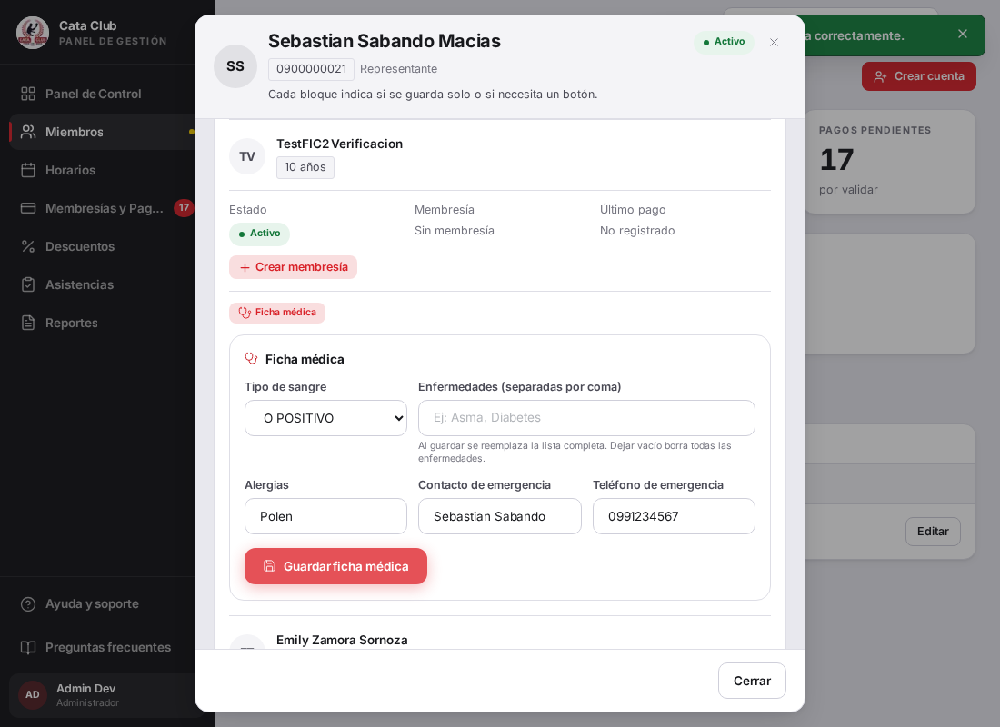
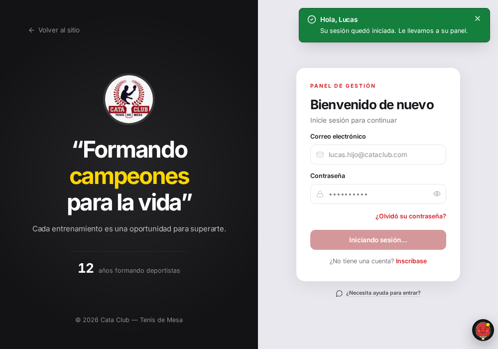
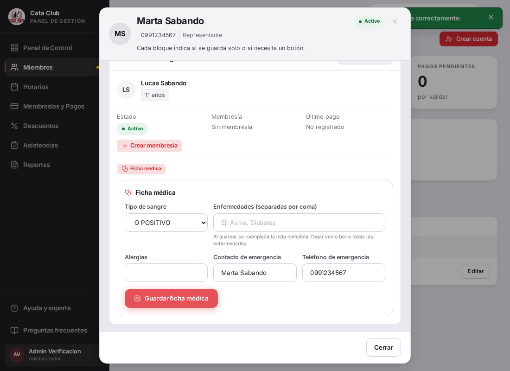

# Fix 3 · Dos guardados que dicen «listo» y no guardan

- **Cierra:** FIC-2, FIC-5
- **Decisión que lo gobierna:** decisión 1, sección Correos — una cuenta = un correo único, la cuenta del menor es opcional; si el representante la completa, tiene que crearse.
- **Rama:** fix/guardados-que-mienten
- **Commits:**
  - `fix(ficha-medica): distinguish an omitted field from an explicit null on PATCH`
  - `fix(members): send null, not undefined, to actually clear medical fields`
  - `fix(representados): forward correo, contrasenia and institucionId to backend`

## El problema

**FIC-2.** El representante completa correo y contraseña para su hijo en el paso 2 del alta, la API responde 201, el cartel dice «Dependiente agregado correctamente» — y el menor queda sin cuenta. El día que intenta entrar, «correo o contraseña incorrectos».

**FIC-5.** Un administrador vacía «Alergias» porque el chico ya no la tiene, guarda, ve el cartel verde de éxito — y la alergia sigue en la base. Pasaba igual con contacto y teléfono de emergencia; con enfermedades no, y esa asimetría fue la pista.





## Qué se hizo

**FIC-2.** `frontend/src/app/api/personas/[id]/representados/route.ts` armaba el cuerpo para el backend copiando solo `nombres/apellidos/cedula/fecha_nacimiento/telefono/ficha_medica` — `correo`, `contrasenia` e `institucionId` nunca salían del BFF, aunque el formulario ya los mandaba y el backend (`RepresentadoCreateDTO`) ya los acepta. Se agregaron los tres al reenvío, cada uno solo si vino en el cuerpo. Verificado aparte: el selector de institución educativa no se dibuja hoy porque la tabla `institucion` está vacía en QA (`instituciones.length > 0` nunca se cumple) — es un dato ausente, no un bug de interfaz, así que se reenvía `institucionId` por completitud con el contrato del backend pero no se construyó ninguna UI nueva para poblarlo.

**FIC-5.** La causa real vivía en `MedicalRecordEditor.tsx`: al vaciar un campo, `alergias.trim() || undefined` convertía el string vacío en `undefined`. El BFF omite las claves `undefined` del cuerpo, y el PATCH del backend interpreta «clave ausente» como «no tocar este campo» (edición parcial) — exactamente lo que se necesita para no pisar campos que el usuario no tocó, pero indistinguible de «el usuario lo vació a propósito». `enfermedades` no sufría esto porque el frontend siempre manda una lista (aunque sea `[]`), nunca `undefined`.

Se resolvió con la señal que ya faltaba: `null` explícito significa «borrar», la ausencia de la clave significa «no tocar». El componente ahora manda `alergias.trim() || null` (mismo criterio para contacto y teléfono de emergencia). El tipo `FichaMedicaUpdatePayload` y el `PatchBody` de la ruta BFF se ensancharon a `string | null`. En el backend, `FichaMedicaServicio.actualizar_por_persona` dejó de preguntar `is not None` (que no distingue «no vino» de «vino null») y pasó a `datos.model_dump(exclude_unset=True)` — el mismo patrón que ya usan `auth_servicio.py`, `descuento_servicio.py` y `antecedentes_club_servicio.py` para PATCH parciales.

Se descartó mandar `""` en vez de `null` para el campo vacío: `telefono_emergencia` tiene un `pattern=r"^\d{7,10}$"` en el DTO, y un string vacío no lo cumple (422). `null` bypassea el patrón porque el campo es `Optional[str]`.

## El candado

Backend: `test_vaciar_alergias_contacto_y_telefono_los_borra` en `backend/tests/test_ficha_medica.py`.
Frontend componente: `sends null, not undefined, for alergias/contactoEmergencia/telefonoEmergencia once emptied` en `frontend/src/app/members/__tests__/MedicalRecordEditor.test.tsx`.
Frontend ruta: `forwards correo, contrasenia and institucionId to the backend (FIC-2)` en `frontend/src/app/api/personas/[id]/representados/__tests__/route.test.ts`.

```
# Backend — rojo antes del fix (root cause: `is not None` trata null como "no vino")
FAILED tests/test_ficha_medica.py::test_vaciar_alergias_contacto_y_telefono_los_borra
AssertionError: assert 'Polen' is None

# Backend — verde después del fix, suite completa de ficha médica
tests/test_ficha_medica.py tests/test_ficha_medica_representante.py
21 passed, 1 warning in 1.15s

# Backend — suite completa, sin regresiones
865 passed, 2 skipped, 12 warnings in 91.88s

# Frontend — rojo antes del fix (root cause: `|| undefined` en el componente)
MedicalRecordEditor.test.tsx > sends null, not undefined ...
AssertionError: expected mockActualizarFichaMedica to have been called with alergias: null
  (received: alergias: undefined)

# Frontend — rojo antes del fix (root cause: route.ts descarta correo/contrasenia/institucionId)
route.test.ts > forwards correo, contrasenia and institucionId to the backend (FIC-2)
AssertionError: expected 1st "fetch" call to have been called with [ …(2) ]
  (received body sin correo/contrasenia/institucion_id)

# Frontend — verde después del fix, suite completa
Test Files  161 passed (161)
     Tests  2446 passed (2446)
```

## La prueba

Verificación end-to-end contra Postgres real (no solo la respuesta HTTP), en dos entornos aislados: el QA compartido en `:3000`/`:8000` (código sin parchear — reproduce el «antes») y un backend/frontend propios levantados desde este worktree sobre una base Postgres descartable (reproduce el «después»). Datos de prueba creados para la verificación fueron borrados del QA compartido al terminar.

**FIC-2 antes (QA sin parchear):** `POST /personas/{id}/representados` con `correo`+`contrasenia` responde 201, `SELECT count(*) FROM usuario WHERE persona_id=<hijo>` da 0, y el login del menor devuelve 401 «Credenciales inválidas».

**FIC-2 después (worktree parcheado):** mismo flujo, `usuario` queda creado, y el login del menor:



**FIC-5 antes (QA sin parchear):** PATCH omitiendo `alergias` (lo que manda el componente real al vaciar el campo) responde 200, y `SELECT alergias FROM ficha_medica` sigue devolviendo `Polen`. La captura muestra el toast de éxito y el campo repoblado con el valor viejo en el mismo instante:

**FIC-5 después (worktree parcheado):** mismo flujo con el componente ya arreglado (manda `null` explícito), `alergias IS NULL` da `true` en la base, y el campo queda vacío tras el guardado:



## Lo que NO cambió

- El PATCH sigue siendo parcial: un campo que el usuario nunca tocó (la clave ni aparece en el `PATCH`) sigue sin modificarse — eso es intencional, no el bug. Lo único que cambió es cómo se señaliza «lo vacié a propósito» (`null`) contra «no lo toqué» (ausente).
- `enfermedades` no se tocó: ya funcionaba porque el frontend siempre manda la lista completa, nunca `undefined`.
- No se agregó el selector de institución educativa al formulario de «Agregar dependiente» — el hallazgo verificado es que la tabla `institucion` está vacía en QA, no que falte la interfaz. `institucionId` se reenvía en el BFF por completitud con el contrato del backend, pero queda sin ejercitar hasta que exista al menos una institución cargada.
- No se tocó `RepresentadoCreateDTO` ni `FichaMedicaUpdateDTO` en el backend: ya aceptaban estos campos como opcionales; el problema completo era de reenvío/serialización en las dos capas de arriba.
