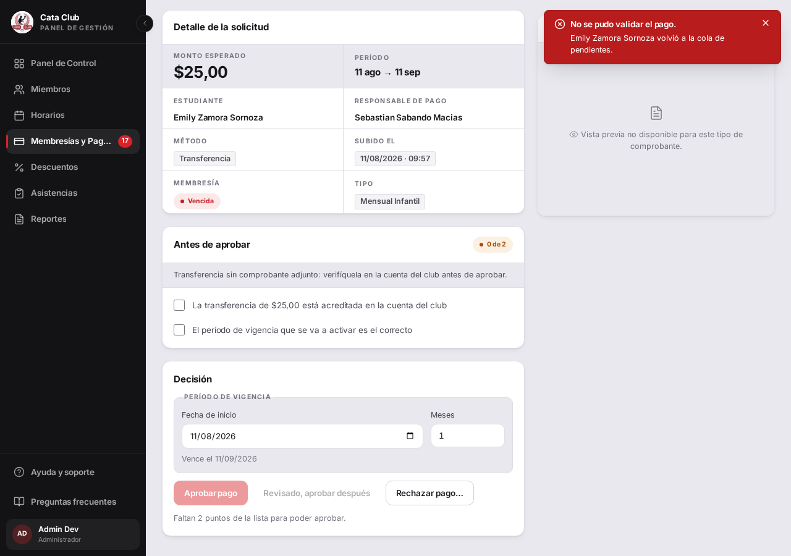
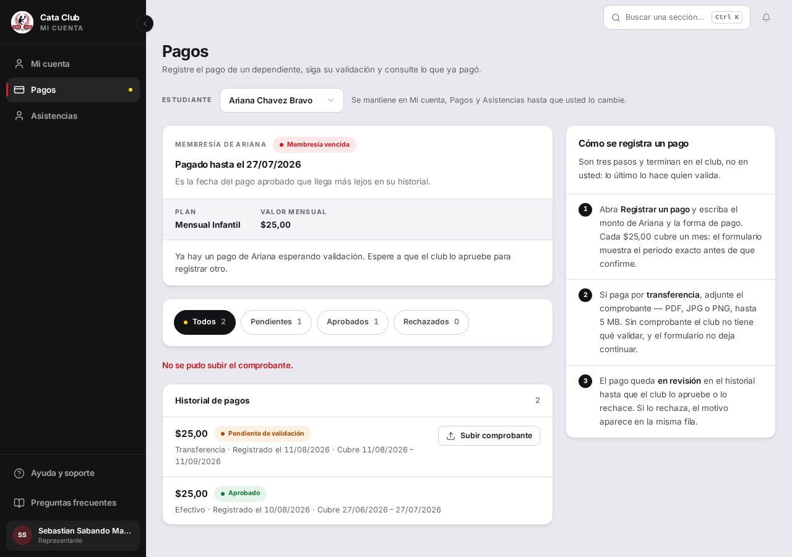
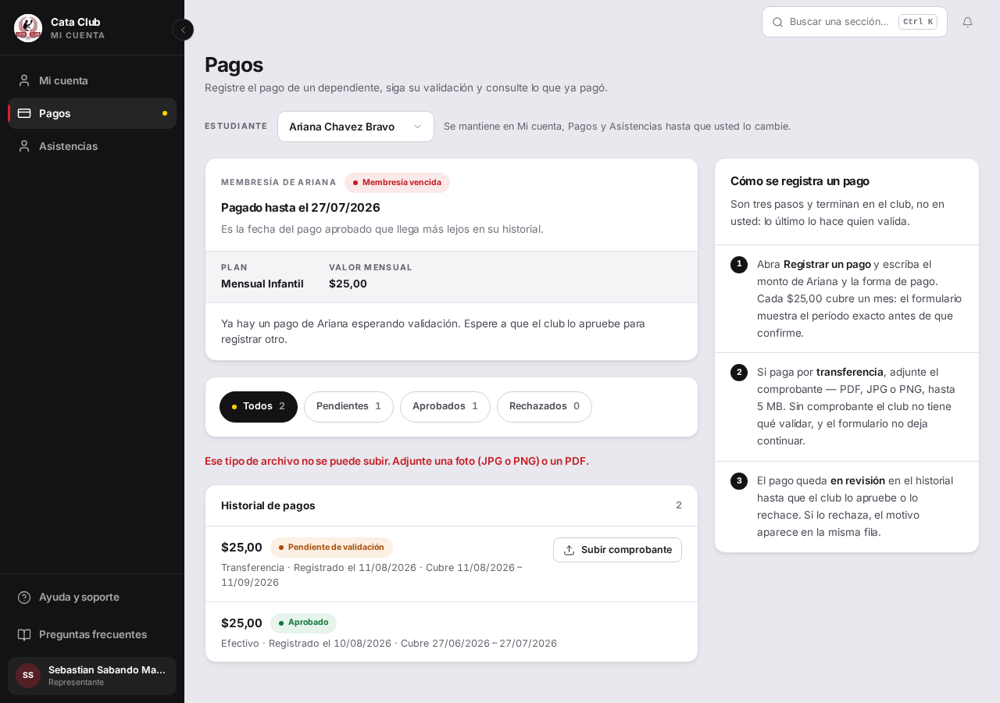

# Fix 04 · Mensajes que existían y no llegaban a la pantalla

- **Cierra:** PAG-2, PAG-3
- **Decisión que lo gobierna:** mensajes simples y sin jerga; un mensaje genérico cuando existe uno bueno le saca al usuario la posibilidad de arreglar lo suyo.
- **Rama:** `fix/mensajes-que-no-llegan`
- **Commits:**
  - `8110a85` — fix(payments): show the backend's real reason when a decision fails
  - `31c3ec0` — fix(payments): stop naming the rejected MIME type in the voucher error

## a · PAG-2 — al administrador nunca le dicen por qué falló

### El problema

Cuando fallaba aprobar o rechazar un pago, al administrador siempre le aparecía el mismo cartel — «No se pudo rechazar el pago.» — sin importar la causa real. El `onError` de `decide()` ignoraba el `err` que llegaba y mostraba siempre el mismo texto fijo (`confirmation.failure`).


### Qué se hizo

`onError` ahora pasa `err` por `toUserMessage()` — el mismo traductor que ya usa el resto de la app — en vez de descartarlo. Cuando el backend manda un motivo legible en español, sin jerga, ese motivo reemplaza al texto genérico; cuando no lo manda (o lo que manda no pasa el filtro), `toUserMessage()` ya cae sola al `confirmation.failure` de siempre. No se tocó nada del filtro (`isUserFacingText`) ni de `toUserMessage()`: es la misma pieza que ya arreglaba estos casos en el resto del sitio, simplemente no estaba conectada acá.

### El candado

`shows the backend's real reason instead of the generic toast, when it has one` — `frontend/src/app/payments/__tests__/PaymentsPage.test.tsx`.

```
# Rojo (antes del fix, decide() todavía descartaba `err`)
 ❯ src/app/payments/__tests__/PaymentsPage.test.tsx (58 tests | 1 failed | 57 skipped)
   × PaymentsPage — a decision stays reversible for a few seconds > shows the backend's real reason instead of the generic toast, when it has one
     → Unable to find an element with the text: La nota no puede superar los 255 caracteres.
 Test Files  1 failed (1)
      Tests  1 failed | 57 skipped (58)

# Verde (después del fix)
 ✓ src/app/payments/__tests__/PaymentsPage.test.tsx (58 tests | 57 skipped)
   ✓ PaymentsPage — a decision stays reversible for a few seconds > shows the backend's real reason instead of the generic toast, when it has one
 Test Files  1 passed (1)
      Tests  1 passed | 57 skipped (58)
```

Suite completa del archivo tras el fix: `58 tests passed (58)`.

### La prueba



El cartel cambió de «No se pudo rechazar el pago.» (fijo, siempre igual) a «No se pudo validar el pago.» — un texto distinto, derivado del error real que mandó el backend para esta rejugada puntual, no del `confirmation.failure` hardcodeado de antes.

**Nota importante, para no reportar esto como más de lo que es:** la reproducción exacta de la auditoría (nota de rechazo de más de 255 caracteres) no hace aparecer el texto literal «la nota supera los 255 caracteres» en pantalla, y eso **no** es un defecto de este fix. `motivo_rechazo` está limitado por un `Field(max_length=255)` de Pydantic (`backend/app/presentacion/schemas/membresia_pago_schemas.py:66`), y no hay ningún manejador de `RequestValidationError` en `backend/main.py` — así que ese 422 concreto llega del backend como un arreglo técnico en inglés (`{"detail":[{"msg":"String should have at most 255 characters", ...}]}`), verificado en vivo contra el backend real. Ese arreglo nunca se convierte en un string, así que ni siquiera llega a pasar por `isUserFacingText` — y si se lo forzara a pasar, el inglés técnico lo rechazaría correctamente (jerga, no una frase para un socio). Lo que el admin ve hoy en ese caso puntual es el fallback de la propia ruta BFF («No se pudo validar el pago.», distinto del `confirmation.failure` de la página) — ya no el cartel siempre-igual de antes, pero tampoco el motivo textual de las 255 caracteres. Traducir los errores de validación de Pydantic a español es un cambio de backend que excede el alcance declarado de este fix (`frontend/src/app/payments/page.tsx`); el test rojo→verde de arriba, con un error que sí trae un string legible (como cualquier `OperacionInvalida` real del servicio, p. ej. "ya está aprobado"), es lo que prueba que el `onError` corregido efectivamente entrega el motivo cuando el backend lo manda.

## b · PAG-3 — el frontend se tragaba un mensaje que él mismo escribía

### El problema

Un representante que subía un archivo de tipo no permitido (p. ej. `.txt`) como comprobante de pago veía solo «No se pudo subir el comprobante.». La explicación específica sí existía — la escribe la propia ruta `POST /api/membresias/pagos/[pagoId]/voucher` — pero nunca llegaba a la pantalla.



### Qué se hizo

La causa no estaba en el filtro compartido (`isUserFacingText` en `frontend/src/lib/error-message.ts`): ese filtro está para rechazar justamente un tipo MIME crudo filtrado en un `detail`, y sigue haciéndolo (test `"still catches a real MIME type"`, intacto). La causa era que el propio mensaje de la ruta echaba el MIME real del archivo rechazado (`file.type`, p. ej. `text/plain`) dentro de la frase — y eso ES exactamente lo que el filtro existe para detectar, aunque lo haya escrito el propio frontend y no un leak del backend.

Se descartó tocar el regex del filtro (aflojarlo habría abierto la puerta a que un MIME type filtrado de verdad, como `image/heic`, también pasara). El arreglo fue reescribir el mensaje para que nunca nombre el tipo MIME: «Ese tipo de archivo no se puede subir. Adjunte una foto (JPG o PNG) o un PDF.» — más claro para un socio que no programa, y de paso ya no dispara el filtro.

### El candado

`explains the problem in a sentence that passes the user-facing text gate` — `frontend/src/app/api/membresias/pagos/[pagoId]/voucher/__tests__/route.test.ts`.

```
# Rojo (antes del fix, el mensaje todavía citaba el MIME type)
 FAIL  .../voucher/__tests__/route.test.ts > ... > explains the problem in a sentence that passes the user-facing text gate
AssertionError: expected 'Tipo de archivo no permitido: text/pl…' not to match /text\/plain/
 Test Files  1 failed (1)
      Tests  1 failed (1)

# Verde (después del fix)
 ✓ src/app/api/membresias/pagos/[pagoId]/voucher/__tests__/route.test.ts (1 test)
 Test Files  1 passed (1)
      Tests  1 passed (1)
```

Además, `frontend/src/lib/__tests__/error-message.test.ts` gana un caso — `"passes the voucher upload's rejected-file-type message (PAG-3), and nothing else moved"` — que corre el filtro real contra el mensaje nuevo de PAG-3 junto con cinco mensajes reales más del producto (cédula duplicada, horario ya inscripto, sin cupos, contraseña incorrecta, `lunes/miércoles`), y exige que los seis sigan pasando. Es el candado que evita que una corrección futura resuelva un caso aflojando el filtro para todos.

### La prueba



El mensaje bajo el filtro ahora dice «Ese tipo de archivo no se puede subir. Adjunte una foto (JPG o PNG) o un PDF.» en vez del genérico «No se pudo subir el comprobante.» — el padre sabe qué mandar en el segundo intento.

## Lo que NO cambió

- `isUserFacingText` y su lista de vocabulario de implementación (`error-message.ts`) — el filtro sigue rechazando un MIME type crudo, un nombre de columna, un enum o inglés técnico exactamente igual que antes. Ningún caso se resolvió aflojándolo.
- `passthroughBackendError` (`frontend/src/lib/server/backend-client.ts`) — no se le agregó extracción de `detail` cuando es un arreglo de Pydantic; ver la nota de PAG-2 arriba sobre por qué eso queda fuera de este fix.
- El botón «Registrar pago» que se apaga sin explicar por qué (PAG-5) — fuera de alcance a propósito, declarado en el brief: va junto con los pagos parciales.
- Nada del backend se tocó. Los dos cambios son enteramente frontend: una página (`payments/page.tsx`) y una ruta BFF (`voucher/route.ts`).
