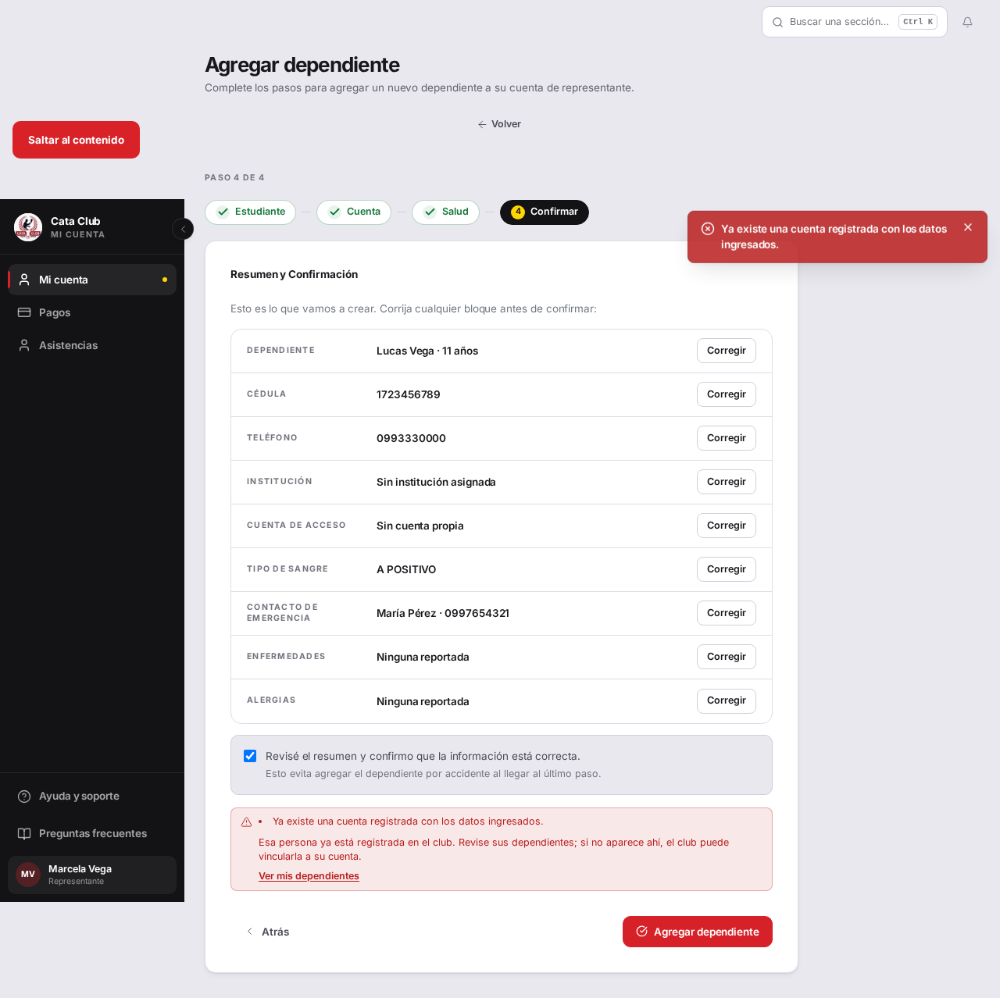
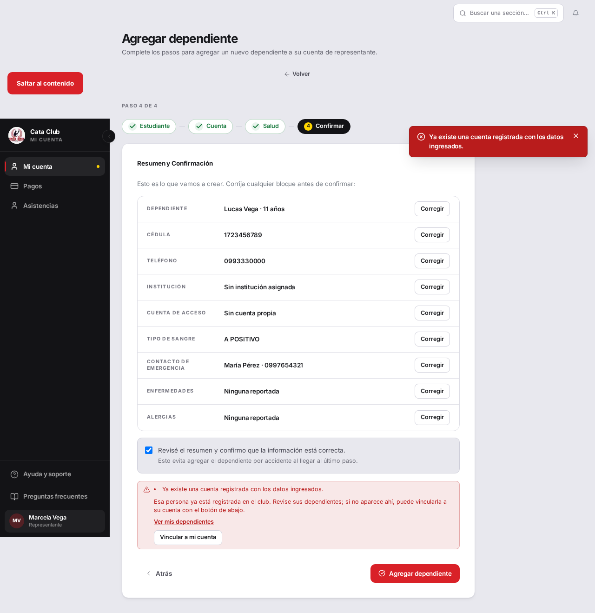
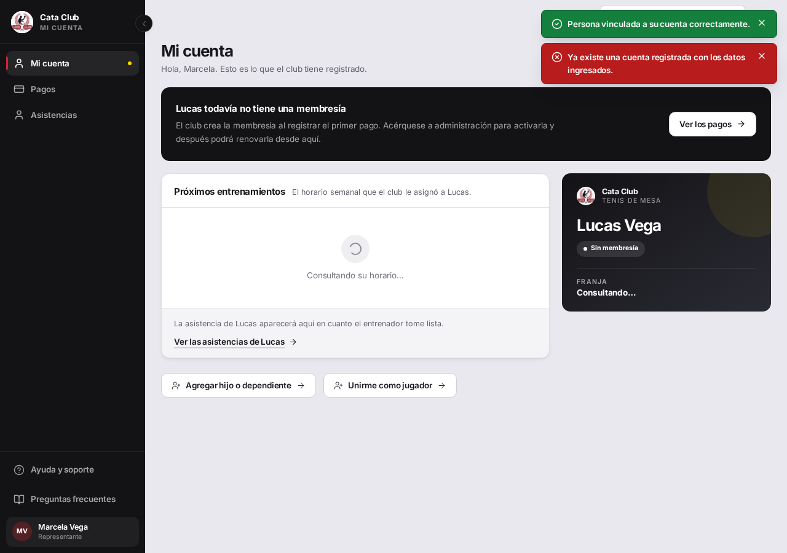
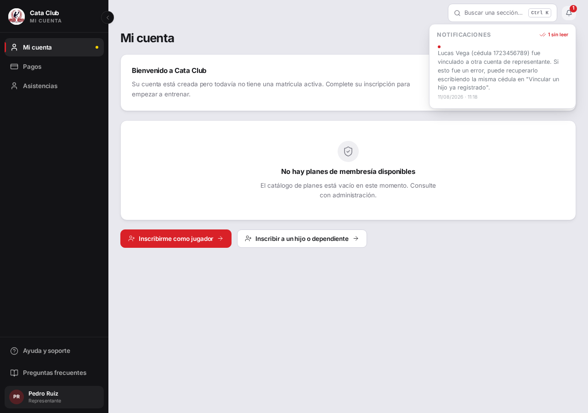

# Fix 05 · Vincular a un chico ya registrado con su representante

- **Cierra:** INS-2
- **Decisión que lo gobierna:** un chico tiene un solo representante y el representante lo vincula solo, sin que nadie apruebe — con auditoría, aviso posterior al representante anterior, cero filtrado de datos antes de confirmar, y tope de intentos (`docs/decisiones-de-negocio-2026-08-11.md` §1)
- **Rama:** `fix/vinculacion-representante`
- **Commits:** (ver `git log` de la rama)

## El problema

Si un papá agregaba un hijo con una cédula que ya pertenecía a otro representante, el sistema le decía «revise sus dependientes; si no aparece ahí, el club puede vincularla a su cuenta». Esa función no existía: no había ningún endpoint ni pantalla, ni siquiera para el administrador, que cambiara el representante de una persona ya registrada. El sistema prometía algo que no podía cumplir.



## Qué se hizo

Se agregó `POST /personas/{representante_id}/vincular-representado`: el representante escribe la cédula del chico y, si es elegible, queda vinculado a su cuenta en el mismo paso — sin que el representante anterior tenga que aprobar nada. Los cuatro guardarraíles de la decisión, sin agregarle un clic al padre que vincula:

1. **Auditoría** — tabla nueva `vinculacion_representante` (quién, a quién, cuándo), un log de eventos que nunca se actualiza ni se borra.
2. **Aviso al representante anterior** — se cuelga del feed de notificaciones que ya existía (`NotificacionServicio`/`Notificacion`, tipo nuevo `VINCULACION_REPRESENTANTE`), nada construido de cero. El aviso identifica al chico (ya lo conocía: lo había dado de alta) y explica que "deshacerlo" es escribir la misma cédula de nuevo — no hizo falta un endpoint de undo aparte, el mismo endpoint sirve para las dos direcciones.
3. **Cero filtrado antes de confirmar** — cédula inexistente, persona mayor de edad, ya vinculada a ese mismo representante, o la cédula del propio representante: los cuatro casos devuelven el mismo texto (`MENSAJE_VINCULACION_NO_DISPONIBLE`) con el mismo HTTP 400. No hay una vía separada de "previsualizar" la cédula — cada intento es la operación real (auditada, capada), nunca una consulta gratis.
4. **Tope de intentos** — freno progresivo por representante (1s al 3er fallo, duplicando, techo 30s), mismo patrón que el freno de login de `fix/sesion-y-acceso`. Nunca bloqueo duro: un representante real puede simplemente estar recordando mal un dígito.

En el frontend, el mensaje de «cédula duplicada» de `/student/add-dependent` dejó de prometer algo ajeno y ahora describe la acción real, con un botón «Vincular a mi cuenta» al lado del error — reusa la cédula que el representante ya tipeó, cero campos nuevos, cero pantalla nueva.

**Camino descartado:** una pantalla separada de "buscar cédula" con confirmación en dos pasos. Se descartó porque abre exactamente el oráculo que el guardarraíl 3 prohíbe: una vía de consulta sin efecto secundario es una vía de enumeración. Con el diseño elegido, cada intento (fallido o no) es una operación real, auditada y capada.

## El candado

`test_cedula_existente_no_elegible_sigue_la_misma_curva_de_retraso_que_una_inexistente`, en `backend/tests/test_vincular_representado.py` — antes del fix, el módulo entero fallaba al importar porque nada de la función existía:

```
ERROR tests/test_vincular_representado.py
ImportError while importing test module '.../tests/test_vincular_representado.py'.
tests/test_vincular_representado.py:30: in <module>
    from app.dominio.mensajes import MENSAJE_VINCULACION_NO_DISPONIBLE
E   ImportError: cannot import name 'MENSAJE_VINCULACION_NO_DISPONIBLE' from 'app.dominio.mensajes'
========================= 1 warning, 1 error in 0.09s ==========================
```

Después del fix:

```
tests/test_vincular_representado.py::test_cedula_existente_no_elegible_sigue_la_misma_curva_de_retraso_que_una_inexistente PASSED [100%]
========================= 1 passed, 1 warning in 0.52s =========================
```

La suite completa del área — 21 tests en `test_vincular_representado.py` (elegibilidad, auditoría, notificación, anti-enumeración, tope de intentos, ownership del router) — pasa en verde, y la suite entera del backend (885 tests) también.

## La prueba



El mismo error de «cédula duplicada» ya no promete una función ajena: describe la acción real y pone el botón «Vincular a mi cuenta» al lado.



Al confirmar, el chico aparece de inmediato en la cuenta de la nueva representante («Persona vinculada a su cuenta correctamente»).



El representante anterior recibe la notificación después del hecho, con el nombre y la cédula del chico (que ya conocía) y la forma de deshacerlo.

Verificación adicional del guardarraíl anti-filtrado, contra el backend real (no solo el test): una cédula inexistente y la cédula de una persona existente pero no elegible devuelven la **misma** respuesta, byte a byte:

```
--- cedula inexistente ---
{"detail":"No fue posible vincular esa cédula a su cuenta. Verifique el número e intente nuevamente.", ...}
HTTP 400
--- cedula existente pero no elegible ---
{"detail":"No fue posible vincular esa cédula a su cuenta. Verifique el número e intente nuevamente.", ...}
HTTP 400
```

Y el freno de intentos, cronometrado contra el servidor real:

```
intento 1: HTTP 400, tardo 0.01s
intento 2: HTTP 400, tardo 0.01s
intento 3: HTTP 400, tardo 1.01s
intento 4: HTTP 400, tardo 2.01s
```

## Lo que NO cambió

- **No se agregó un paso de aprobación del representante anterior.** El dueño evaluó el riesgo (la cédula de un menor no es un secreto) y decidió igual por la vía directa, pese a que se le ofreció la alternativa. Esa decisión ya está tomada y con fecha (`docs/decisiones-de-negocio-2026-08-11.md` §1) — este fix la implementa tal cual, no la vuelve a discutir.
- El aislamiento entre familias (403 en accesos cruzados) sigue intacto: el nuevo endpoint reusa `PoliticaAccesoPersona.exigir_acceso_directo`, el mismo chequeo de ownership que ya usa `crear_representado`, y `test_vincular_representado_persona_id_no_coincide_con_token_da_403` lo prueba explícitamente.
- El padre que entrena y además representa (`REPRESENTANTE` con roles `REPRESENTANTE + ALUMNO`) no se tocó: no tenía nada que ver con este fix.
- No se agregó una pantalla separada de "vincular" ni un formulario nuevo: la acción vive donde el problema aparece, en la misma alerta de cédula duplicada.
