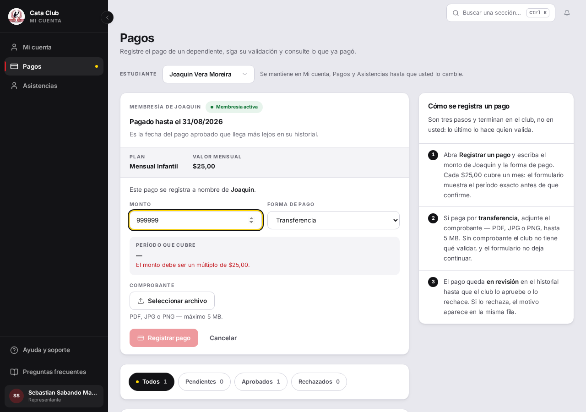
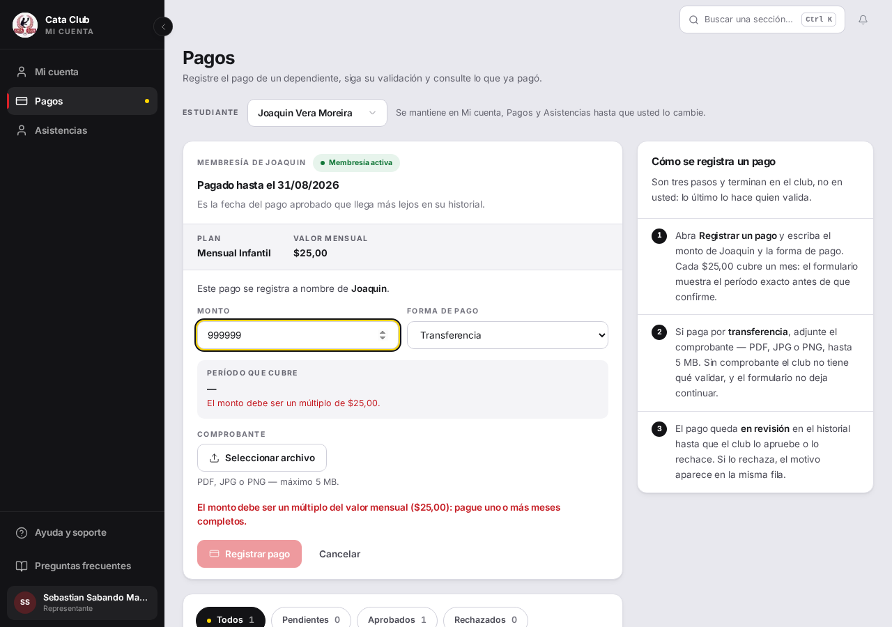

# Fix 06 · El período de cobertura lo decide el backend, no el cliente

> **Esta rama está apilada sobre `fix/pago-sin-comprobante`.** Ese PR tiene
> que mergear primero — comparte el mismo archivo
> (`frontend/src/app/student/payments/page.tsx`) y este fix parte de lo que
> el otro ya cambió ahí, sin deshacerlo.
>
> El alcance original de este fix era «pagos parciales con saldo a favor».
> Se recortó dos veces en el camino: primero porque implementarlo bien exigía
> tocar la activación de membresías sin una decisión tomada sobre cómo
> representar un pago sin cobertura; después porque el dueño ya había sacado
> los parciales de esta entrega junto con la membresía anual, y el encargo
> original no lo reflejaba. El detalle de ambos frenos está en el hilo de la
> tarea, no en este documento — acá solo queda el alcance final.

- **Cierra:** PAG-5, y un agujero de seguridad de datos encontrado al
  implementarlo (no estaba en la auditoría — ver más abajo).
- **Decisión que lo gobierna:** decisiones-de-negocio-2026-08-11.md §6 — la
  versión corregida: se elimina la membresía anual y los pagos parciales del
  alcance; la regla del múltiplo (`monto % precio_mensual`) se queda tal
  cual; lo único que cambia es quién calcula el período de cobertura.
- **Rama:** `fix/periodo-de-cobertura` (renombrada desde `fix/pagos-parciales`
  — sin commits todavía en el momento del renombre, así que no hizo falta
  pelear con git).
- **Commits:** ver `git log` de la rama (backend, frontend y este documento,
  en commits separados).

## El problema

Dos hallazgos, uno visible y uno que no lo era.

**PAG-5 (auditoría):** si un padre escribía un monto que no cerraba —por
ejemplo $40 cuando la cuota es $25—, el botón «Registrar pago» se apagaba y
no aparecía ninguna explicación. El mensaje que lo resolvería ya estaba
escrito en el código (`findProblem()`) pero solo se mostraba si el botón se
podía apretar — y ese es exactamente el estado en el que nunca se aprieta.

**El agujero de cobertura (encontrado al implementar, no en la auditoría):**
`POST /membresias/pagos` recibía `fecha_inicio` y `fecha_fin` del cliente y
solo validaba que una fuera anterior a la otra. La regla del múltiplo
validaba el **monto**; el período viajaba por separado, sin ninguna relación
forzada con él. Reproducido en vivo contra el backend de QA:

```
POST /api/v1/membresias/pagos
{"membresia_id":25,"persona_id":36,"monto":25,"tipo_pago":"TRANSFERENCIA",
 "fecha_inicio":"2026-08-11","fecha_fin":"2027-08-11"}
→ 201. Pago creado con exactamente esas fechas: un mes de cuota, doce
  meses de cobertura.
```

(El pago de prueba se borró después de confirmar el resultado.)

## Qué se hizo

**El backend calcula el período; deja de leerlo del cliente.**
`PagoCreateDTO` ya no tiene `fecha_inicio`/`fecha_fin` — no se aceptan
opcionales y se ignoran, se sacan del contrato entero, porque un campo que
el cliente manda y el backend descarta en silencio es la próxima confusión.

`PagoServicio.registrar_pago` (`backend/app/servicios_negocio/membresia_pago_servicio.py`)
ahora:

1. Sigue validando la regla del múltiplo exacto (`monto % precio_mensual`,
   sin cambios) — es lo que garantiza que todo pago represente meses
   completos, y por eso el cálculo de abajo puede ser una división simple
   sin saldos ni estados intermedios.
2. Calcula `meses = monto // precio_mensual` **sobre el monto BASE**, antes
   de que `_congelar_descuento` lo convierta en el monto final. Esto importa
   por la membresía anual del club: se vende como descuento del catálogo
   sobre doce meses adelantados ($300 → $270 tras el descuento), y la
   cobertura tiene que ser de doce meses — no de diez, que es lo que daría
   calcularla sobre el monto ya descontado. Candado:
   `test_cobertura_se_calcula_sobre_el_monto_base_no_el_descontado`.
3. Ancla el nuevo período en el `fecha_fin` más lejano entre los pagos
   APROBADOS de la membresía (`PagoRepositorio.fecha_fin_maxima_aprobada`,
   `MAX(fecha_fin) WHERE estado_pago = 'APROBADO'`) — o en hoy (`hoy_club()`,
   nunca `date.today()`) si la membresía nunca tuvo uno. La misma lógica que
   ya usaba el frontend para no perderle días pagados a una familia que paga
   adelantada.
4. Extiende esa ancla `meses` meses completos (`_sumar_meses`, espejo en
   Python de `addMonthsIso` del frontend: recorta al último día del mes
   destino cuando el día de origen no existe ahí).

Nada de esto agrega columnas ni migración: el ancla se deriva de datos que
ya existían (`Pago.fecha_fin` de los pagos aprobados).

**El frontend deja de mandar fechas que el backend ya no lee.**
`RegistrarPagoInput` perdió `fechaInicio`/`fechaFin`; el BFF
(`frontend/src/app/api/membresias/pagos/route.ts`) dejó de exigirlas y de
reenviarlas. Los dos formularios que registran pagos
(`student/payments/page.tsx` y `members/page.tsx`) siguen calculando esas
fechas **localmente, solo para la vista previa** que el lector ve antes de
confirmar — el cálculo real, el que cuenta, pasó al backend.

**PAG-5:** el mensaje de `findProblem()` ahora se lee en cada render
(`monto !== "" && findProblem()`), no solo cuando el lector aprieta el botón
que el propio mensaje explica que está apagado. `error` (un intento de envío
real, o un fallo de la API) sigue ganando cuando existe; esto solo llena el
hueco de antes de ese punto.

## Lo que se evaluó y se descartó

La primera versión de este fix (pagos parciales + saldo a favor) hubiera
necesitado una columna o una bandera nueva en `Pago` para distinguir «este
pago trae plata pero no compró cobertura» de un pago normal — sin eso,
aprobar un parcial de $15 sobre una cuota de $25 habría activado la
membresía igual, por el mismo tipo de error que este fix cierra en la
dirección contraria. Con los parciales fuera de alcance, la regla del
múltiplo garantiza que ese caso no existe: todo pago aprobado compró un
número entero de meses, así que `validar_pago` no necesitó ningún cambio.

## El candado

**El agujero, reproducido en un test automatizado —**
`test_un_pago_de_un_mes_no_puede_pedir_doce_de_cobertura` —
`backend/tests/test_periodo_cobertura.py`. Manda exactamente el payload de
la reproducción en vivo (`fecha_inicio`/`fecha_fin` separadas un año) y
verifica que el pago quede con **un mes** de cobertura, no doce.

El test depende de congelar `hoy_club()` en `membresia_pago_servicio`
(no estaba cubierto por el `autouse` de `conftest.py`, que solo alcanza a
`persona_servicio`) — así que su "rojo" antes del fix no es un valor
incorrecto sino que el propio fixture no puede armarse (el módulo todavía no
importaba `hoy_club`):

```
# Antes del fix (código de producción revertido, test tal cual queda)
tests/test_periodo_cobertura.py::test_un_pago_de_un_mes_no_puede_pedir_doce_de_cobertura FAILED
AttributeError: <module 'app.servicios_negocio.membresia_pago_servicio' ...>
has no attribute 'hoy_club'
```

La reproducción real del agujero (rojo con SIGNIFICADO, no solo un fixture
roto) es la que abrió este documento: contra el código sin el fix, el mismo
POST que en el test da 1 mes de cobertura, ahí daba 201 con
`fechaFin: "2027-08-11"` — doce meses por una cuota de uno.

```
# Después del fix
tests/test_periodo_cobertura.py::test_un_pago_de_un_mes_no_puede_pedir_doce_de_cobertura PASSED
tests/test_periodo_cobertura.py::test_primer_pago_arranca_hoy PASSED
tests/test_periodo_cobertura.py::test_renovacion_arranca_donde_termino_la_aprobada PASSED
tests/test_periodo_cobertura.py::test_adelantar_dos_meses PASSED
tests/test_periodo_cobertura.py::test_adelantar_tres_meses PASSED
tests/test_periodo_cobertura.py::test_monto_no_multiplo_de_la_cuota_sigue_rechazado PASSED
tests/test_periodo_cobertura.py::test_cobertura_se_calcula_sobre_el_monto_base_no_el_descontado PASSED
7 passed, 1 warning in 0.93s
```

Verificado además en Postgres, no solo en la respuesta HTTP: un pago
registrado con el mismo intento de agujero (`fecha_fin` un año después)
quedó, leído directo con `psql` contra la base de test —

```
id | monto | fecha_inicio | fecha_fin  | estado_pago
 4 | 25.00 | 2026-08-11   | 2026-09-11 | PENDIENTE_VALIDACION
```

— con un mes exacto de cobertura, sin importar lo que pedía el payload. Fila
de prueba borrada después de verificarla.

**PAG-5** — `StudentPaymentsPage.test.tsx` y el resto de la suite del
frontend pasan sin cambios de comportamiento nuevos que candar con un test
dedicado (es una UI live, no una regla de negocio con estados); la prueba
visual está en las capturas de abajo.

Suite completa después del fix: backend `871 passed, 2 skipped`; frontend
`2453 passed` (161 archivos).

## La prueba




Mismo monto inválido ($999.999 contra una cuota de $25) en el mismo
formulario: antes, el botón «Registrar pago» está apagado y no hay ninguna
explicación visible. Después, con el botón igual de apagado —la regla del
múltiplo sigue vigente—, aparece el mensaje completo de `findProblem()`
("El monto debe ser un múltiplo del valor mensual ($25,00): pague uno o más
meses completos.") mientras la persona todavía está escribiendo.

## Lo que NO cambió

`validar_pago` no se tocó: como todo pago aprobado ya representa un número
entero de meses (la regla del múltiplo sigue vigente), la activación de la
membresía sigue siendo incondicional a la aprobación, exactamente como
antes. La corrección manual de fechas que un ADMINISTRADOR puede mandar al
aprobar un pago (`PagoValidarDTO.fecha_inicio`/`fecha_fin`, en
`validar_pago`) tampoco se tocó — sigue siendo una capacidad legítima y
existente, acotada a un rol de confianza, distinta del contrato que este fix
cierra (que era alcanzable por cualquier representante al *registrar* el
pago). Adelantar varios meses de una vez sigue funcionando igual que antes
($50 = dos meses, $75 = tres): el cálculo nuevo es una división, no cambia
ese caso. No se agregó columna ni migración.
