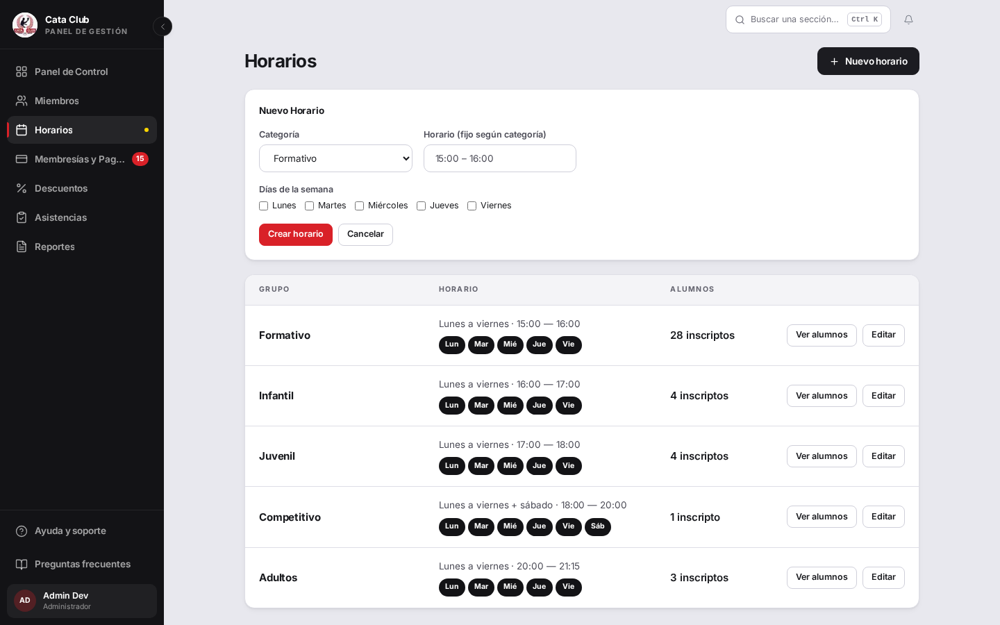
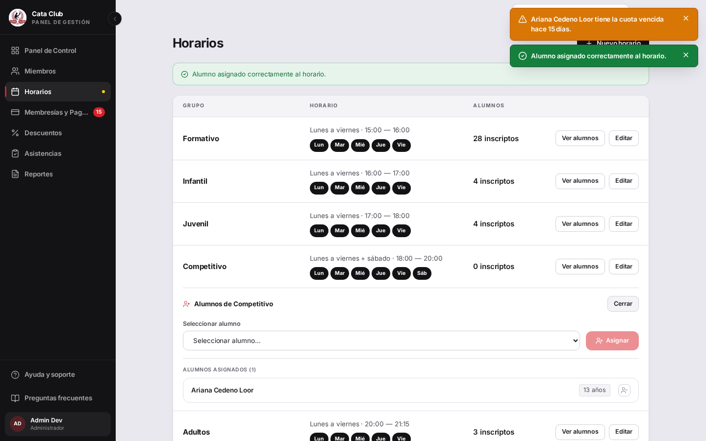

# Fix 07 · Un solo horario por día, y la cuota vencida no frena la cancha

- **Cierra:** INS-3, INS-6
- **Decisión que lo gobierna:** decisiones 5 y 4 del 11 de agosto de 2026 — «una sola fila por categoría y día, con candado en la base» y «la cuota vencida no impide entrenar»
- **Rama:** `fix/reglas-horario-y-cuota`
- **Commits:**
  - `19668b4` — fix(asistencia): enforce one horario row per categoria and day
  - `5245f3c` — feat(asistencia): surface an overdue-membership warning on assignment
  - `3c4bc94` — feat(groups): show a non-blocking overdue-membership warning on assign

## El problema

Crear un horario con la categoría y el día que otro horario ya tenía lo dejaba pasar sin avisar, y la tarjeta seguía mostrando los mismos días como si nada — pero cada alumno anotado después quedaba enrolado dos veces. Y al asignar a un alumno con la cuota vencida, el sistema lo dejaba entrenar igual (correcto) pero no le decía nada al administrador.



## Qué se hizo

- **Horario duplicado (INS-3):** se agregó el candado en la base (`UNIQUE` sobre categoría + día) y el chequeo en el servicio que lo rechaza con un mensaje legible antes de llegar a la base. La migración también limpia los duplicados que ya existieran, conservando la fila más vieja y reacomodando alumnos e historial de asistencia hacia ella.
- **Cuota vencida (INS-6):** asignar sigue funcionando igual que siempre — el alumno queda anotado. Lo que cambia es que la respuesta ahora dice si la membresía está vencida y desde hace cuántos días, y `/groups` lo muestra como un aviso aparte, sin frenar nada.
- Se descartó calcular el aviso por la categoría del horario: en este sistema una persona tiene una sola membresía vigente para todo el club, no una por categoría, así que se usa la más reciente de la persona.

## El candado

`test_crear_horario_rechaza_dia_ya_existente_en_la_categoria` (`backend/tests/test_horario_categoria.py`) y `test_asignar_alumno_con_membresia_vencida_marca_el_aviso_con_dias` (`backend/tests/test_asignacion_membresia_vencida.py`), más la batería de la migración en `backend/tests/test_migracion_horario_categoria_dia_unico.py`.

```
tests/test_horario_categoria.py::test_crear_horario_rechaza_dia_ya_existente_en_la_categoria PASSED
tests/test_migracion_horario_categoria_dia_unico.py::test_el_unique_no_existia_antes_de_la_migracion PASSED
tests/test_migracion_horario_categoria_dia_unico.py::test_upgrade_con_datos_limpios_crea_el_unique_y_conserva_las_filas PASSED
tests/test_migracion_horario_categoria_dia_unico.py::test_upgrade_colapsa_duplicado_sin_alumnos_a_la_fila_de_id_mas_bajo PASSED
tests/test_migracion_horario_categoria_dia_unico.py::test_upgrade_reapunta_alumno_horario_al_conservado_si_no_colisiona PASSED
tests/test_migracion_horario_categoria_dia_unico.py::test_upgrade_borra_la_fila_sobrante_si_el_alumno_ya_esta_en_el_conservado PASSED
tests/test_migracion_horario_categoria_dia_unico.py::test_upgrade_reapunta_el_historial_de_asistencia_a_la_fila_conservada PASSED
tests/test_migracion_horario_categoria_dia_unico.py::test_downgrade_retira_el_unique PASSED
tests/test_migracion_horario_categoria_dia_unico.py::test_upgrade_real_despues_de_la_limpieza_rechaza_un_nuevo_duplicado PASSED
tests/test_asignacion_membresia_vencida.py::test_asignar_alumno_con_membresia_vencida_igual_lo_asigna PASSED
tests/test_asignacion_membresia_vencida.py::test_asignar_alumno_con_membresia_vencida_marca_el_aviso_con_dias PASSED
tests/test_asignacion_membresia_vencida.py::test_asignar_alumno_con_membresia_activa_no_marca_el_aviso PASSED
tests/test_asignacion_membresia_vencida.py::test_asignar_alumno_sin_ninguna_membresia_no_marca_el_aviso PASSED
tests/test_asignacion_membresia_vencida.py::test_asignar_alumno_con_membresia_inactiva_no_marca_el_aviso PASSED
tests/test_asignacion_membresia_vencida.py::test_asignar_alumno_mira_la_membresia_mas_reciente PASSED

15 passed in 5.59s
```

Antes del fix, sin el chequeo del servicio, la primera prueba no fallaba con un error — creaba la fila duplicada en silencio, que era exactamente el bug.

## La prueba



Al asignar a Ariana (cuota vencida) al horario de Competitivo, la asignación se concreta igual (aparece en la lista de alumnos) y aparece el aviso «Ariana Cedeno Loor tiene la cuota vencida hace 15 días» al lado del aviso de éxito. Y al intentar crear un horario de Formativo-Lunes duplicado, el sistema lo rechaza con «La categoría Formativo ya tiene un horario el día lunes» en vez de crearlo en silencio.

## Lo que NO cambió

- No se agregó ninguna validación de edad contra la categoría del horario: `rango_edad` sigue siendo copy de orientación en este proyecto, no una regla, y el hallazgo INS-6b quedó descartado a propósito en la auditoría.
- El aviso de cuota vencida solo mira el estado VENCIDA. Una membresía INACTIVA (la persona nunca activó ninguna, o nunca tuvo un pago aprobado) no dispara el aviso: la decisión de negocio habla de «cuota vencida», que es una membresía que se activó y después expiró, no una que nunca arrancó.
- La lista de alumnos de un horario (`listar_alumnos_por_horario`) y los horarios de un alumno (`listar_horarios_por_alumno`) siguen sin conocer el estado de la membresía: el aviso vive solo en la respuesta de la asignación, para no sumarle una consulta de membresía por fila a esos listados.
