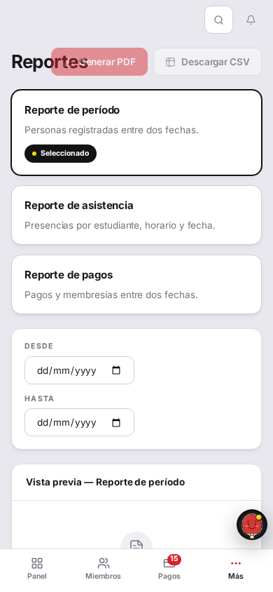
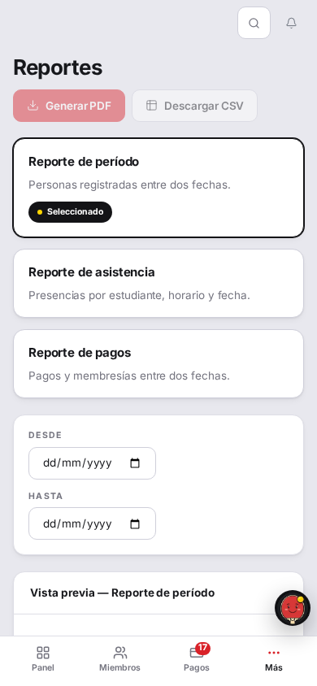
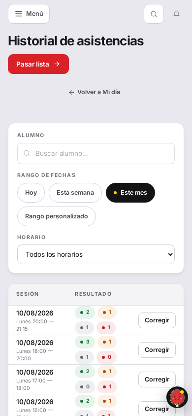
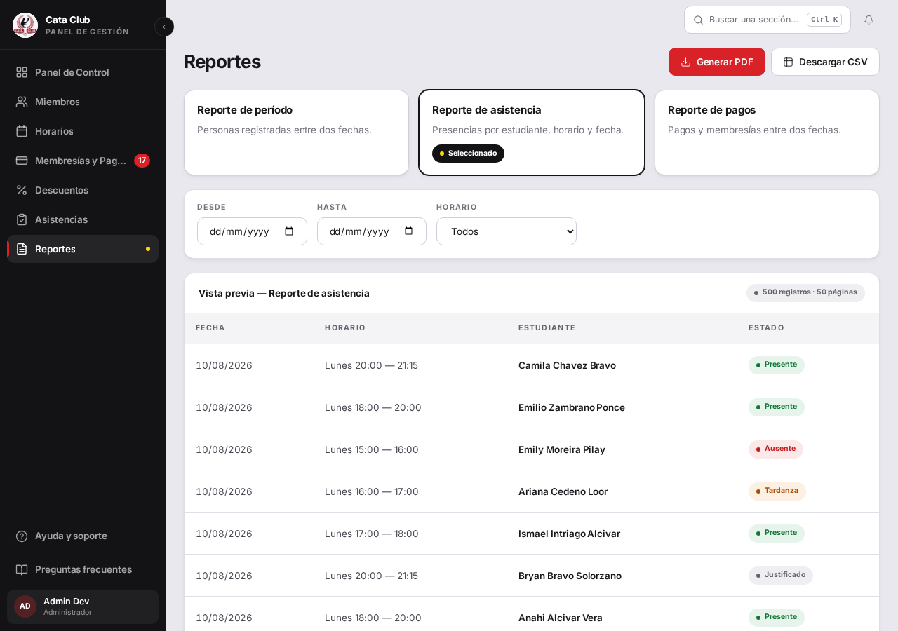
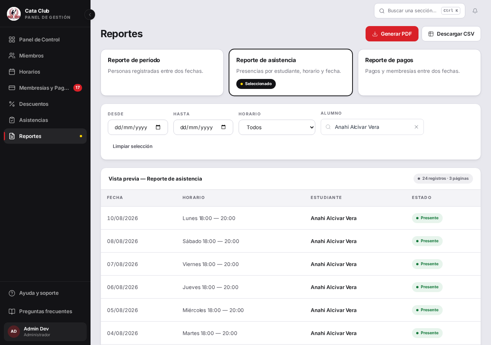
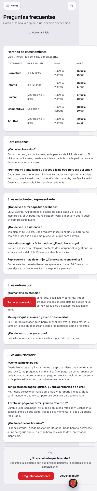
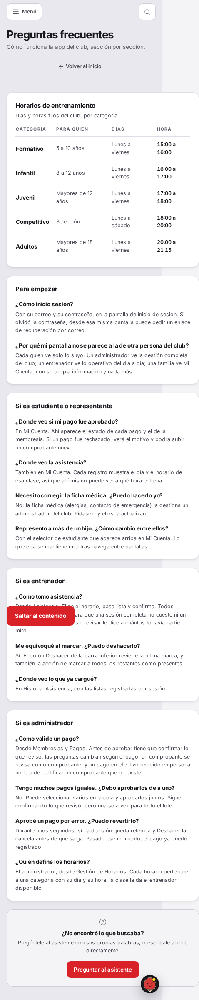
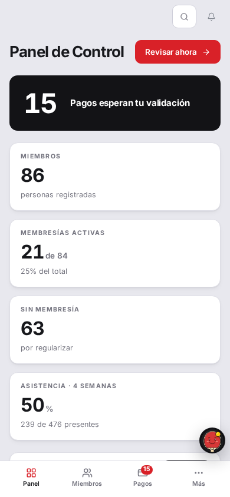
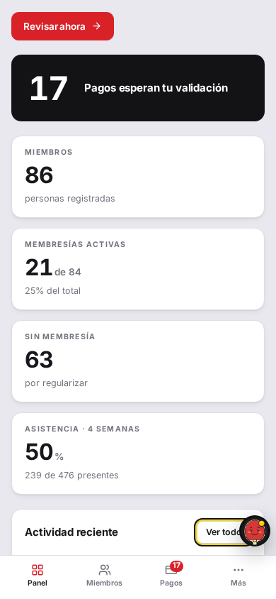

# Fix 9 · Interfaz menor

- **Cierra:** ASI-8, ASI-6, ASI-7, DSH-3, DSH-5
- **Decisión que lo gobierna:** «quiero cosas simples, ni tanto texto, y si el usuario necesita ayuda, hacer algún desplegable o que hable con el chatbot. Simpleza y clean.»
- **Rama:** `fix/interfaz-menor`
- **Commits:**
  - `89a3914` — fix(attendance): pluralize sesión as sesiones, not sesións
  - `a0ad573` — fix(reports): filter the attendance report by one alumno
  - `e18a707` — fix(ui): stack PageHeader title above actions on narrow screens
  - `1cf5f6f` — fix(ayuda): remove the duplicate Volver al inicio link
  - `534143e` — fix(a11y): keep keyboard focus clear of the mobile tab bar

## El problema

Cinco defectos chicos pero visibles: en móvil el botón de Reportes tapaba el
título, el historial de asistencias decía «sesións», el reporte de asistencia
no podía filtrarse por un alumno puntual, Ayuda mostraba «Volver al inicio»
dos veces con dos estilos distintos, y en el dashboard móvil el teclado podía
dejar un enlace enfocado escondido detrás de la barra de navegación inferior.

## Qué se hizo

### a · ASI-8 — el botón tapaba el título en móvil

El `<h1>` de `PageHeader` vive en un `<div className="min-w-0 flex-1">`. A
390px, con los botones de acción compitiendo por espacio, `min-w-0` dejaba que
la CAJA del título se achicara casi a cero — pero el texto («Reportes», una
sola palabra, `overflow: visible`) seguía pintándose a su ancho real, por
encima de esa caja encogida. El `flex-wrap` del header nunca se activaba
porque, para el layout, las cajas (ya encogidas) entraban igual en una sola
fila.

Se descartó tocar `min-w-0` (lo necesitan otras 11 pantallas que usan
`PageHeader`, y no hay evidencia de que rompa nada ahí). En cambio, el header
pasa a apilarse por defecto (`flex-col`) y comparte fila recién desde `sm:` —
el mismo patrón `flex-col … sm:flex-row` que ya usa `Pagination` para el
mismo problema de "pantalla angosta: nunca compartir renglón".

### b · ASI-6 — «32 sesións»

`Pagination` ya tenía la solución (`itemNounPlural`, usado en `payments/page.tsx`
para «solicitud» → «solicitudes»); al historial del entrenador simplemente le
faltaba pasarlo. No hizo falta un helper de pluralización: es el único caso
irregular entre los seis `itemNoun` del código, así que agregar uno para un
solo caso hubiera sido más código, no menos.

### c · ASI-7 — sin filtro por alumno en el reporte de asistencia

El backend ya aceptaba `persona_id` en `reporte_asistencia`, y
`fetchAttendanceRecords`/`exportAsistenciaReportePdf` ya lo reenviaban — solo
faltaba el campo en la pantalla. Se reusó `StudentSearch`, el mismo buscador
que ya funciona en `/trainer/attendance/history` (llama a
`/api/personas/buscar`), en vez de construir un segundo lookup.

### d · DSH-3 — «Volver al inicio» dos veces en Ayuda

`/ayuda` tenía un `BackLink` arriba y un `<Link>` suelto con otro estilo
abajo. Se dejó solo el `BackLink` de arriba. No se tocó el problema más
grande de Ayuda (el muro de texto) — es un tema aparte, más grande, fuera de
este fix.

### e · DSH-5 — el foco quedaba detrás de la barra móvil

La barra inferior fija del admin (62px, solo bajo `lg:hidden`) vive fuera del
flujo del documento, así que el "scroll into view" nativo del navegador al
enfocar por teclado no sabía que existía: si el control caía geométricamente
dentro del viewport, el navegador no scrolleaba, aunque visualmente quedara
tapado por la barra.

Se agregó `scroll-margin-bottom: 78px` al mismo selector `:focus-visible` que
ya usa el sistema para el anillo de foco, bajo el breakpoint de la barra
(`max-width: 1023.98px`). Eso participa en el mismo cálculo nativo de
scroll-into-view, así que el navegador ahora sí desplaza la página lo
necesario para dejar el control enfocado por encima de la barra. Se aplica al
mecanismo (la barra de `AppShell`), no a `/dashboard` en particular — es la
misma barra la que puede tapar foco en cualquier pantalla admin donde el
contenido llegue hasta el borde inferior.

## El candado

- `Pagination pluralises 'sesión' as 'sesiones', not 'sesións' (ASI-6)` —
  `frontend/src/app/trainer/attendance/history/__tests__/TrainerAttendanceHistoryPage.test.tsx`
- `narrows the asistencia preview to one alumno through the shared student
  search (ASI-7)` y `exports the asistencia PDF scoped to the selected alumno
  (ASI-7)` — `frontend/src/app/reports/__tests__/ReportsPage.test.tsx`
- `stacks the title above actions by default, sharing a row only from sm: up
  (ASI-8)` — `frontend/src/components/ui/__tests__/PageHeader.test.tsx`
- `renders exactly one 'Volver al inicio' link, not one at each end (DSH-3)`
  — `frontend/src/app/ayuda/__tests__/AyudaPage.test.tsx`
- DSH-5 no tiene candado unitario: `scroll-margin`/scroll-into-view no se
  puede medir en jsdom (no computa layout real). Se verificó con Playwright
  contra Chromium real — ver «La prueba».

```
# Antes del fix (ASI-6, en la rama sin el cambio):
 FAIL  TrainerAttendanceHistoryPage > pluralises 'sesión' as 'sesiones', not 'sesións' (ASI-6)
  Unable to find an element with the text: /11 sesiones/.

# Antes del fix (DSH-3):
 FAIL  AyudaPage > renders exactly one 'Volver al inicio' link, not one at each end (DSH-3)
  expected [ <a href="/" …(1)>…(1)</a>, …(1) ] to have a length of 1 but got 2

# Antes del fix (ASI-8):
 FAIL  PageHeader — structure > stacks the title above actions by default…
  expect(element).toHaveClass("flex-col")
  Received: flex flex-wrap items-center gap-3

# Antes del fix (ASI-7): no existía forma de tipear un alumno en /reports —
# `screen.getByLabelText("Buscar alumno")` no encontraba ningún elemento.

# Después: 51/51 tests verdes en los cuatro archivos tocados.
 Test Files  4 passed (4)
      Tests  51 passed (51)
```

## La prueba




A 390px, «Reportes» se lee completo y los botones bajan a su propio renglón.
Medido con Playwright: antes, el texto real del `<h1>` (109.8px) invadía el
botón (que arrancaba en x=72.6); después, el título ocupa las 358px de ancho
disponibles y el botón queda en una fila propia, sin superposición vertical.




El pie de la tabla decía «32 sesións»; ahora dice «32 sesiones» (dato real
de QA, no un fixture — el historial del entrenador ya tenía exactamente 32
sesiones cargadas).




Antes, el preset de asistencia solo ofrecía Desde/Hasta/Horario. Después hay
un campo «Alumno» con el mismo buscador de `/trainer/attendance/history`;
eligiendo «Anahi Alcivar Vera» la vista previa pasa a mostrar solo sus 24
registros, con un botón «Limpiar selección» para volver atrás.




Antes, «Volver al inicio» aparecía arriba (con flecha) y abajo (subrayado,
sin flecha). Después solo queda el de arriba.




Tabulando por `/dashboard` a 390×844, el enlace «Ver todo» pasaba de
`top:785,bottom:817` (detrás de la barra, que arranca en 782) a
`top:733.9,bottom:765.9` (el navegador desplazó la página para dejarlo
visible arriba de la barra, con su anillo de foco completo).

## Lo que NO cambió

- El muro de texto de `/ayuda` (DSH-3 lo menciona, pero es un problema más
  grande, fuera de este fix).
- La consolidación de los dos componentes `BackLink` (`components/BackLink.tsx`
  vs `components/ui/BackLink.tsx`) en las otras 6 pantallas — acá solo se
  quitó el duplicado dentro de Ayuda.
- `min-w-0`/`flex-1` en `PageHeader`: se mantiene, porque el fix es en el
  eje de apilado (`flex-col`/`sm:flex-row`), no en esas clases.
- `/groups`: se confirmó que su contenido termina en 766px, antes de que
  empiece la barra (782px) — no reproduce DSH-5, y no se tocó.
