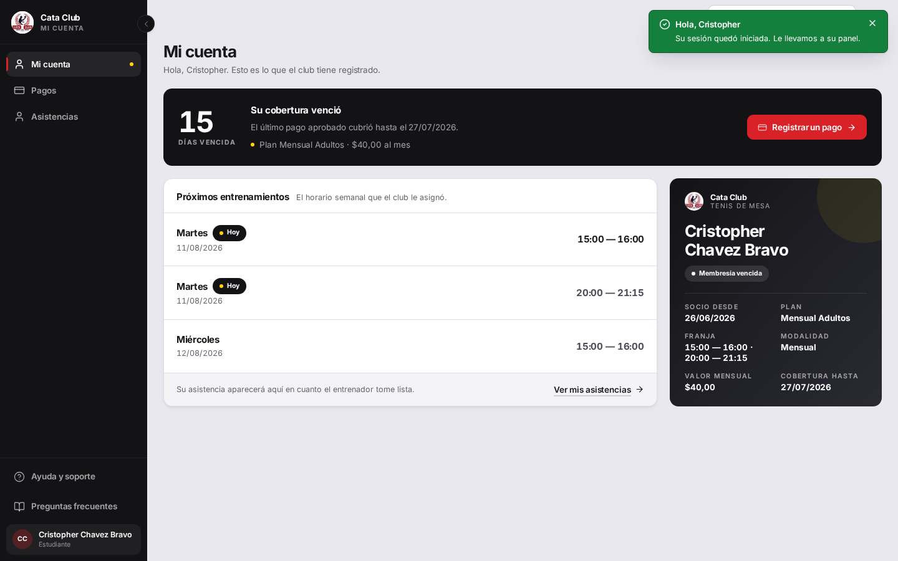
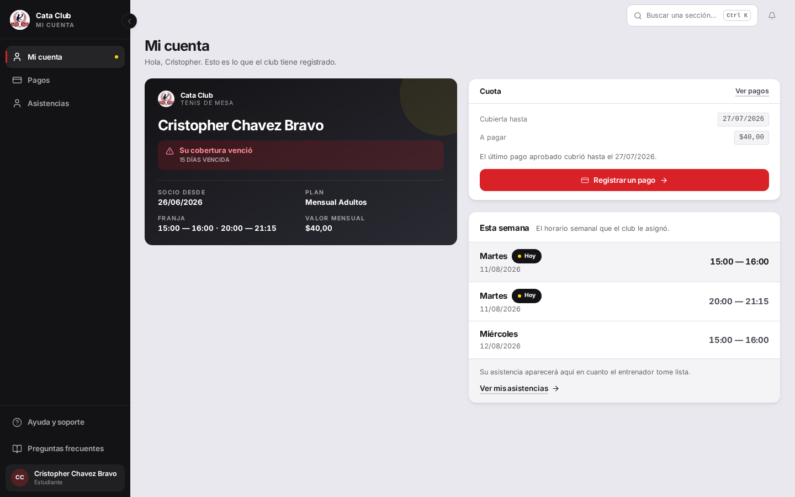
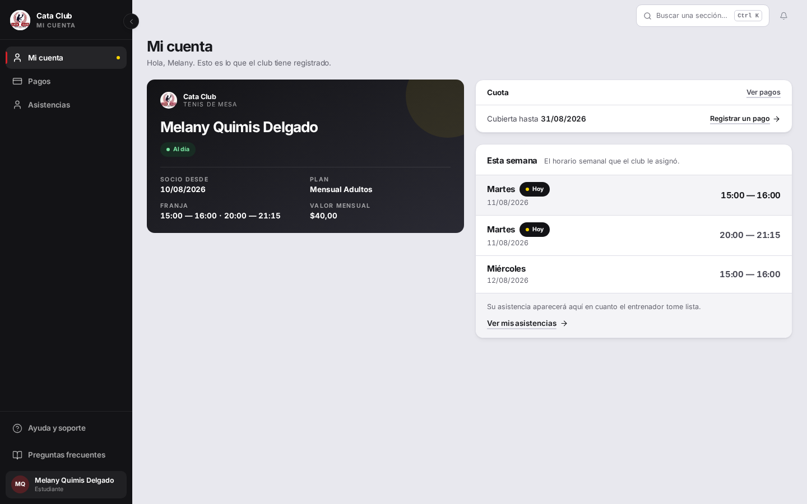
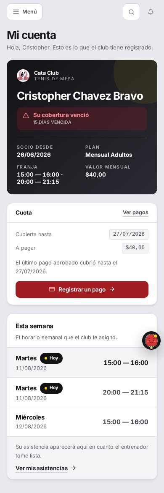
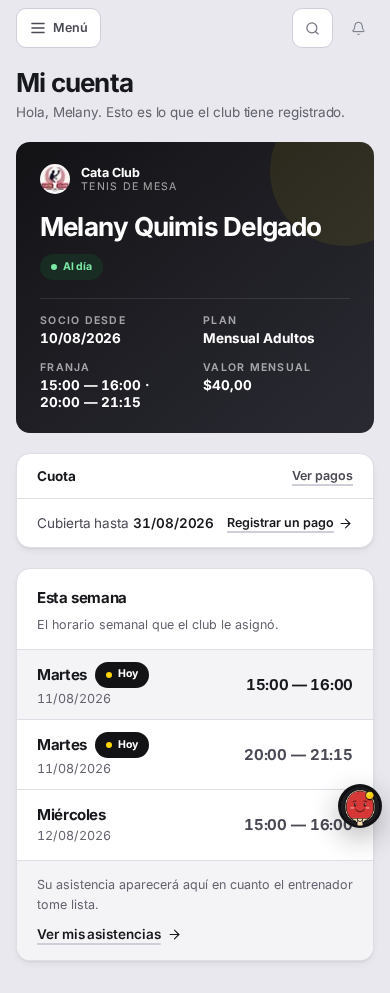

# Fix 12 · Rediseño de «Mi cuenta»: el carnet manda

- **Cierra:** rediseño de `/student` según la Propuesta 2 de las tres maquetas
  presentadas («El carnet manda»)
- **Decisión que lo gobierna:** el dueño eligió la Propuesta 2 después de ver
  las tres, con un problema propio anotado en la maqueta — «pesa mucho cuando
  no hay nada que resolver» — a resolver como parte de la implementación, no
  a ignorar
- **Rama:** `feat/mi-cuenta-carnet`
- **Commits:**
  - `ec20622` — feat(student): make the carnet lead Mi cuenta, weighted by cuota status
  - `a9768d9` — docs(fixes): document the Mi cuenta carnet redesign
  - `6391768` — fix(student): stop the carnet from stretching and the franja splitting
    (corrección 12b, ver más abajo — dos defectos visuales encontrados revisando
    la implementación contra capturas reales)
  - `17d143b` — fix(student): match the carnet screen to the chosen maquette's layout
    (corrección 12c, ver más abajo — la maqueta es la especificación, no una
    referencia a interpretar)

## El problema

La pantalla de antes abría con una banda de pago a todo lo ancho, seguida de
los próximos entrenamientos en la columna principal y el carnet reducido a
340px en una barra lateral — un adorno, no el motivo de la pantalla. Además,
la banda y el carnet decían prácticamente lo mismo dos veces (el estado de la
membresía por un lado, el estado de la cuota por otro), y ambos pesaban igual
sin importar si había algo que resolver o no: una familia al día veía la
misma pantalla cargada que una familia con la cuota vencida hace dos semanas.




## Qué se hizo

El carnet pasa a ser la columna ancha de la pantalla (reutilizando
`PAGE_RAIL`, el único patrón de dos columnas del sistema, solo que ahora el
carnet ocupa el lado 1fr en vez del riel de 340px) y lleva el estado de la
cuota como una banda sobre sí mismo, no como una tarjeta aparte. A la derecha,
apiladas: la tarjeta «Cuota» (cubierta hasta, a pagar, el botón) y «Esta
semana» (los próximos entrenamientos, con el más próximo resaltado — la
misma lógica que ya existía, solo renombrada y reubicada).

Debajo del carnet, en un grid fijo de dos columnas (no `auto-fit`: con el
carnet ahora ancho, `auto-fit` habría repartido los datos en cuatro o cinco
columnas en vez de dos), los cuatro datos que pide la maqueta: Socio desde,
Plan, Franja, Valor mensual. "Modalidad" y "Cobertura hasta" salen del
carnet — la primera porque la maqueta no la dibuja, la segunda porque pasa a
la tarjeta Cuota, que es donde vive la fecha de cobertura.

La banda del carnet **reemplaza** la vieja insignia de `Membresia.estado`
("Membresía activa/pendiente/vencida"): las dos podían decir cosas distintas
para el mismo caso (un admin puede marcar una membresía `INACTIVA` sin que
eso diga nada sobre si la cuota está pagada), y la maqueta dibuja una sola
banda. Ahora las dos tarjetas de pago (carnet y «Cuota») leen la misma
`describePaymentSituation` que ya existía — una sola fuente de verdad, nunca
dos redacciones del mismo estado.

Descarté reescribir el carnet sobre `MemberCard` (el componente genérico de
`/profile`): el carnet de `/student` ya es una variante propia, con
documentación extensa sobre por qué cada campo es real y de dónde sale
(`franja` derivada de los horarios asignados, no del plan; sin número de
socio inventado). Fusionarlo con `MemberCard` — que solo conoce
nombre/correo/rol/fecha — habría significado inventarle a `MemberCard` una
API mucho más ancha solo para este caso, sin beneficiar a `/profile`.
Extender el carnet ya existente, en vez de construir uno nuevo, es la lectura
que le doy a «no hagas un carnet paralelo».

### El problema anotado en la maqueta

La dirección elegida: la banda **cambia de peso**, no solo de color.

- **Urgente** (vencida, por vencer, nunca pagada): la banda es una franja
  ancha con ícono, roja, con la cifra que antes lideraba la banda vieja
  (`14 días vencida`).
- **Al día**: la banda se comprime a la píldora pequeña que antes usaba la
  insignia de membresía — un punto verde, una palabra («Al día»).
- **Otros estados sin urgencia** (pago en revisión, menor sin pagos propios,
  sin membresía): mantienen la franja completa pero en tono neutro, porque
  todavía necesitan explicar algo (quién paga, por qué no hay botón) — la
  compresión es específicamente para «no hay nada que resolver», no para
  «no es urgente» en general.

La tarjeta «Cuota» sigue la misma regla: se comprime a una sola línea
(«Cubierta hasta 31/08/2026» + un enlace de texto, sin fila «A pagar» y sin
botón grande) únicamente cuando el estado es `covered`. El espacio que cede
lo toma «Esta semana» de forma natural, sin necesitar redimensionarla a mano.

## Corrección 12b — dos defectos que la primera pasada no vio

La primera versión hacía que el carnet se **estirara** (`lg:!items-stretch`
en el grid de `PAGE_RAIL` más `flex-1` en el propio carnet) para igualar el
alto de la columna derecha (Cuota + Esta semana). La intención era cerrar el
"vacío que no se llena" que tenía la pantalla vieja. El resultado real, visto
en una captura contra datos reales: cuando la columna derecha era más alta
que el contenido del carnet, el carnet crecía igual — y los ~400px de
diferencia quedaban como canvas negro vacío **adentro** del carnet, debajo de
«Franja / Valor mensual». El vacío no desapareció: se mudó de la página al
carnet.

La solución: el carnet **no se estira**. Vuelve a la altura natural,
alineado arriba con la columna derecha (`PAGE_RAIL` sin overrides). Un
carnet tiene proporción de carnet, no de columna — y el margen que queda
debajo, en la columna izquierda, es canvas de página normal (el mismo tipo
de espacio que cualquier columna corta deja), no un hueco dentro de una
tarjeta con borde propio.

El segundo defecto: una «Franja» con dos horarios ("15:00 — 16:00 · 20:00 —
21:15") es una sola cadena en una celda de ~172px, así que el navegador
envolvía la línea donde encontraba un espacio — incluso adentro de un mismo
horario, partiendo "20:00 —" de "21:15" en dos renglones. Un alumno con dos
franjas no es un caso raro (el de la captura está en dos categorías a la
vez), así que había que resolverlo. Cada horario ahora vive en su propio
`<span className="whitespace-nowrap">`; el único punto donde el navegador
puede cortar la línea es el " · " entre dos horarios, nunca adentro de uno.

## Corrección 12c — la maqueta es la especificación, no una referencia

Después de 12b, el dueño la miró contra el prototipo y dijo lo que las dos
pasadas anteriores no habían hecho: *«pero fijate en el prototipo, si decido
eso, pues debería verse igual»*. Tenía razón — las dos correcciones previas
habían arreglado síntomas (el estirado, el wrap de la franja) sin volver a
mirar la maqueta que se había elegido, y el hueco que perseguían era, en el
fondo, un problema de proporción que ninguna de las dos tocó.

Comparando el HTML/CSS real de la maqueta (Propuesta 2) contra la
implementación, elemento por elemento:

1. **Las columnas.** La maqueta dibuja el split de escritorio como
   `grid-template-columns: 1fr 1fr` — parejas. La implementación reusaba el
   riel de 340px de `PAGE_RAIL` sin modificar, dejando el carnet en unos tres
   cuartos del ancho de la fila y el riel en un cuarto. Esta es la causa real
   del hueco perseguido en fix 12 y 12b: con el carnet tres veces más ancho
   que lo que su grilla de cuatro datos necesita, cualquier ajuste de altura
   solo movía el vacío de lugar (adentro del carnet en 12, debajo en la
   versión sin estirar). **Corregido**: un override local sobre `PAGE_RAIL`
   (`lg:!grid-cols-[minmax(0,1fr)_minmax(0,1fr)]`, el mismo mecanismo de
   `!important` que 12b ya usó y luego retiró para el estirado — la técnica
   estaba bien, esa aplicación no).
2. **La fila del próximo entrenamiento.** La maqueta la resalta con un fondo
   distinto (`.row.next`). La implementación solo la distinguía con la
   insignia «Hoy», que no es lo mismo: solo aparece cuando esa sesión cae en
   el día de hoy, no cuando es simplemente la más próxima de la semana.
   **Corregido**: la primera fila (la más próxima, sea o no «hoy») ahora
   lleva `bg-sunken`. La insignia «Hoy» se mantiene además — es un dato real
   que la maqueta no contradice, solo no alcanza a distinguir la fila por sí
   sola.
3. **La grilla de datos del carnet.** La maqueta la dibuja al ancho completo
   de la tarjeta. La implementación la limitaba a `sm:max-w-[360px]`, una
   medida heredada de cuando el carnet era la columna "ancha" de ~1000px de
   fix 12. Con las columnas ya parejas (~660px cada una), ese límite dejaba
   una franja vacía a la derecha **adentro** del propio carnet — el mismo
   defecto que 12b ya había cerrado una vez (el vacío interno), mudado de
   lugar otra vez. **Corregido**: se quitó el límite.

### Diferencias evaluadas y mantenidas a propósito

- **La banda de estado que cambia de peso** (franja completa con ícono para
  urgente/neutral, píldora chica solo para «al día») en vez de la píldora
  `.chip` fija que la maqueta usa para todos los casos: no es un olvido, es
  la decisión ya documentada arriba en "El problema anotado en la maqueta" —
  resuelve el propio costo que la maqueta anota («pesa mucho cuando no hay
  nada que resolver»), aprobada como parte de la implementación original.
- **El espaciado entre bloques** (`gap-page`, 20px) en vez de los 12px del
  boceto: son los tokens de espaciado del sistema de diseño del proyecto
  (documentados en `layout.ts`), no un pixel suelto de la maqueta — cae bajo
  la misma excepción que ya cubre colores y tipografía.
- **La frase de resumen de asistencia** al pie de «Esta semana» («asistió a
  X de N sesiones» + el enlace «Ver mis asistencias»): la maqueta de
  Propuesta 2 no la dibuja (solo pone un enlace «Asistencias» en el título de
  la tarjeta), pero es un dato real que la pantalla ya mostraba antes de esta
  corrección, y la maqueta no lo prohíbe — no es el defecto que se está
  corrigiendo acá, así que se dejó como estaba.

*(Un encargo intermedio de esta misma corrección había pedido agregar una
tarjeta de asistencia con una barra debajo del carnet, para llenar el hueco.
Se retiró antes de implementarla al identificar que el hueco era la
proporción de columnas, no la falta de contenido — la maqueta elegida no
dibuja esa tarjeta, así que no se agregó.)*

## El candado

`StudentPage — the carnet earns its space when the cuota is up to date` en
`frontend/src/app/student/__tests__/StudentPage.test.tsx`: los dos casos,
vencida y al día, se comparan por atributos (`data-urgent`, `data-tone`,
`data-compact`) y por contenido (la tarjeta compacta no tiene fila «A pagar»
ni botón grande). Si alguien vuelve a mostrar la misma banda completa para
ambos estados, el test se pone rojo.

```
✓ StudentPage — the carnet earns its space when the cuota is up to date > renders the full-weight strip and the full Cuota card when the cuota is overdue
✓ StudentPage — the carnet earns its space when the cuota is up to date > renders a compact pill and a one-line Cuota card when the cuota is up to date

 Test Files  1 passed (1)
      Tests  37 passed (37)
```

**Candado de la corrección 12b**, mismo archivo:

- `StudentPage — the carnet keeps its own proportions instead of stretching >
  does not force the carnet's height to match the rail's` — el carnet no
  lleva `flex-1` y el grid que lo separa de la columna derecha no lleva
  `items-stretch`. Si alguien reintroduce el estiramiento, el test se pone
  rojo.
- `StudentPage — the carnet's franja agrees with the assigned schedule >
  keeps each window as one unbreakable run so a wrap can never split a time
  in half` — cada horario de una «Franja» con dos ventanas vive en su propio
  `whitespace-nowrap`, y el valor completo sigue leyéndose igual
  ("15:00 — 16:00 · 20:00 — 21:15").

```
✓ StudentPage — the carnet keeps its own proportions instead of stretching > does not force the carnet's height to match the rail's
✓ StudentPage — the carnet's franja agrees with the assigned schedule > keeps each window as one unbreakable run so a wrap can never split a time in half

 Test Files  1 passed (1)
      Tests  39 passed (39)
```

**Candados de la corrección 12c**, mismo archivo:

- `StudentPage — the carnet and the rail split the row evenly > matches the
  chosen maquette's 1fr/1fr desktop grid instead of a 340px rail` — la fila
  que contiene el carnet lleva el override `lg:!grid-cols-[minmax(0,1fr)_minmax(0,1fr)]`.
  Si alguien lo retira y vuelve al riel de 340px, el test se pone rojo.
- `StudentPage — próximos entrenamientos > highlights the nearest session's
  row instead of only badging it 'Hoy'` — la primera fila de "Esta semana"
  (la más próxima) lleva `bg-sunken`; las siguientes no. Corre con la hora
  real del sistema, sin `Date` simulado, para probar que el resaltado sigue
  la posición y no una coincidencia de fecha.
- `StudentPage — the club membership card (carnet) > lets the facts grid
  fill the carnet's real width instead of capping at the old wide-column
  measure` — la grilla de datos ya no lleva `sm:max-w-[360px]`.

```
✓ StudentPage — the club membership card (carnet) > lets the facts grid fill the carnet's real width instead of capping at the old wide-column measure
✓ StudentPage — próximos entrenamientos > highlights the nearest session's row instead of only badging it 'Hoy'
✓ StudentPage — the carnet and the rail split the row evenly > matches the chosen maquette's 1fr/1fr desktop grid instead of a 340px rail

 Test Files  1 passed (1)
      Tests  42 passed (42)
```

## La prueba






Las cuatro capturas son de la corrección 12c, sacadas contra un backend
propio levantado desde este worktree apuntando a la base de QA compartida
(ver la nota al final). Reemplazan a las de 12b, que mostraban el carnet a
tres cuartos del ancho de la fila.

Lo que se ve ahora, comparado contra la maqueta: el carnet y la columna
derecha (Cuota + Esta semana) miden prácticamente lo mismo de ancho — en
1440px, ambos rondan los 565px, dejando un margen de menos de 10px entre sí
y el mismo margen respecto de los bordes del área de contenido. La grilla de
cuatro datos del carnet («Socio desde / Plan / Franja / Valor mensual») ya no
deja una franja vacía a la derecha: llena el ancho de la tarjeta en dos
columnas parejas, igual que `.carnet .grid` en la maqueta. En «cuota
vencida», la fila «Martes · Hoy · 15:00 — 16:00» (la más próxima) tiene un
fondo gris claro que la distingue de las dos filas siguientes — el mismo
resalte que `.row.next` usa en la maqueta. La «Franja» con dos horarios
(15:00 — 16:00 y 20:00 — 21:15) sigue envolviendo entre un horario y el
otro, nunca partiendo uno por la mitad (candado de 12b, intacto). La banda
sigue cambiando de peso según haya algo que resolver, y en «al día» la
tarjeta Cuota se mantiene comprimida a una línea.

Debajo del carnet queda un margen de página normal cuando la columna derecha
es más alta (el caso «al día», donde el carnet es más corto sin la banda
completa) — canvas de página, sin borde propio, del mismo tipo que cualquier
columna corta deja (ver `PAGE_RAIL`, `layout.ts`), no el hueco con borde que
esta corrección existe para cerrar.

*(Las capturas "representante con 4 hijos" y "alumna autogestionada" de la
pasada anterior no se regeneraron — no estaban en el alcance de esta
corrección — así que se sacaron de esta lista en vez de dejarlas
desactualizadas junto a las cuatro nuevas.)*

### El espacio en blanco — la medición que esta corrección obligó a arreglar

La tabla de "antes/después" de la pasada anterior medía, por cada captura de
1440×900, la fila más baja con contenido real y el porcentaje de canvas
vacío **por debajo** de esa fila — el mismo método que el panel del
entrenador. Con esa vara, el caso «vencida» pasó de 27,2 % a 11,1 %: una
mejora real y bien medida.

Pero el defecto que esta corrección cierra — los ~400px de negro vacío
**adentro** del carnet, entre el grid de datos y el borde inferior de la
tarjeta — no podía aparecer en ese número, por diseño del método: el carnet
tiene contenido arriba de ese hueco (el nombre, la banda, el grid de
"Franja / Valor mensual"), así que "la fila más baja con contenido real" caía
más abajo que el hueco mismo, y todo lo que hay entre el contenido y el borde
de la tarjeta queda fuera de lo que el método mira. El 11,1 % de "después"
convivió con la pantalla de la captura mostrando un rectángulo medio vacío,
y el número no lo contradijo porque nunca pudo verlo.

No reemplazo esa tabla por otra automática: la métrica midió lo fácil de
medir (canvas de página, un problema real y distinto) y no lo que importaba
acá (canvas dentro de un elemento con contenido propio arriba). Fabricar un
segundo número con el mismo apuro que produjo el primero sería repetir el
error con más decimales. La prueba de esta corrección es la captura de
arriba: el carnet termina donde termina su contenido, sin franja negra
sobrante debajo del grid de datos, en los dos estados (vencida y al día) y
en los dos anchos (1440px y 390px) — mirala y comparala con la de la pasada
anterior si hace falta el contraste.

**La lección:** un número que no coincide con lo que se ve es peor que no
tener número. Antes de reusar una métrica para un caso nuevo, hay que
preguntar qué puede y qué no puede ver — no solo si el método ya funcionó en
otra pantalla.

## Lo que NO cambió

- `ManagedStudentPicker` (el selector de estudiante) — intacto.
- `AgeUpConfirmation` y la lógica de qué alumno se muestra — intacta.
- Los dos accesos de siempre (agregar hijo, anotarme como jugador) — mismo
  lugar, mismo comportamiento.
- La ruta BFF (`frontend/src/app/api/student/route.ts`) y su adaptador
  (`student-adapter.ts`) — **no se tocaron**. Ver la nota siguiente.

## Nota — un bug preexistente en el ambiente de QA, no de este fix

Al levantar el `pnpm dev` propio contra el backend de QA, `/api/student`
devolvía 500 para **cualquier** cuenta (antes y después de este cambio):
`TypeError: historial is not iterable` en `student-adapter.ts::buildRecentSessions`.
El backend de QA ahora devuelve `/asistencias/persona/{id}` paginado
(`{items, total, skip, limit}`), y el adaptador en `main` todavía espera un
arreglo plano — un desfase de versión con el ambiente, no algo que este
rediseño causó (rompe la pantalla vieja igual que la nueva).

Apliqué un parche local, **no commiteado**, solo para poder sacar capturas
reales contra QA (`historial = Array.isArray(raw) ? raw : raw.items ?? []`
en `route.ts`), y lo revertí antes de terminar — `git diff` contra
`origin/main` en ese archivo da vacío. No lo dejé en la rama porque es
exactamente el archivo que `fix/rendimiento` está tocando; avisé en vez de
resolverlo.

La corrección 12c repitió el mismo parche local, sin commitear, para sacar
sus propias cuatro capturas contra el mismo backend de QA — el bug sigue sin
tocar la rama que lo va a resolver, y `git diff` contra `origin/main` en
`route.ts` vuelve a dar vacío al terminar.
