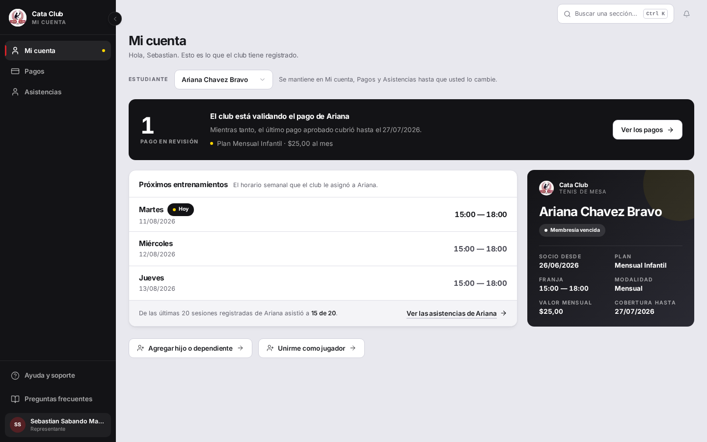
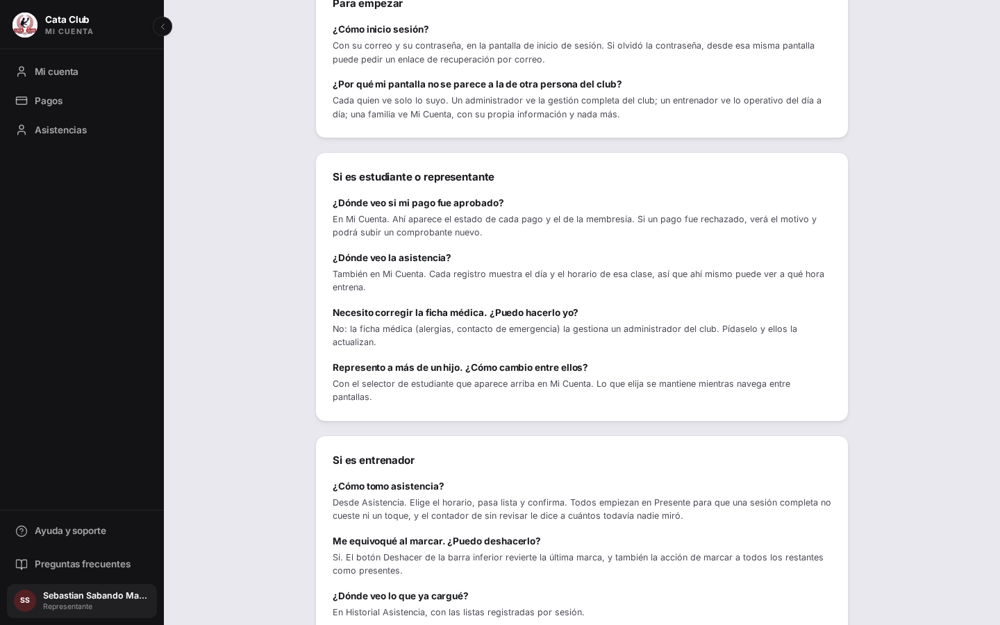
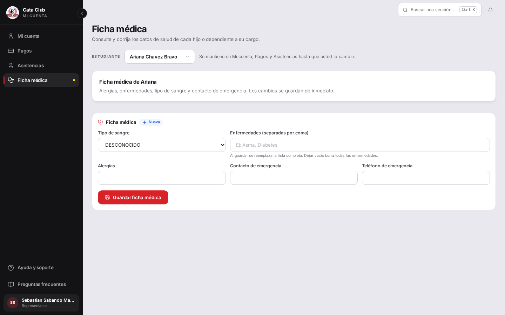
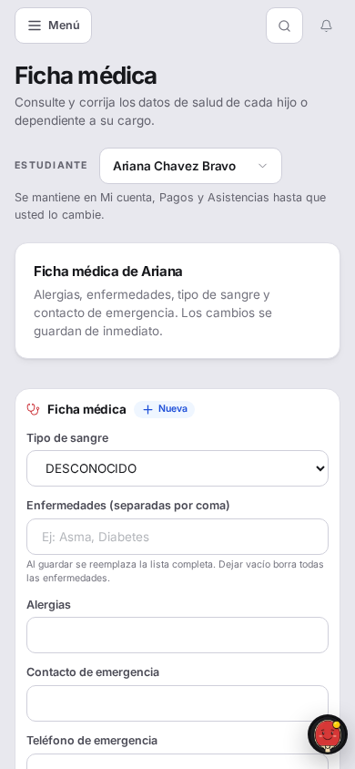
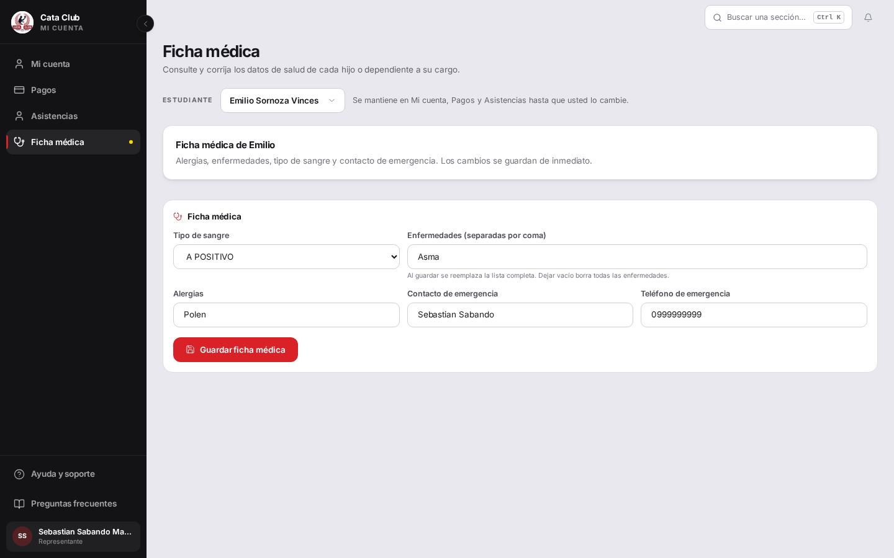
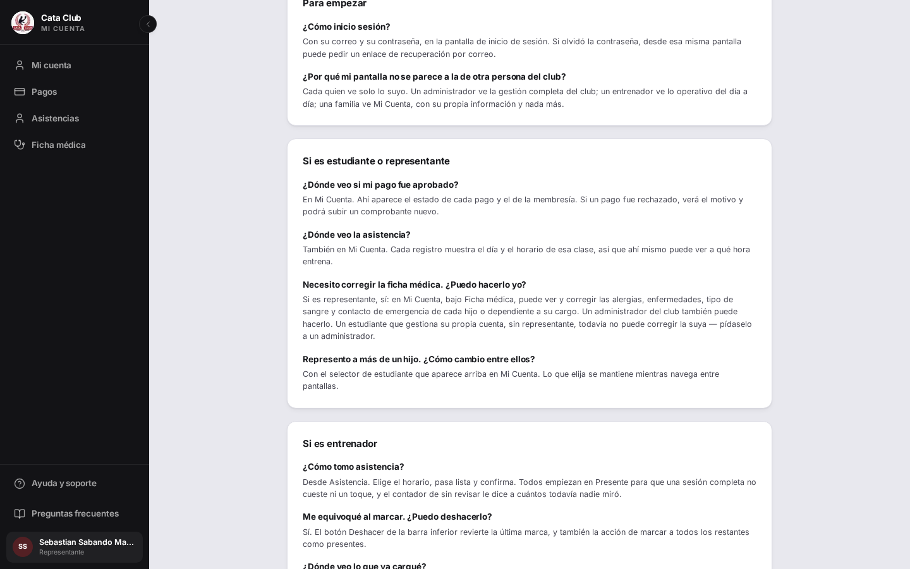
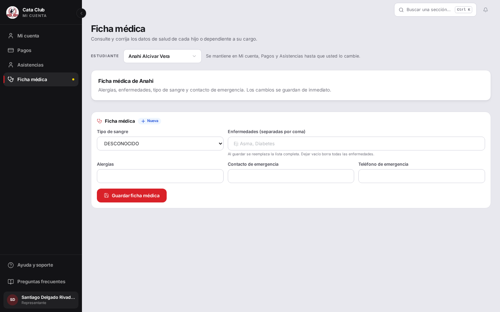

# Fix 13 · El representante ya puede corregir la ficha médica de su hijo

- **Cierra:** FIC-4
- **Decisión que lo gobierna:** ninguna decisión de negocio nueva — el backend ya autorizaba esto; faltaba la pantalla. El caso del alumno autogestionado (titular sin representante) queda explícitamente fuera, por diseño ya existente (`incluir_titular=False`), documentado en «Lo que NO cambió».
- **Rama:** `feat/ficha-medica-representante`
- **Commits:**
  - `cc8d5a7` — feat(student): give a representante access to a representado's ficha médica
  - `966253f` — docs(ayuda): stop telling a representante they can't fix the ficha médica

## El problema

La API ya dejaba que un representante leyera y corrigiera la ficha médica de su hijo — probado con 200 propio / 403 ajeno. Pero ningún lugar de `Mi cuenta` ofrecía esa pantalla: `MedicalRecordEditor` vivía solo bajo `/members`, territorio de administración. Y encima, el FAQ le mentía al representante en la cara: decía que **no podía** hacerlo.



Arriba: el menú de un representante con 4 hijos, sin ninguna entrada a «Ficha médica». Abajo, el FAQ respondiéndole que no puede.



## Qué se hizo

1. **Nueva pantalla `/student/medical-record`**, representante-only. Reutiliza `MedicalRecordEditor` sin tocarlo — el componente ya recibía un `personaId` genérico y llamaba a los mismos `fetchFichaMedica`/`actualizarFichaMedica` que usa `/members`; no hacía falta un segundo editor.
2. **Entrada de menú nueva**, solo para el rol `representante` (`getNavLinksForRole`), no para `estudiante`: el backend sigue excluyendo al titular de su propia ficha (`incluir_titular=False`), así que a un alumno autogestionado no se le ofrece un destino que el backend le va a rechazar con 403.
3. **El selector de estudiante (`ManagedStudentPicker`) se reutiliza sin tocarlo**, con `hasAlumnoRole` forzado a `false` para esta pantalla — así el perfil propio del representante (si además es alumno) nunca entra en la lista, ni siquiera si el rol de sesión cambiara.
4. **El FAQ y el texto del chatbot se corrigen** para decir lo que de verdad pasa, sin tocar la excepción real (el alumno autogestionado).

**Caminos descartados:**
- Colgar el acceso desde `app/student/page.tsx` (el carnet) o desde `ManagedStudentPicker.tsx`: ambos archivos estaban marcados como zona de conflicto con otra rama en curso (`feat/mi-cuenta-carnet`) y explícitamente vedados de tocar. El nav compartido (`auth-utils.ts` → `AppShell`/`Header`) resolvió el acceso sin tocar ninguno de los dos.
- Un segundo editor de ficha médica: descartado por instrucción explícita — reusar `MedicalRecordEditor` es el punto central del pedido.

## El candado

**Frontend — `getNavLinksForRole` no ofrecía el destino** (`frontend/src/lib/__tests__/auth-utils.test.ts`, test `returns representante links to Mi cuenta, Pagos, Asistencias and Ficha médica`):

```
 ❯ src/lib/__tests__/auth-utils.test.ts (31 tests | 1 failed) 14ms
   × getNavLinksForRole > returns representante links to Mi cuenta, Pagos, Asistencias and Ficha médica 5ms
     → expected [ Array(4) ] to have a length of 5 but got 4
```

**Frontend — la pantalla no existía** (`frontend/src/app/student/medical-record/__tests__/StudentMedicalRecordPage.test.tsx`):

```
Error: Failed to resolve import "@/app/student/medical-record/page" from
"src/app/student/medical-record/__tests__/StudentMedicalRecordPage.test.tsx".
Does the file exist?
```

Después del fix, ambos en verde:

```
 ✓ src/lib/__tests__/auth-utils.test.ts (31 tests) 8ms
 ✓ src/app/student/medical-record/__tests__/StudentMedicalRecordPage.test.tsx (6 tests) 275ms

 Test Files  2 passed (2)
      Tests  37 passed (37)
```

El aislamiento entre familias en sí **ya estaba probado y ya pasaba** antes de este fix —
`backend/tests/test_ficha_medica_representante.py`, 20 tests, incluido
`test_el_representante_no_lee_la_ficha_medica_de_otra_familia` (IDOR, 403) y
`test_el_titular_no_lee_su_propia_ficha_medica` (el límite del alumno autogestionado).
Verificado de nuevo en esta rama, sin cambios: `20 passed`.

## La prueba



El menú ahora tiene «Ficha médica»; la pantalla nombra a la hija seleccionada («Ficha médica de Ariana») y monta el mismo editor que usa administración.



A 390×844 el formulario se apila sin recortes.



Emilio (otro hijo del mismo representante) con los cinco campos ya guardados — verificado en Postgres, no solo en pantalla (ver abajo).



El FAQ ya no miente.

### Verificación fuera de la interfaz

**Postgres — los cinco campos llegaron, ninguno se cayó en silencio** (bug previo conocido: 3 de 5 se perdían):

```
$ docker exec cataclub-qa-db-1 psql -U usuario -d cataclub_db -tAF'|' \
    -c "SELECT persona_id, tipo_sangre, alergias, contacto_emergencia, telefono_emergencia
        FROM ficha_medica WHERE persona_id = 34;"
2|34|A_POSITIVO|Polen|Sebastian Sabando|0999999999

$ docker exec cataclub-qa-db-1 psql -U usuario -d cataclub_db -tAF'|' \
    -c "SELECT nombre_enfermedad FROM enfermedades WHERE ficha_medica_id = 2;"
Asma
```

**403 a mano, con curl, representante ajeno contra un hijo que no es suyo:**

```
$ curl -s http://127.0.0.1:8010/api/v1/fichas-medicas/persona/34 \
    -H "Authorization: Bearer <token de Santiago, otro representante>"
{"detail":"Solo un administrador o el representante de esta persona pueden
acceder a su ficha médica"} · STATUS:403
```

El mensaje no menciona a Emilio por nombre ni confirma que exista — el 403 no filtra nada.

**403 a mano, cambiando el id en la URL del navegador:** con la sesión de Santiago (otro representante, sin vínculo con la familia de Emilio), forzar `/student/medical-record?alumno=34` (el id de Emilio) no muestra la ficha de Emilio — el `ManagedStudentPicker` ignora un id que no está en la lista de representados propios de Santiago y cae al primero de los suyos:



El encabezado dice «Ficha médica de Anahi» — la propia representada de Santiago — nunca la de Emilio.

## Lo que NO cambió

- **`ManagedStudentPicker.tsx` y `AgeUpConfirmation`**: sin tocar, tal como se pidió.
- **`app/student/page.tsx`**: sin tocar. El acceso se resolvió por el nav compartido (`getNavLinksForRole` → `AppShell`), evitando el conflicto con `feat/mi-cuenta-carnet`.
- **El aislamiento entre familias en el backend**: no se tocó ni un byte de `PoliticaAccesoPersona` ni de `ficha_medica_router.py`. Los 20 tests de `test_ficha_medica_representante.py` siguen pasando exactamente igual que antes de este fix.
- **El alumno autogestionado (titular sin representante) sigue sin ver su propia ficha.** Es `FIC-3` en la auditoría, «por diseño del backend: no tiene representante», y es un encargo aparte. Este fix no lo complica: la pantalla nueva es representante-only (`allowedRoles={["representante"]}`), así que un `estudiante` no la ve en el menú ni la alcanza por ruta directa (`ProtectedRoute` lo redirige). Cuando ese encargo se tome, encajaría cambiando `incluir_titular` a `True` en `ficha_medica_router.py` (dos líneas) y sumando `"estudiante"` a `allowedRoles` de esta misma pantalla — el componente (`MedicalRecordEditor`, `ManagedStudentPicker`) no necesitaría cambios.
