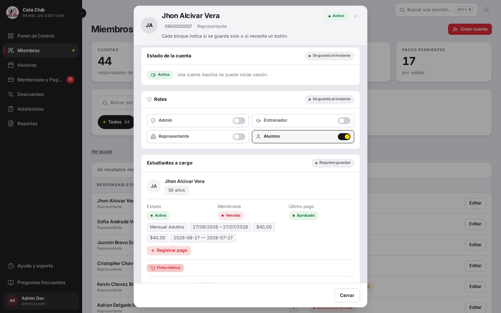
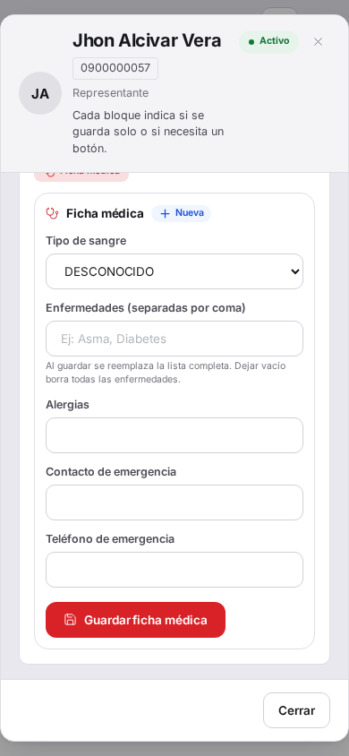
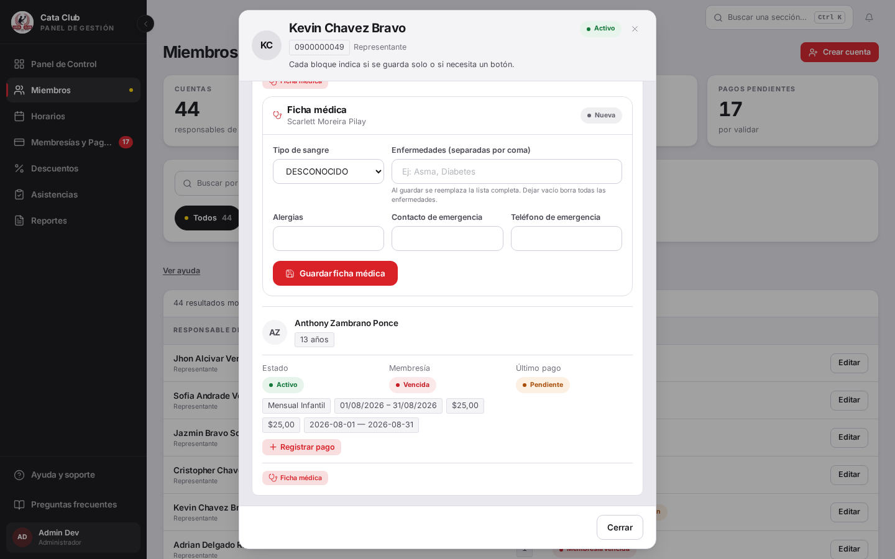
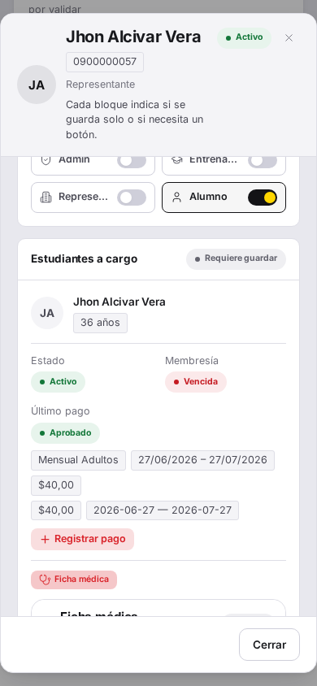
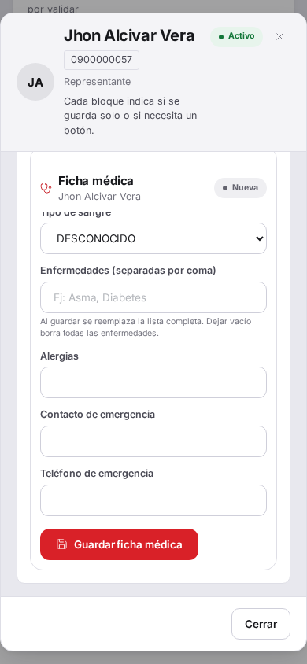

# Fix 14 · El header de la ficha médica ya pesa como un título

- **Cierra:** hallazgo directo del dueño (walkthrough del 7 de agosto de 2026): «el header de la ficha médica es muy plano».
- **Decisión que lo gobierna:** ninguna decisión de negocio nueva — es un ajuste de jerarquía visual, sin tocar campos, validaciones ni el contrato con el backend.
- **Rama:** `fix/header-ficha-medica`
- **Commits:**
  - `ee535c1` — fix(members): give the medical record header its own hierarchy

## El problema

El `<h3>` «Ficha médica» tenía el mismo peso visual que una etiqueta de campo como «Tipo de sangre»: mismo tamaño, mismo grosor, sin nada que lo distinga como título de sección. Y en pantalla angosta, el nombre del alumno solo se mostraba en el header del diálogo de edición, arriba de todo — al hacer scroll para completar los campos, ese header desaparecía y no quedaba ningún rastro de a quién le pertenecía la ficha que se estaba editando.



En desktop, con el diálogo recién abierto: el título «Ficha médica» no se distingue de un campo más.




En 390px, arriba se ve «Jhon Alcivar Vera» en el header del diálogo. Abajo, tras un solo scroll, ese nombre ya no está en ningún lado — solo queda un «Ficha médica» sin jerarquía y sin identidad.

## Qué se hizo

1. **El `<h3>` pasó de `text-sm font-bold` a `text-base font-extrabold`**, envuelto en un `<header>` propio con su ícono, en vez de compartir contenedor con los campos del formulario.
2. **Nuevo prop opcional `studentName`** en `MedicalRecordEditor`: si el caller lo pasa, se renderiza una segunda línea (`text-xs text-ink-3`) debajo del título, dentro del mismo header.
3. **Ese header es `sticky top-0`** dentro de la tarjeta, con `bg-paper` opaco y `rounded-t-2xl` para que encaje con las esquinas de la tarjeta (que dejó de recortar overflow — recortarlo habría roto el sticky, convirtiendo la tarjeta en su propio contenedor de scroll en vez de dejar que el scroll real, más arriba en el árbol, sea el que lo mueve). Mientras el usuario completa los campos y estos se desplazan hacia arriba, el título y el nombre quedan fijos en la parte superior.
4. **`members/page.tsx` ahora pasa `studentName={`${student.nombres} ${student.apellidos}`}`** al montar `MedicalRecordEditor` desde `StudentEditPanel`.
5. De paso, el badge «Nueva» se migró de un `<span>` artesanal al componente `Badge` compartido (`tone="neutral"`) — mismo lugar, sin cambiar su significado.

`studentName` es opcional a propósito: un caller sin el nombre a mano igual renderiza el editor, simplemente sin la banda de identidad.

## El candado

`src/app/members/__tests__/MedicalRecordEditor.test.tsx`, describe `"MedicalRecordEditor header hierarchy"`:

- `"gives the section title more visual weight than a field label"`
- `"shows the student's name so identity survives once the fields scroll out of view"`

Para confirmar que el candado es real (no solo "se ve bien"), reemplacé temporalmente el componente por la versión pre-fix (`git show e663953:...MedicalRecordEditor.tsx`) y corrí ambos tests:

```
❯ src/app/members/__tests__/MedicalRecordEditor.test.tsx (5 tests | 3 skipped)
  × MedicalRecordEditor header hierarchy > gives the section title more visual weight than a field label
  × MedicalRecordEditor header hierarchy > shows the student's name so identity survives once the fields scroll out of view

 Test Files  1 failed (1)
      Tests  2 failed | 3 skipped (5)
```

El segundo test ni siquiera llega a su assertion: la versión pre-fix no acepta `studentName`, así que el `heading` con el nombre nunca se renderiza y el `findByRole` hace timeout. Restaurado el componente con el fix, la suite completa de `src/app/members` corre en verde:

```
 ✓ src/app/members/__tests__/MembersPage.test.tsx (54 tests)
 ✓ src/app/members/__tests__/members-utils.test.ts (69 tests)
 ✓ src/app/members/__tests__/MedicalRecordEditor.test.tsx (5 tests)

 Test Files  3 passed (3)
      Tests  128 passed (128)
```

jsdom no hace layout ni scroll real, así que lo que el test fija es el mecanismo (`position: sticky`, el peso tipográfico, que el nombre se renderiza cuando el caller lo pasa) — la prueba de que efectivamente se queda pegado en pantalla es la captura de abajo, contra un navegador real.

## La prueba



En desktop, el título ya lee como un título — más grande, más pesado — y debajo aparece el nombre del alumno (acá, «Scarlett Moreira Pilay»), algo que antes no existía en ningún lugar de la tarjeta.




La segunda captura en 390px está tomada en la misma posición de scroll que su equivalente «antes»: el campo «Tipo de sangre» queda parcialmente tapado por el header, que se mantiene fijo arriba con «Ficha médica» y «Jhon Alcivar Vera» — exactamente lo que antes desaparecía. La identidad del alumno ya no se pierde mientras se edita.

## Lo que NO cambió

- Los campos, sus validaciones y el contrato con `fetchFichaMedica`/`actualizarFichaMedica` — el fix es puramente de jerarquía visual y de qué queda fijo en pantalla.
- El comportamiento cuando no se pasa `studentName`: el editor sigue funcionando, solo sin la segunda línea.
- El resto de `MembersPage` y sus 54 tests, y los 69 de `members-utils` — no tocados, corridos igual para confirmar que nada se rompió alrededor.

## Un consumidor más a tener en cuenta al mergear

`MedicalRecordEditor` ya no vive solo bajo `/members`. La rama `feat/ficha-medica-representante` (que no incluye este fix — sale de un `main` anterior) agrega `/student/medical-record`, la pantalla donde un representante corrige la ficha médica de su hijo, y **reutiliza el mismo componente sin cambios**:

```tsx
<MedicalRecordEditor key={selectedProfile.personaId} personaId={Number(selectedProfile.personaId)} />
```

Esa llamada **no pasa `studentName`**. Como el prop es opcional, esa pantalla va a compilar y renderizar sin problema una vez mergeadas ambas ramas — pero el header sticky ahí va a mostrar solo «Ficha médica», sin el nombre debajo, y el punto central de este fix (que la identidad del alumno no se pierda al hacer scroll) **no se cumple en ese contexto**. Esa pantalla sí tiene el nombre del alumno arriba del editor (`<h2>Ficha médica de {studentName}</h2>`), pero ese `<h2>` no es sticky — se pierde al scrollear igual que antes.

Para que el representante tenga la misma garantía que el administrador, falta un cambio de una línea en `app/student/medical-record/page.tsx` al mergear: pasar `studentName={studentName}` (la variable ya existe en ese archivo, calculada con `firstNameOf(selectedProfile.nombres)`) a la llamada de `MedicalRecordEditor`. No lo hice yo porque esa rama no forma parte de este working tree.
