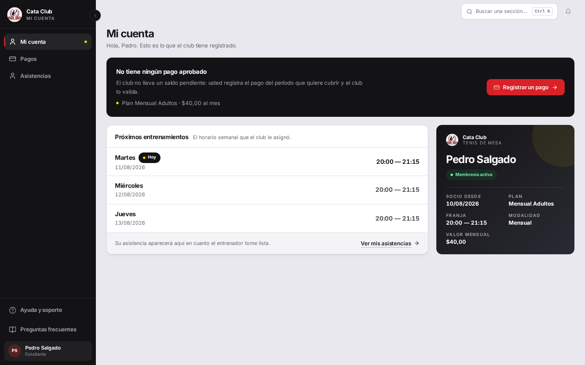
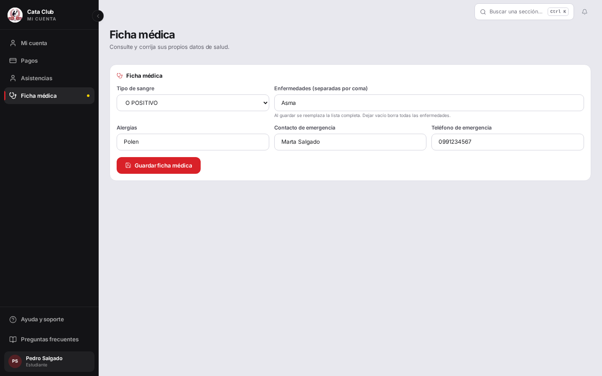
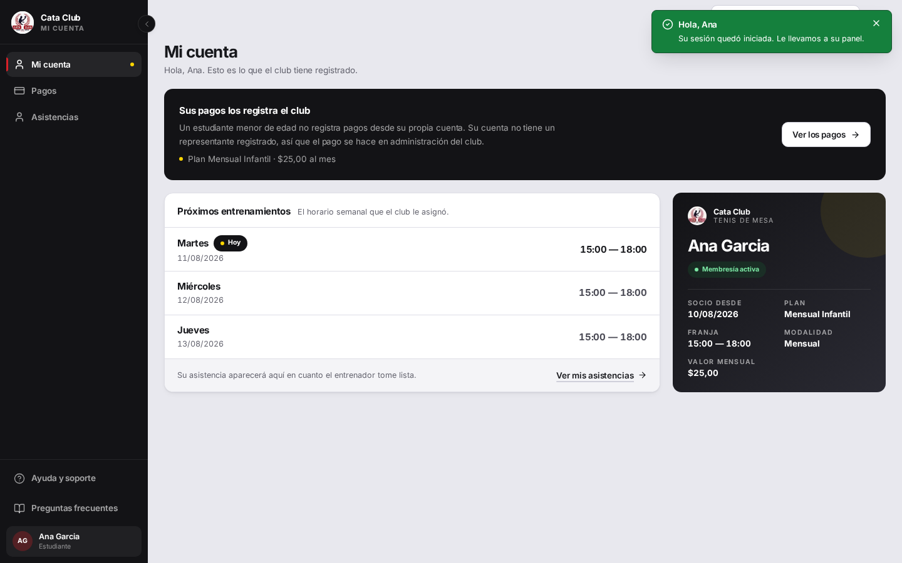

# Fix 15 · Un alumno mayor de edad puede ver su propia ficha médica

- **Cierra:** FIC-3 (parcial)
- **Decisión que lo gobierna:** un alumno MAYOR DE EDAD puede ver y corregir su propia ficha médica; un menor con cuenta propia, no — la de un menor la gestiona su representante.
- **Rama:** `feat/ficha-medica-propia`
- **Commits:**
  - `568f51d` — fix(student): let an adult titular read and correct their own ficha médica
  - `6dbfd79` — feat(auth): expose fecha_nacimiento on GET /auth/me
  - `dee6b6c` — feat(auth): gate the Ficha médica nav link to adult estudiante accounts
  - `f45d66e` — feat(student): wire the adult-estudiante nav flag into Header and AppShell
  - `139ac69` — feat(student): add /student/medical-record for an adult titular's own ficha

## El problema

Un alumno autogestionado (sin representante) no podía ver ni corregir su propia ficha médica, aunque fuera mayor de edad. El backend cerraba el acceso al titular en los dos verbos (`GET`/`PATCH /fichas-medicas/persona/{id}`), y el frontend no tenía ninguna pantalla que lo mostrara. Pedro, adulto y autogestionado, no tenía forma de corregir su propio tipo de sangre o cargar una alergia.



## Qué se hizo

**Backend:** `ficha_medica_router.py` ahora resuelve la edad del solicitante en el propio router (`_es_titular_mayor_de_edad`), no dentro de `PoliticaAccesoPersona`. La política es compartida con personas/asistencias/pagos y su `incluir_titular` por defecto no se toca — cambiarle la semántica le habría cambiado la regla a media aplicación. El router calcula si el solicitante es el titular Y es mayor de edad (reusando `EDAD_MAYORIA_EDAD`/`_calcular_edad` de `persona_servicio.py`, los mismos que ya usan `asistencia_servicio.py` y `membresia_pago_servicio.py` para el mismo corte) y le pasa el resultado a `exigir_acceso(incluir_titular=...)`. Los 403 siguen sin distinguir "persona inexistente" de "persona ajena" — la garantía anti-IDOR de la política no cambió.

Se descartó agregar un parámetro nuevo a `PoliticaAccesoPersona` (la otra opción que planteaba el brief): habría significado tocar el archivo que comparten cinco call sites por un chequeo que solo necesita uno.

`GET /auth/me` ahora devuelve `fechaNacimiento` — el frontend lo necesita para decidir, sin una llamada aparte, si mostrar el ítem de menú a un alumno autogestionado. El campo ya estaba declarado en `UsuarioEstudiante` pero nunca se poblaba.

**Frontend:** siguiendo el patrón de `feat/ficha-medica-representante` (nav vía `getNavLinksForRole`, reuso de `MedicalRecordEditor` sin tocarlo, sin pasar por `student/page.tsx`), se agregó una ruta nueva `/student/medical-record` — solo para el rol `estudiante`, y solo si `!isMinor(fechaNacimiento)`. `getNavLinksForRole` recibe un flag `studentIsAdult` acotado al caso `"estudiante"`: pasarlo en `"representante"` no hace nada, porque ese acceso (a la ficha de un representado) es un permiso distinto y no relacionado con la edad de quien lo pide. Como defensa en profundidad, si un menor escribe la URL directo, la pantalla lo redirige a `/student` apenas resuelve el perfil — el backend igual lo rechazaría con 403, esto solo evita mostrárselo crudo.

## El candado

`backend/tests/test_ficha_medica_representante.py::test_el_titular_no_lee_su_propia_ficha_medica` se partió en dos:

- `test_el_titular_menor_de_edad_no_lee_su_propia_ficha_medica` — se mantiene en 403.
- `test_el_titular_mayor_de_edad_si_lee_su_propia_ficha_medica` / `test_el_titular_mayor_de_edad_si_actualiza_su_propia_ficha_medica` — nuevos, afirman 200.

Antes del fix (los dos tests nuevos, contra el router viejo con `incluir_titular=False` fijo):

```
tests/test_ficha_medica_representante.py::test_el_titular_mayor_de_edad_si_lee_su_propia_ficha_medica FAILED
tests/test_ficha_medica_representante.py::test_el_titular_mayor_de_edad_si_actualiza_su_propia_ficha_medica FAILED

    assert respuesta.status_code == 200
E   assert 403 == 200
E    +  where 403 = <Response [403 Forbidden]>.status_code

=================== 2 failed, 11 passed, 1 warning in 1.13s ====================
```

Después:

```
tests/test_ficha_medica_representante.py::test_el_titular_menor_de_edad_no_lee_su_propia_ficha_medica PASSED
tests/test_ficha_medica_representante.py::test_el_titular_mayor_de_edad_si_lee_su_propia_ficha_medica PASSED
tests/test_ficha_medica_representante.py::test_el_titular_mayor_de_edad_si_actualiza_su_propia_ficha_medica PASSED

======================== 13 passed, 1 warning in 0.72s =========================
```

Suite completa del backend: `867 passed, 2 skipped`. Suite completa del frontend: `2451 passed` (incluye `auth-utils.test.ts`, `auth.test.ts`, y el nuevo `StudentOwnMedicalRecordPage.test.tsx`).

## La prueba


El ítem "Ficha médica" aparece en el menú de Pedro (adulto, autogestionado) — antes no estaba.



La pantalla carga y permite corregir su propia ficha: los cinco campos (`tipoSangre`, `enfermedades`, `alergias`, `contactoEmergencia`, `telefonoEmergencia`) llegan y se guardan de verdad — verificado en Postgres, no solo en el toast de éxito:

```
$ docker exec cataclub-qa-db-1 psql -U usuario -d cataclub_db -tAF'|' -c "
  select fm.id, fm.persona_id, fm.tipo_sangre, fm.alergias, fm.contacto_emergencia,
         fm.telefono_emergencia,
         (select string_agg(e.nombre_enfermedad, ',') from enfermedades e
          where e.ficha_medica_id = fm.id) as enfermedades
  from ficha_medica fm where fm.persona_id = 11;"
3|11|O_POSITIVO|Polen|Marta Salgado|0991234567|Asma
```



Ana (menor, autogestionada) sigue sin ver el ítem — su menú termina en "Asistencias".

Matriz por `curl` contra un backend propio (puerto 8001, mismo dataset de QA — el backend compartido de `:8000` corre código de otra rama):

| Caso | Esperado | Obtenido |
|---|---|---|
| Pedro (adulto, autogestionado) `GET` su propia ficha | 200 | 200 |
| Pedro (adulto) `PATCH` su propia ficha | 200 | 200 |
| Ana (menor, autogestionada) `GET`/`PATCH` su propia ficha | 403 | 403 |
| Pedro `GET` la ficha de Ana (ajena) | 403 | 403 |
| Ana escribe `/student/medical-record` directo en la URL | redirige a `/student` | redirige a `/student` |

## Lo que NO cambió

- `PoliticaAccesoPersona.incluir_titular` sigue en `True` por defecto para personas/asistencias/pagos — ningún otro call site cambió de comportamiento.
- El `POST /fichas-medicas/` (alta suelta por `persona_id`) sigue siendo ADMINISTRADOR-only.
- El acceso del representante a la ficha de un representado (`incluir_titular` no interviene ahí, es el vínculo `representante_id`) no se tocó.
- Los 403 de la política siguen sin distinguir "persona inexistente" de "persona ajena".

## Conflicto con `feat/ficha-medica-representante`

Esa rama (no mergeada todavía) agrega su propia pantalla en la misma ruta `/student/medical-record`, restringida a `allowedRoles={["representante"]}`, con un `ManagedStudentPicker` sobre `data.representados`. Esta rama sale de `main` y no tiene ese trabajo — el choque es esperado en tres archivos:

- **`frontend/src/lib/auth-utils.ts`** (`getNavLinksForRole`): esta rama agrega el link condicionado a `role === "estudiante" && studentIsAdult`. La otra rama separa el `case "estudiante"` del `case "representante"` para el link sin condición de edad. **Combinado:** un único bloque que empuja el link de representante sin condición y el de estudiante solo si `studentIsAdult`.
- **`frontend/src/app/student/medical-record/page.tsx`** y su `layout.tsx`: dos implementaciones distintas en la misma ruta. **Combinado:** una sola página que branchea por `session.user.role` — `representante` ve el picker sobre representados (contenido de esa rama), un `estudiante` adulto ve su propia ficha directo sin picker (contenido de esta rama), y un `estudiante` menor no llega a ninguna de las dos ramas del componente.
- **`frontend/src/components/Header.tsx`**: esa rama agrega el ícono `Stethoscope` para `/student/medical-record` en `NAV_ICON_MAP` — esta rama hace exactamente lo mismo. Al mergear, es el mismo cambio duplicado; no hay nada que reconciliar más allá de quedarse con una sola entrada.

Ningún conflicto es de lógica de negocio — los dos criterios de acceso (representante vs. titular mayor de edad) son independientes y ya conviven sin pisarse en el backend (`PoliticaAccesoPersona` resuelve ambos vínculos por separado).
