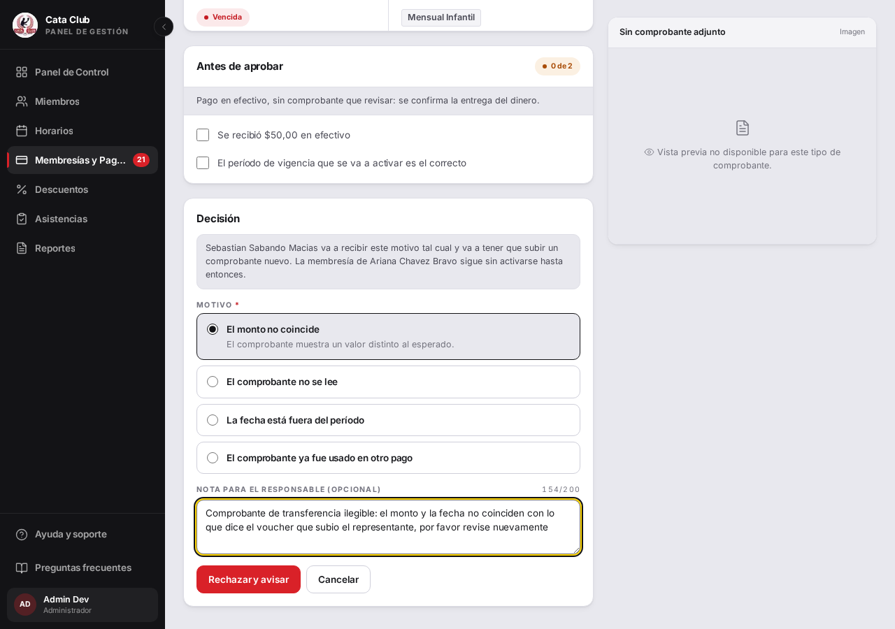

# Fix 17 · Un aviso largo no puede dejar la base a medias

- **Cierra:** hallazgo en vivo, 2026-08-11 (encontrado mirando los logs del backend de QA; PAG-2 ya se había cerrado en el fix 04, pero ese fix era del frontend — no tocaba esta causa)
- **Decisión que lo gobierna:** decisión de negocio §1 (`docs/decisiones-de-negocio-2026-08-11.md`), guardarraíl 2 — "si el chico ya tenía representante, al anterior le llega el aviso, con forma de deshacerlo"
- **Rama:** `fix/notificacion-no-revienta`
- **Commits:**
  - `ece8617` — fix(notifications): stop a long message from crashing the insert
  - `83e3b1d` — fix(payments): keep a rejected payment and its notice in sync
  - `2ca5523` — fix(notifications): guard every other site that names a person
  - `62c5ab9` — fix(payments): cap the rejection note and surface a failed notice

## El problema

Rechazar un pago con una nota de nota larga (menos de 255 caracteres, el tope del campo del admin, pero suficiente una vez que se le agrega el texto fijo alrededor) hacía que el aviso al representante reventara un `INSERT` con `DataError`. Para cuando eso pasaba, el rechazo del pago ya estaba commiteado en Postgres: la pantalla le decía al administrador que había fallado, el representante nunca recibía el aviso, y el pago quedaba rechazado igual. El mismo patrón — un nombre de persona sin tope embebido en un mensaje con columna de ancho fijo — amenazaba el aviso al representante anterior cuando alguien vincula un chico ya registrado.


## Qué se hizo

Tres cosas, cada una resolviendo una parte distinta del hallazgo:

1. **Que una notificación larga no reviente — ambas cosas, no una.** `notificacion.mensaje` creció de `VARCHAR(255)` a `VARCHAR(500)` (el peor caso real hoy, con los anchos de `Persona.nombres`/`apellidos`, es ~488 caracteres) vía migración de Alembic. Además, `Notificacion` lleva un `@validates("mensaje")` que trunca cualquier mensaje que igual supere ese máximo, con un aviso en el log — último resorte que cubre cualquier escritor, presente o futuro, incluido `alertas_tareas.py`, que escribe directo con `db.add_all(...)` sin pasar por `NotificacionRepositorio`. Se descartó confiar solo en agrandar la columna: un nombre de persona no tiene tope real, así que el mensaje siempre puede volver a acercarse al límite.
2. **Que el pago y su notificación no puedan quedar desparejos.** `_crear_notificacion_pago` ya no relanza: devuelve si el aviso salió, y `validar_pago` expone eso como `aviso_no_enviado` en la respuesta del `PATCH /pagos/{id}/validar` — un `200` que dice la verdad completa en vez de un `500` genérico (que además, por diseño del frontend, nunca le habría mostrado el motivo real al admin: un `detail` 5xx no llega al usuario). El frontend lee ese campo y, si vino en `true`, dispara un toast de advertencia aparte —distinto del de éxito, que ya se había mostrado optimísticamente antes de que el `commit` real terminara.
3. **Que el cliente frene antes.** El campo "Nota para el responsable" ahora tiene `maxLength` y un contador en vivo (`154/200`), calculado para que la razón compuesta (`"<motivo tipificado> — <nota>"`) nunca se acerque al límite real del backend (255 en `motivo_rechazo`), sin importar cuál de los cuatro motivos tipificados se eligió.

**Al recortar, se recorta lo que no importa.** En el aviso al representante de un pago, si el mensaje wrapeado ("Para \<nombre\>: \<motivo\>") tuviera que acortarse, lo que se acorta es el nombre del alumno — el motivo del rechazo nunca se toca, porque es lo que el representante necesita leer. Mismo criterio en el aviso de vinculación al representante anterior.

**Buscá los demás — qué se revisó.** Los cinco sitios que escriben en `notificacion` (`grep`-eados, no adivinados): el rechazo/aprobación de pago (`membresia_pago_servicio.py`, dos veces — el propio y el del representante), la vinculación de un representado (`persona_servicio.py`), la nueva inscripción (`enrollment_servicio.py`) y el vencimiento de membresía (`alertas_tareas.py`, dos veces). De los cinco, **tres** interpolan un nombre de persona sin tope (el del alumno rechazado, el del representado vinculado, el del alumno inscrito/con membresía por vencer) — los tres ahora pasan por el mismo `acortar_nombre_para_notificacion`. El de pago rechazado además compone con la nota libre del admin, que es lo que realmente reventaba en producción; el resto (pago aprobado, vencimiento del propio alumno) usa texto fijo sin variables largas y nunca estuvo en riesgo real, pero igual queda cubierto por el candado sistémico (columna + `@validates`).

## El candado

`TestNotificacionPago::test_pago_rechazado_con_nota_larga_no_revienta_y_preserva_el_motivo` (`backend/tests/test_notificaciones.py`) y `test_vincular_representado_con_nombres_largos_no_revienta` (`backend/tests/test_vincular_representado.py`).

Antes del fix (reproducido en vivo contra el backend real de QA, no solo en el test — `PATCH /membresias/pagos/19/validar` con una nota de 253 caracteres):

```
sqlalchemy.exc.DataError: (psycopg.errors.StringDataRightTruncation) value too long for type character varying(255)
[SQL: INSERT INTO notificacion (tipo, mensaje, leida, fecha_creacion, entidad_relacionada_id, persona_id) VALUES (...)]
HTTP 500
```
Y en Postgres, después de ese 500: `pago.estado_pago = RECHAZADO` (commiteado) y `SELECT ... FROM notificacion WHERE entidad_relacionada_id = 19` → 0 filas.

Después del fix (test y reproducción en vivo contra QA reconstruida con el fix, pago fresco id=75):

```
tests/test_notificaciones.py::TestNotificacionPago::test_pago_rechazado_con_nota_larga_no_revienta_y_preserva_el_motivo PASSED
tests/test_vincular_representado.py::test_vincular_representado_con_nombres_largos_no_revienta PASSED
2 passed, 1 warning in 0.60s
```
`PATCH /membresias/pagos/75/validar` con la misma nota de 253 caracteres → `HTTP 200`, `avisoNoEnviado: false`, y en Postgres: `pago.estado_pago = RECHAZADO` con `motivo_rechazo` íntegro, más dos filas en `notificacion` (alumno y representante) con el motivo completo, sin recortar.

## La prueba



Antes, el campo no mostraba ningún límite ni conteo; después, "NOTA PARA EL RESPONSABLE (OPCIONAL)" muestra "154/200" en vivo mientras se escribe, y el `textarea` no deja escribir más allá de 200 caracteres.

## Lo que NO cambió

- La regla de negocio del rechazo: el pago se rechaza igual, con el mismo motivo tipificado y la misma nota libre; lo único que cambió es que el aviso ahora acompaña (o, si falla por algo imprevisto, el admin se entera en vez de que quede en silencio).
- El tope de 255 caracteres de `motivo_rechazo` en el backend (`PagoValidarDTO`, Pydantic): sigue igual. El campo del cliente se acota a 200 para la NOTA libre, con margen para el motivo tipificado más largo — no se tocó el contrato del backend.
- Los cuatro guardarraíles de la decisión de negocio §1 (vinculación sin aprobación, auditoría, anti-enumeración, tope de intentos): ninguno se modificó. Este fix solo blinda el aviso al representante anterior que esos guardarraíles ya requerían.
- El patrón de "loguear y no propagar" para el PDF de comprobante (`_disparar_generacion_comprobante_pdf`) sigue igual — no es el mismo caso: ese efecto posterior tiene su propia tarea de reconciliación; el aviso de notificación no la tenía, por eso necesitaba una señal explícita al admin en vez de solo un log.
