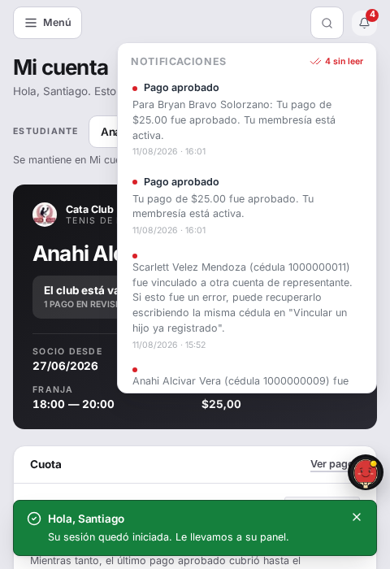
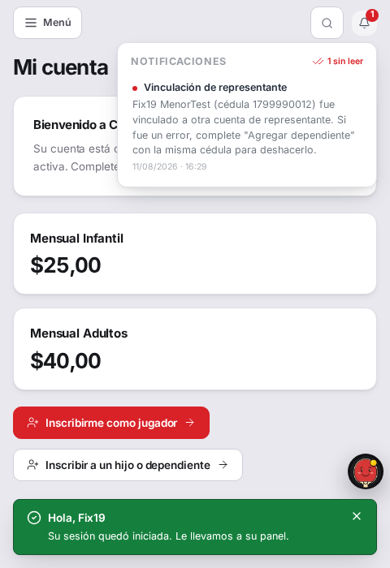
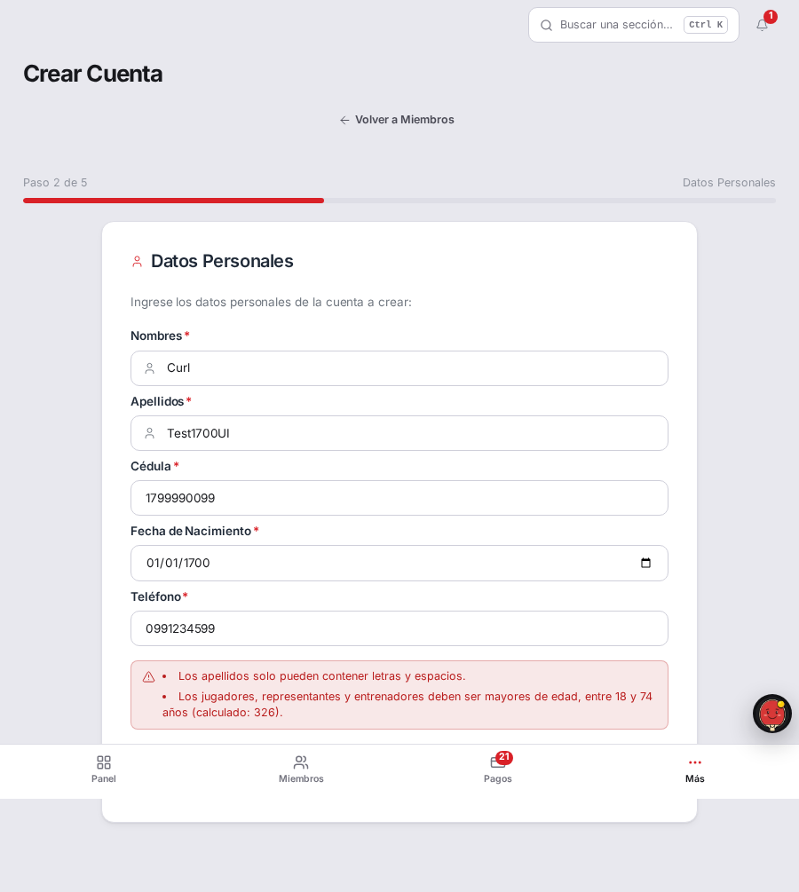

# Fix 19 · Tres costuras de la tanda de vinculación y edad

- **Cierra:** aviso de vinculación sin título en el frontend; el mismo aviso
  manda a una pantalla que no existe; `/admin/crear-cuenta` acepta una edad
  imposible para Jugador, Representante y Entrenador.
- **Decisión que lo gobierna:** `docs/decisiones-de-negocio-2026-08-11.md` §1
  — el aviso al representante anterior es uno de los cuatro guardarraíles que
  el dueño pidió para la vinculación directa por cédula.
- **Rama:** `fix/costuras-vinculacion-y-edad`
- **Commits:**
  - `64da29a` — fix(admin): cap age for adult accounts in crear-cuenta
  - `e12854f` — fix(admin): cap age client-side for adult accounts too
  - `0666153` — fix(notifications): add VINCULACION_REPRESENTANTE to frontend type map
  - `886dc13` — fix(notifications): point the undo hint at the real add-dependent screen

## a · El aviso de vinculación llega sin título

### El problema

El backend emite notificaciones de tipo `VINCULACION_REPRESENTANTE`, pero el
mapa de tipos del frontend (`frontend/src/types/domain.ts`) solo conocía
cuatro de los cinco valores que el backend define. Sin el tipo en el mapa,
`NotificationBell.tsx` no tenía a qué título asignarle el aviso: un mensaje
sobre la custodia de un menor se mostraba sin negrita y sin categoría, más
degradado que un aviso de pago.



### Qué se hizo

Se agregó `"VINCULACION_REPRESENTANTE"` a la unión `TipoNotificacion` de
`domain.ts` y su etiqueta ("Vinculación de representante") a `TIPO_LABELS` en
`NotificationBell.tsx`. Como `TIPO_LABELS` está tipado como
`Record<TipoNotificacion, string>`, TypeScript ya exige una etiqueta por cada
miembro del tipo — eso evita que un tipo presente en la unión quede sin
etiqueta. Lo que no evita es que la unión misma se atrase respecto del enum
del backend, que es exactamente lo que pasó acá: nada comparaba los dos
lados.

Se agregó un candado nuevo,
`frontend/src/types/__tests__/tipo-notificacion-parity.test.ts`, que lee
`backend/app/dominio/enums.py` y `frontend/src/types/domain.ts` como texto y
compara los dos conjuntos de miembros. Se verificó que efectivamente detecta
la regresión: revirtiendo solo `domain.ts` a su estado anterior, el test cae
con `VINCULACION_REPRESENTANTE` señalado como faltante.

**Otros tipos de notificación sin mapear:** ninguno. El backend define
exactamente cinco (`MIEMBRESIA_VENCIMIENTO_PROXIMO`, `PAGO_APROBADO`,
`PAGO_RECHAZADO`, `NUEVA_INSCRIPCION`, `VINCULACION_REPRESENTANTE`); con este
fix el frontend conoce los cinco, y el candado nuevo se encarga de que la
próxima vez que se agregue un sexto, la prueba lo señale en vez de dejarlo
en silencio.

### El candado

`NotificationBell — shows a real title for VINCULACION_REPRESENTANTE, not a
blank one` en `frontend/src/components/__tests__/NotificationBell.test.tsx`,
más `TipoNotificacion — frontend union stays in sync with the backend enum`
en `frontend/src/types/__tests__/tipo-notificacion-parity.test.ts`.

```
# Antes del fix (dominio.ts sin VINCULACION_REPRESENTANTE):
 ❯ NotificationBell > shows a real title for VINCULACION_REPRESENTANTE, not a blank one
   AssertionError: expected <p /> to have text content matching /vinculaci[oó]n/i
 ✕ 1 failed | 8 passed (9)

 ❯ tipo-notificacion-parity > every backend TipoNotificacion value has a matching frontend literal
   AssertionError: expected [ 'VINCULACION_REPRESENTANTE' ] to deeply equal []
 ✕ 2 failed | 2 passed (4)

# Después del fix:
 ✓ src/components/__tests__/NotificationBell.test.tsx (9 tests) 144ms
 ✓ src/types/__tests__/tipo-notificacion-parity.test.ts (4 tests) 3ms
```

### La prueba



Antes, el tercer aviso de la lista no tenía ninguna línea en negrita arriba
del mensaje. Después, dice "Vinculación de representante" en negrita, igual
de claro que "Pago aprobado".

### Lo que NO cambió

El resto de `TIPO_LABELS` (pago, membresía, inscripción) sigue igual. El
candado de paridad no interviene en el runtime: es una prueba, no una
validación que corra en producción.

---

## b · El aviso dice cómo deshacerlo, y ese camino no existe

### El problema

El mensaje le decía al representante anterior: *"puede recuperarlo
escribiendo la misma cédula en 'Vincular un hijo ya registrado'"*. Esa
pantalla no existe con ese nombre. El camino real es abrir "Agregar
dependiente", completar el asistente hasta el paso final con la misma
cédula del menor, dejar que salte el error de cédula duplicada, y desde ahí
usar el botón "Vincular a mi cuenta" que aparece junto al error.

(Ver también la captura de "antes" de la sección **a**: el mismo aviso
muestra el texto viejo.)

### Qué se hizo

Se cambió el mensaje en `persona_servicio.py::_notificar_representante_anterior`
para que nombre la pantalla real: *"Si fue un error, complete 'Agregar
dependiente' con la misma cédula para deshacerlo."*

Se decidió NO detallar el paso final ("hasta que salte el error, y ahí toque
'Vincular a mi cuenta'") dentro del mensaje. Escribirlo completo lo hacía
largo y con forma de instructivo, no de aviso — y esa dificultad para
resumirlo en una frase corta es la señal de que el camino real tiene más
fricción de la que debería: hoy exige completar los tres pasos del
asistente completo (datos del menor, credenciales opcionales, ficha médica)
antes de que aparezca el botón de deshacer, cuando lo único que hace falta
es la cédula. Arreglar esa fricción es un cambio de flujo, no de texto, y
queda fuera del alcance de este fix — se deja anotado acá para que no se
pierda.

### El candado

`test_vincular_representado_notifica_al_representante_anterior` en
`backend/tests/test_vincular_representado.py`.

```
# Antes del fix:
E   assert 'Agregar dependiente' in notif.mensaje
E    +  where notif.mensaje = '...Si esto fue un error, puede recuperarlo
       escribiendo la misma cédula en "Vincular un hijo ya registrado".'
FAILED tests/test_vincular_representado.py::test_vincular_representado_notifica_al_representante_anterior

# Después del fix:
21 passed, 1 warning in 3.33s
```

### La prueba

Ver la captura de "después" de la sección **a** — el mismo aviso, esta vez
con el mensaje real: *"Fix19 MenorTest (cédula 1799990012) fue vinculado a
otra cuenta de representante. Si fue un error, complete 'Agregar
dependiente' con la misma cédula para deshacerlo."*

### Lo que NO cambió

El flujo de "Vincular a mi cuenta" en sí (`add-dependent-utils.ts`,
`WizardNavigation`) no se tocó — sigue exigiendo pasar por el asistente
completo, que es la fricción anotada arriba y no la resuelve este fix.

---

## c · `/admin/crear-cuenta` acepta una edad imposible

### El problema

El endpoint aceptaba una fecha de nacimiento de 1700 (326 años) para
Jugador, Representante y Entrenador, sin aviso ni en el cliente ni en el
servidor. La causa era distinta en cada lado:

- **Servidor** (`admin_cuenta_servicio.py`): la rama de cuentas adultas solo
  validaba el piso (`edad < EDAD_MAYORIA_EDAD`), nunca el techo.
- **Cliente** (`crear-cuenta-utils.ts`): usaba `calculateAge`, que devuelve
  `NaN` para años fuera de 1900-2200. `NaN < 18` es `false`, así que la
  comprobación de "menor de edad" nunca disparaba — el mismo defecto de fondo
  que tenía `add-dependent-utils.ts` antes del fix de hoy en ese formulario.

### Qué se hizo

**Servidor:** la rama de `TIPOS_CUENTA_ADULTA` en `admin_cuenta_servicio.py`
ahora valida `EDAD_MAYORIA_EDAD <= edad <= EDAD_MAXIMA_ALUMNO` (18 a 74). No
se inventó una cota nueva: JUGADOR y REPRESENTANTE ya reciben el rol ALUMNO
(`ROLES_POR_TIPO_CUENTA`), así que `EDAD_MAXIMA_ALUMNO` no es una cota
prestada para ellos. ENTRENADOR no recibe ese rol, pero es el único techo
que el sistema define y una persona de más de 74 años dictando
entrenamientos es igual de implausible que un jugador de esa edad — se
prefirió reutilizarlo antes que inventar un número nuevo sin respaldo.

**Cliente:** se agregó `edadDesdeFecha`, una versión de la edad que NO capa
el año de entrada (mismo patrón que `add-dependent-utils.ts::edadDesdeFecha`,
agregado hoy para el mismo bug en el formulario de dependientes), y se
reemplazó `calculateAge` por esta función en la validación de edad de
`validatePersonal`. De paso quedó protegido el caso MENOR con la misma fecha
imposible, que tenía el mismo agujero por la misma razón (`NaN >= 18` y
`NaN < 5` son ambos `false`) aunque el hallazgo original no lo nombrara.

**Otros formularios con fecha de nacimiento sin techo:** se encontró un
tercero. `/student/enroll` (autoinscripción pública) valida el techo de edad
del alumno correctamente en el servidor
(`enrollment_servicio.py:55`, `EDAD_MINIMA_ALUMNO`–`EDAD_MAXIMA_ALUMNO`), pero
la fecha de nacimiento del **representante** que inscribe a un hijo
(`enrollment_servicio.py:74` y su espejo en
`frontend/src/app/student/enroll/enroll-utils.ts:316-319`) solo valida el
piso (`>= 18`), nunca el techo — el mismo patrón que tenía
`admin/crear-cuenta` para REPRESENTANTE antes de este fix. Queda fuera del
alcance de este documento (el hallazgo original solo nombra
`/admin/crear-cuenta`); se deja anotado para que no lo encuentre otra
auditoría.

### El candado

`test_edad_imposible_rechazada_para_cuentas_adultas` (parametrizado por
JUGADOR/REPRESENTANTE/ENTRENADOR) en
`backend/tests/test_admin_cuenta_servicio.py`, y
`validateCrearCuentaForm — edad imposible (326 años)` en
`frontend/src/app/admin/crear-cuenta/__tests__/crear-cuenta-utils.test.ts`.

```
# Backend, antes del fix:
E       assert 201 == 400
E        +  where 201 = <Response [201 Created]>.status_code
FAILED test_edad_imposible_rechazada_para_cuentas_adultas[JUGADOR-...]
FAILED test_edad_imposible_rechazada_para_cuentas_adultas[REPRESENTANTE-...]
FAILED test_edad_imposible_rechazada_para_cuentas_adultas[ENTRENADOR-...]

# Backend, después del fix:
27 passed

# Frontend, antes del fix:
 × rejects JUGADOR born in 1700 — expected '' to match /74/
 × rejects REPRESENTANTE born in 1700 — expected '' to match /74/
 × rejects ENTRENADOR born in 1700 — expected '' to match /74/
 × rejects a MENOR born in 1700 too — expected [] to not deeply equal []
 4 failed | 5 passed (9)

# Frontend, después del fix:
 ✓ crear-cuenta-utils.test.ts (9 tests) 4ms
```

### La prueba



Al completar "Datos Personales" con tipo Jugador y fecha de nacimiento
01/01/1700, "Siguiente" queda bloqueado por el mensaje "Los jugadores,
representantes y entrenadores deben ser mayores de edad, entre 18 y 74 años
(calculado: 326)."

Por `curl`, contra un backend propio (puerto 8011, sin tocar el contenedor
compartido) con la misma base de QA:

```
POST /api/v1/personas/admin/cuentas {"tipo_cuenta":"JUGADOR", "fecha_nacimiento":"1700-01-01", ...}
→ 400 {"detail":"Los jugadores deben ser mayores de edad, entre 18 y 74 años (calculado: 326)."}

POST /api/v1/personas/admin/cuentas {"tipo_cuenta":"REPRESENTANTE", "fecha_nacimiento":"1700-01-01", ...}
→ 400 {"detail":"Los representantes deben ser mayores de edad, entre 18 y 74 años (calculado: 326)."}

POST /api/v1/personas/admin/cuentas {"tipo_cuenta":"ENTRENADOR", "fecha_nacimiento":"1700-01-01", ...}
→ 400 {"detail":"Los entrenadores deben ser mayores de edad, entre 18 y 74 años (calculado: 326)."}
```

Se verificó en Postgres que ninguna de las tres cuentas se creó (los tres
intentos quedaron rechazados antes del insert), y se borraron las cuentas de
prueba usadas para las capturas de las secciones **a** y **b** (personas de
prueba `Fix19 RepresentanteA/B/MenorTest`, creadas y eliminadas dentro de
esta sesión).

### Lo que NO cambió

`EDAD_MINIMA_ALUMNO`, `EDAD_MAXIMA_ALUMNO` y `EDAD_MAYORIA_EDAD` siguen
siendo 5, 74 y 18 — no se agregó ninguna cota nueva. La validación de MENOR
en `admin_cuenta_servicio.py` (servidor) no cambió: ya validaba el techo
correctamente. `/student/enroll` no se tocó (ver el hallazgo anotado
arriba).
