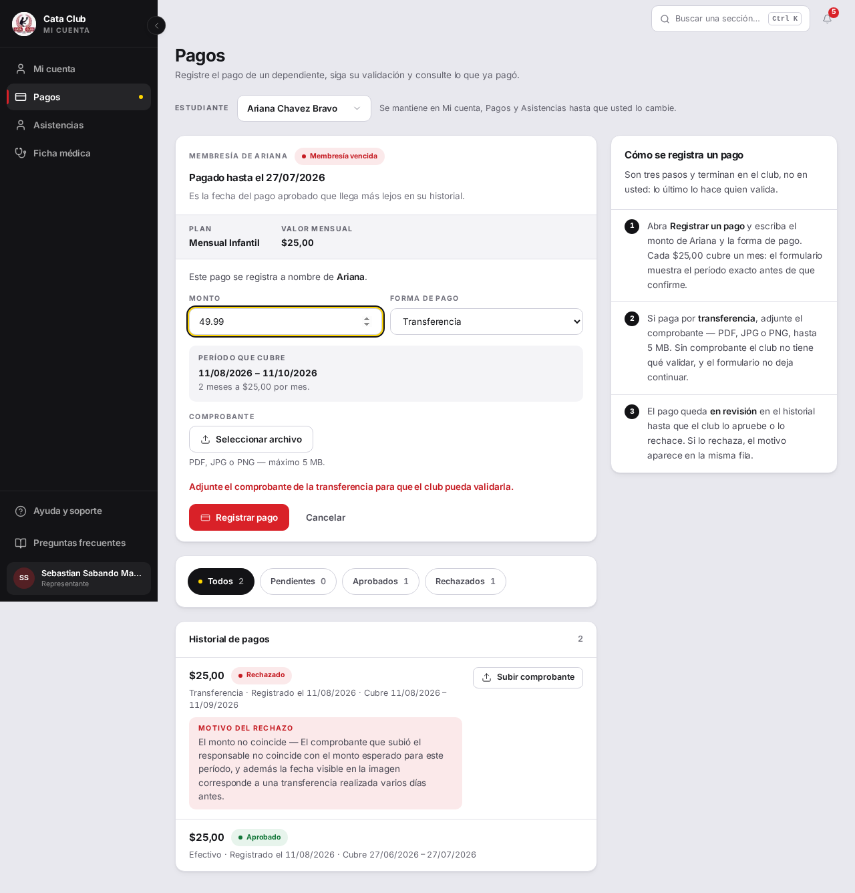
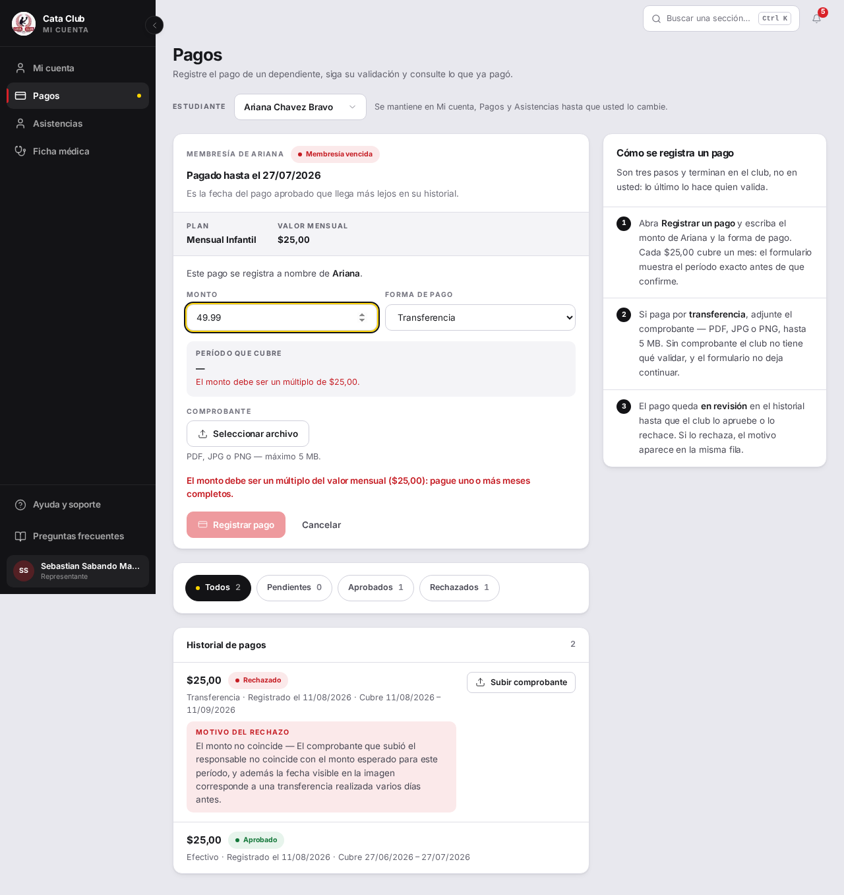

# Fix 20 · El resumen de compra mentía: aceptaba un monto que el backend rechazaba

- **Cierra:** hallazgo nuevo (fuera de la numeración de la auditoría del 10 de
  agosto — reportado directamente, no aparece como PAG-N en
  `docs/auditoria-qa/README.md`). Relacionado con PAG-5, que dejó
  `findProblem()` visible mientras se escribe; este fix corrige lo que ese
  mensaje decide mostrar.
- **Decisión que lo gobierna:** `decisiones-de-negocio-2026-08-11.md` §6 —
  «la regla del múltiplo exacto SE QUEDA» (`monto % precio != 0`,
  `membresia_pago_servicio.py:308`).
- **Rama:** `fix/monto-sin-tolerancia`
- **Commits:** `df272c2` — fix(payments): compare cents, not a float tolerance, for whole months

## El problema

Con una cuota de $25, escribir $49,99 pasaba una tolerancia de 0,001 en
`wholeMonthsFor()`: la pantalla mostraba «2 meses», el período de cobertura y
dejaba avanzar hasta la confirmación. Recién ahí, al enviar, el backend lo
rechazaba con su regla exacta (`Decimal`). El monto nunca se perdía, pero el
resumen de compra le prometía al padre algo que el sistema no iba a cumplir.



## Qué se hizo

`wholeMonthsFor` ahora compara en **centavos enteros** en vez de dividir
flotantes con margen de error: redondea `amount * 100` y `monthlyPrice * 100`
al entero más cercano y exige `amountCents % priceCents === 0`. Esto imita
la exactitud de `Decimal` en el backend sin adoptar aritmética decimal en el
cliente — el ruido binario de `* 100` (p. ej. `40.8 * 100 === 4079.999...`)
queda muy por debajo del margen de redondeo de medio centavo, así que sigue
resolviendo casos legítimos como `40.8 / 13.6 = 3 meses`. Se agregó además una
guarda con `Number.isSafeInteger` para no confiar en el resultado de `%` más
allá de `Number.MAX_SAFE_INTEGER` centavos.

Se descartó sacar la tolerancia a secas (dividir y comparar con `!==`
estricto): eso rompe montos legítimos como $40,80 contra una cuota de $13,60,
que el propio comentario original documentaba como motivo de la tolerancia.
También se descartó traer una librería de decimales al cliente solo para
esta función — centavos enteros alcanza porque los montos en el dominio
siempre tienen como máximo dos decimales.

## El candado

`wholeMonthsFor > rejects an amount the old 0.001 tolerance let through as a
false 2 months`, en
`frontend/src/app/student/payments/__tests__/payments-utils.test.ts`.

```
# Antes del fix
 ❯ src/app/student/payments/__tests__/payments-utils.test.ts (38 tests | 2 failed)
   × wholeMonthsFor > rejects an amount the old 0.001 tolerance let through as a false 2 months
     → expected 2 to be null
   × wholeMonthsFor > rejects amounts just below and just above an exact multiple
     → expected 1 to be null
 Tests  2 failed | 36 passed (38)

# Después del fix
 ✓ src/app/student/payments/__tests__/payments-utils.test.ts (38 tests) 16ms
 Test Files  1 passed (1)
      Tests  38 passed (38)
```

Suite completa del frontend, sin regresiones: `Test Files 169 passed (169)`,
`Tests 2549 passed (2549)`.

## La prueba



Con el fix, escribir $49,99 (cuota $25,00) muestra en vivo «El monto debe ser
un múltiplo de $25,00», sin período de cobertura, y el botón «Registrar pago»
queda deshabilitado — ya no llega a la confirmación. Verificado además
directo contra el backend (`sebastiansabando21@cataclub.com`, Ariana,
`membresiaId=26`, `personaId=37`):

- `POST /membresias/pagos` con `monto=49.99` → `422`, `"El monto ($49.99) debe
  ser múltiplo del precio mensual ($25.00)."` — el mismo texto que ahora
  bloquea en el cliente.
- `POST /membresias/pagos` con `monto=50` (múltiplo exacto) → `201`,
  `PENDIENTE_VALIDACION` — lo que el cliente ahora acepta, el backend también
  lo acepta.

## Lo que NO cambió

- El adelanto de meses sigue funcionando: 2× y 12× la cuota siguen dando 2 y
  12 meses (cubierto por los tests existentes de múltiplo exacto).
- La validación sigue corriendo sobre el monto **base**, antes de aplicar
  cualquier descuento — no se tocó ese orden en `page.tsx` ni en el backend.
- `findProblem()` y su exposición en vivo mientras se escribe (PAG-5) no se
  tocaron: solo cambió qué decide `wholeMonthsFor`, no cómo ni cuándo se
  muestra el mensaje.
- El formulario de administración (`members/page.tsx:334`, comparación
  exacta con `%`) no tenía este bug y no se modificó.
