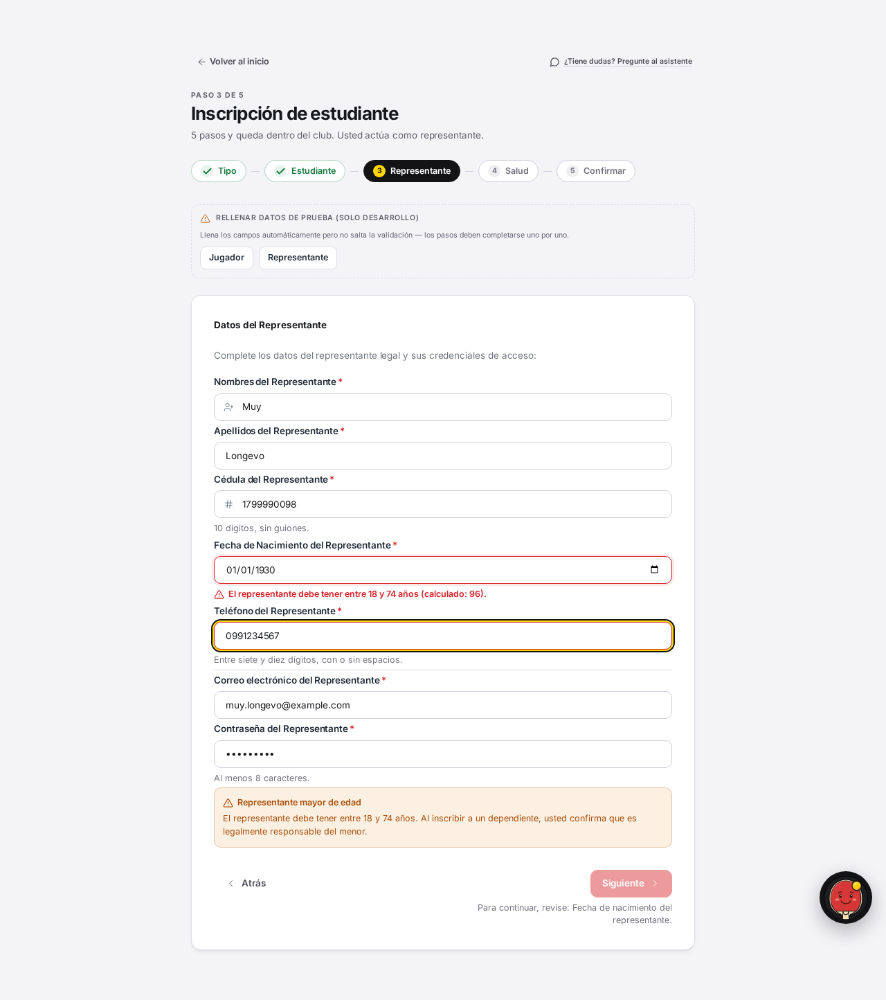

# Fix 21 · La edad que se comparaba contra NaN y pasaba en silencio

- **Cierra:** el defecto de origen detrás de INS-8 (`/student/add-dependent`,
  226 años) y del bypass ya corregido en `/admin/crear-cuenta` (1700 años) —
  ambos fixes anteriores le escribieron un cálculo de edad local en vez de
  arreglar el compartido, que seguía roto. No tiene un id de auditoría
  propio: es un encargo directo post-auditoría para atacar la raíz en vez
  del cuarto síntoma.
- **Decisión que lo gobierna:** ninguna de `docs/decisiones-de-negocio-2026-08-11.md`
  — es un fix de defecto, no una regla de negocio nueva. Reutiliza los
  límites ya existentes (`EDAD_MINIMA_ALUMNO`, `EDAD_MAXIMA_ALUMNO`,
  `EDAD_MAYORIA_EDAD` en `persona_servicio.py`).
- **Rama:** `fix/edad-nan-en-la-raiz`
- **Commits:**
  - `fca9eed` — fix(enroll): stop calculateAge from capping birth years into NaN
  - `d6a97c0` — fix(enrollment): reject a representante past the age ceiling
  - `160b27e` — refactor(frontend): unify duplicated age calculations

## El problema

`calculateAge` acotaba el año de nacimiento entre 1900 y 2200 y devolvía
`NaN` fuera de ese rango. Toda comparación con `NaN` (`< 18`, `> 74`) da
`false`, así que una fecha de nacimiento imposible no fallaba una
validación: la esquivaba en silencio, justo cuando el dato era más
absurdo. El defecto ya había aparecido tres veces — en `/student/enroll`,
en `/student/add-dependent` (INS-8) y en `/admin/crear-cuenta` — y cada vez
alguien lo trató como un problema local y le escribió un cálculo de edad
aparte en vez de arreglar el compartido, que seguía esperando al cuarto.


## Qué se hizo

1. **`calculateAge` (enroll-utils.ts) ya no acota el año.** `NaN` queda
   reservado para lo que de verdad no es una fecha calendario válida
   (formato incorrecto, componentes no enteros, un mes/día imposible, un 29
   de febrero fuera de año bisiesto). Cualquier fecha sintácticamente
   válida — sin importar cuán implausible el año — produce un entero real y
   comparable, así que el chequeo de dominio del llamador (`EDAD_MINIMA` /
   `EDAD_MAXIMA`) la atrapa por nombre en vez de que se la salte. Un año tan
   extremo que `Date` no puede representarlo (ej. 999999) sigue devolviendo
   `NaN` — no por plausibilidad, sino porque el chequeo de ida y vuelta con
   `new Date(...)` ya existente lo detecta como `Invalid Date`, igual que
   detecta un 31 de febrero.

   Se descartaron las otras dos formas que ofrecía el pedido — un tipo que
   obligue a manejar el caso (unión discriminada `{ok: true, age} | {ok:
   false}`) hubiera roto la firma en 8+ sitios de llamada sin agregar
   seguridad real, porque cada uno de esos sitios ya filtra con `isDate()` o
   ya compara el resultado contra `NaN` explícitamente antes de usarlo. La
   plausibilidad de una edad (¿es creíble que una persona tenga esta edad?)
   es una regla de DOMINIO, no del parser: le corresponde a
   `EDAD_MINIMA_ALUMNO`/`EDAD_MAXIMA_ALUMNO` en el sitio de uso, no a esta
   función.

2. **Se verificaron los 7 usos de `calculateAge`** después del cambio:
   `isDate()` (ahora correctamente distingue "no es una fecha" de "es una
   fecha implausible"), la regla del alumno en `enroll-utils.ts` (piso
   18, sin cambios — fuera de alcance de este fix), la regla del
   representante (ver punto 4), y cuatro usos de solo VISUALIZACIÓN
   (`members/page.tsx` con su propio cálculo aparte, `wizard-fields.tsx`,
   y los resúmenes de `enroll/page.tsx`, `add-dependent/page.tsx`,
   `crear-cuenta/page.tsx`) que ya protegían contra `NaN` con
   `!Number.isNaN(age)` / `ageValid` antes de mostrarlo — protegidos por
   accidente donde antes hacía falta, y siguen protegidos ahora que ya no
   hace falta.

3. **Se unificaron los dos duplicados que sí servían para lo mismo:**
   `add-dependent-utils.ts::edadDesdeFecha` y
   `crear-cuenta-utils.ts::calculateAge` (esta última, todavía con el bug
   original sin corregir en esta rama) ahora importan el `calculateAge`
   compartido y arreglado, en vez de cargar su propia copia. No se tocó
   `members/page.tsx::calculateAge`: es de solo visualización, usa
   `new Date()` en vez de parseo por componentes (un problema distinto,
   de huso horario, no de este defecto) y no gatea ninguna validación.

4. **Se cerró el cuarto agujero:** la fecha de nacimiento del representante
   al inscribir a un dependiente (`/student/enroll`) validaba el piso
   (`>= 18`) y nunca el techo — ni en `enrollment_servicio.py:74` ni en su
   espejo `enroll-utils.ts`. Ambos ahora validan las dos cotas, igual que
   ya hace la del alumno, reutilizando `EDAD_MAXIMA_ALUMNO` (74) como techo
   — el único que este sistema define.

5. **Búsqueda de un quinto caso** (`rg` por cálculos de edad y validaciones
   de fecha de nacimiento en todo el repo): el backend tiene un solo
   `_calcular_edad` (Python, sin `NaN`, todos sus 8 usos pasan por él).
   Del lado del frontend encontré un QUINTO cálculo de edad duplicado,
   `student-utils.ts::isMinor` — el "age gate" que oculta/restringe
   `/student/payments` y el header para un alumno menor. No comparte el
   defecto de `calculateAge` (no acota el año, así que no devuelve `NaN`
   por esa razón), pero SÍ es otro cálculo hecho a mano, sin el
   chequeo de ida y vuelta contra `Date` que detecta un 31 de febrero.
   Queda fuera de este fix porque opera sobre datos YA validados al
   entrar al sistema (no es un punto de validación de un formulario) y su
   fallo seguro (`false` ante fecha vacía/malformada) no bloquea acceso —
   lo dejo anotado para quien lo evalúe después. También quedan, sin
   tocar a propósito, dos chequeos de techo faltante estructuralmente
   parecidos al del punto 4 pero fuera del pedido explícito:
   `persona_servicio.py:107` (representante de un `crear_representado`) y
   `admin_cuenta_servicio.py:112` — ninguno de los dos involucra `NaN`
   ni un formulario nuevo con dato crudo del usuario.

## El candado

`computes a real (large) age for a year before 1900, instead of NaN` y
sus tres vecinas en `frontend/src/app/student/enroll/__tests__/calculateAge.test.ts`.
También `rejects an implausibly old representante birth date instead of
letting it through` en `validateEnrollFields.test.ts`, y
`test_representante_edad_maxima_rechazada` en
`backend/tests/test_enrollment_servicio.py`.

```
# Antes del fix — frontend (calculateAge.test.ts)
✗ computes a real age for a year the old cap rejected just past 1900
  - Expected: 127
  + Received: NaN
✗ computes a real age for a year the old cap rejected past 2200
  - Expected: -274
  + Received: NaN
Test Files  1 failed | Tests  3 failed | 25 passed (28)

# Antes del fix — backend (test_enrollment_servicio.py)
FAILED tests/test_enrollment_servicio.py::test_representante_edad_maxima_rechazada
1 failed, 1 warning in 0.72s

# Después del fix
✓ src/app/student/enroll/__tests__/calculateAge.test.ts (28 tests)
✓ src/app/student/enroll/__tests__/validateEnrollFields.test.ts (19 tests)
✓ src/app/student/enroll/__tests__/validateEnrollStep.test.ts
✓ src/app/admin/crear-cuenta/__tests__/crear-cuenta-utils.test.ts (6 tests)
✓ src/app/student/add-dependent/__tests__/add-dependent-utils.test.ts
Test Files  169 passed (169) · Tests  2549 passed (2549)   [suite completa]

tests/test_enrollment_servicio.py .................  [100%]  (17 passed)
tests/  938 passed, 2 skipped                                [suite completa]
```

También verificado por `curl` directo contra el backend (fuera del
contenedor de QA, sobre mi propia base de datos de pruebas):

```
$ curl -X POST .../api/v1/enrollment/ -d '{..., "representante": {..., "fecha_nacimiento":"1800-01-01", ...}}'
{"detail":"El representante legal debe tener como máximo 74 años (calculado: 226)."} 
HTTP 400

$ curl -X POST .../api/v1/enrollment/ -d '{..., "representante": {..., "fecha_nacimiento":"1985-01-01", ...}}'
{"access_token":"...", ...}
HTTP 201
```

## La prueba



Misma fecha de nacimiento del representante en ambas capturas
(01/01/1930, 96 años calculados): antes, "Siguiente" queda habilitado y
no aparece ningún error — el techo faltante dejaba pasar una edad
implausible sin avisar. Después, el campo marca el error inline
("El representante debe tener entre 18 y 74 años (calculado: 96).") y
"Siguiente" queda deshabilitado hasta corregir la fecha.

## Lo que NO cambió

- El piso de edad del alumno en `enroll-utils.ts` (solo valida `< 18` del
  lado cliente, sin techo) — fuera del pedido explícito de este fix; el
  backend sí valida las dos cotas en el submit final.
- `members/page.tsx::calculateAge` — duplicado de solo visualización, con
  un problema distinto (huso horario), no gatea ninguna validación.
- `student-utils.ts::isMinor` — quinto cálculo de edad hecho a mano,
  anotado en la sección de búsqueda arriba; opera sobre datos ya
  validados, no sobre un formulario.
- `persona_servicio.py:107` y `admin_cuenta_servicio.py:112` — mismo
  patrón de techo faltante que el punto 4, pero sin `NaN` de por medio y
  fuera del pedido explícito.
- El rango de edad de las categorías sigue siendo copy de orientación, no
  una regla — no se tocó ninguna validación de categoría.
