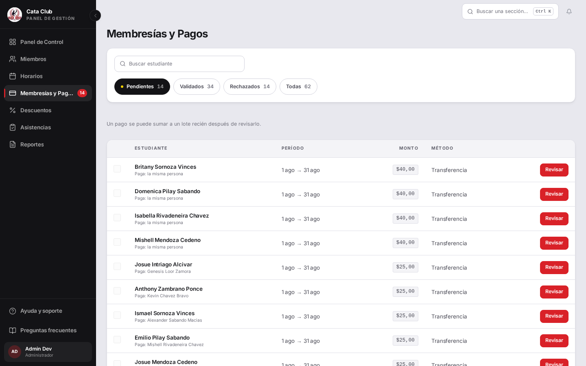
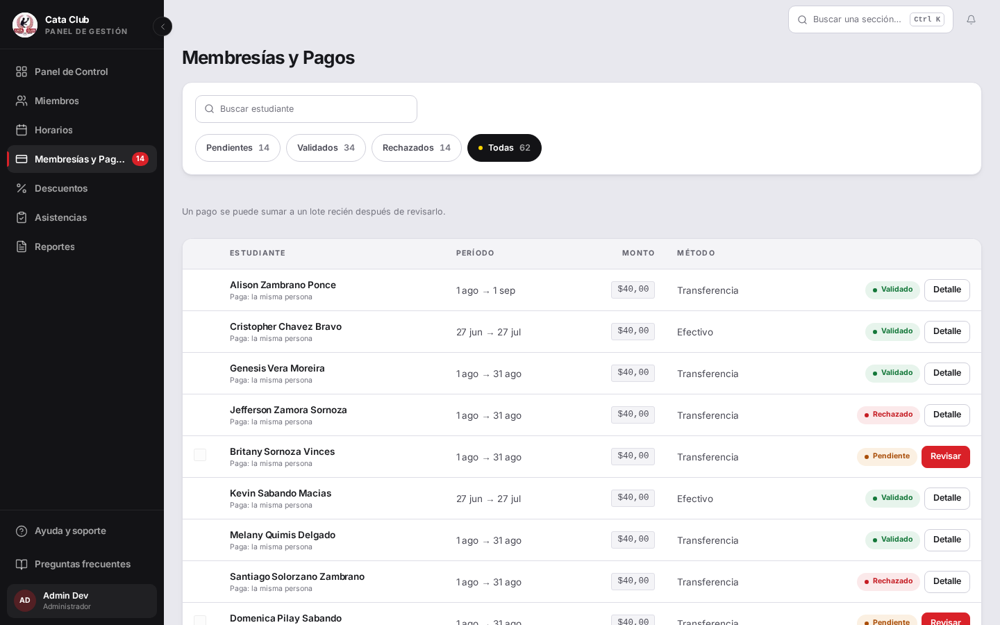

# Fix 22 · La columna «Estado» anunciaba algo que ya no mostraba

- **Cierra:** hallazgo del dueño en `/payments`, cola de validación de pagos (recorrido en vivo, 2026-08-11)
- **Decisión que lo gobierna:** el criterio del dueño para este fix — simpleza, y que lo que se muestre se entienda sin explicación. No reponer el estado por fila: la pestaña activa ya lo dice.
- **Rama:** `fix/columna-estado-vacia`
- **Commits:** `d659d24` — fix(payments): fold the empty Estado column into the action cell

## El problema

En `/payments`, la tabla tenía un encabezado «Estado» cuya celda aparecía vacía en tres de las cuatro pestañas (Pendientes, Validados, Rechazados). Solo en «Todas» tenía contenido real. La causa: alguien sacó la insignia de estado de cada fila —con razón, para no repetir lo que ya dice la pestaña activa— pero nadie sacó el encabezado que la anunciaba.


## Qué se hizo

Se investigó qué mostraba realmente esa celda en cada pestaña, con datos reales (un pago por estado: pendiente, validado, rechazado):

| Pestaña | Contenido de la celda «Estado» |
|---|---|
| Pendientes | Vacía, salvo la insignia «Revisado» si el pago ya se marcó para el lote |
| Validados | Siempre vacía |
| Rechazados | Siempre vacía |
| Todas | Siempre la insignia de estado (Pendiente / Validado / Rechazado) |

No era una columna vacía sin más: era una columna que hacía dos trabajos distintos según la pestaña —insignia de estado en «Todas», marca de revisión en Pendientes— y ninguno de los dos es «Estado» como concepto único, así que renombrarla no cerraba el problema.

Las dos cosas que sí aparecían (la insignia de estado y la marca «Revisado») son accesorias a la acción de la fila: le dicen al admin por qué el botón dice «Revisar» o «Detalle», o que ya no hace falta revisar este pago. Se fusionó esa celda con la de Acción y se eliminó la columna «Estado», en escritorio y en la vista de tarjetas de 390px por igual. El encabezado «Acción» —ya `sr-only`, sin texto visible— queda intacto.

Se descartó renombrar el encabezado: no hay un nombre honesto para una columna que en una pestaña muestra el estado del pago y en otra muestra si ya se revisó para un lote.

## El candado

`PaymentsPage — every visible column header has matching content > never leaves a header's column empty across every row, on any filter tab` en `frontend/src/app/payments/__tests__/PaymentsPage.test.tsx`.

Es una regla general, no del caso puntual: recorre las cuatro pestañas y, para cada encabezado con texto visible (los `sr-only` quedan afuera a propósito), exige que alguna fila tenga contenido en esa columna. Si vuelve a aparecer un encabezado sin celda que lo respalde —el que sea— este test lo agarra.

```
Antes del fix:
 × PaymentsPage — every visible column header has matching content > never leaves a header's column empty across every row, on any filter tab
   AssertionError: header "Estado" on tab "Pendientes" has no content in any row: expected false to be true

Después del fix:
 ✓ PaymentsPage — every visible column header has matching content > never leaves a header's column empty across every row, on any filter tab
 Test Files  1 passed (1)
      Tests  1 passed | 59 skipped (60)

Suite completa del archivo:
 ✓ src/app/payments/__tests__/PaymentsPage.test.tsx (60 tests) 4237ms
 Test Files  1 passed (1)
      Tests  60 passed (60)
```

## La prueba



En «Pendientes» ya no hay encabezado «Estado» ni columna fantasma vacía. En «Todas» —donde el estado sí era información real, no un eco— la insignia se mudó junto al botón de acción, en vez de desaparecer:



Verificado también en 390px, donde la tabla colapsa a tarjetas: la insignia de «Todas» pasó de estar junto al nombre a estar junto al botón «Detalle», coherente con el cambio de escritorio.

## Lo que NO cambió

- La decisión de no repetir el estado por fila cuando la pestaña ya lo fija: sigue así, a propósito.
- La columna Monto no se tocó. Hay un hallazgo abierto aparte sobre que sus números van centrados cuando deberían ir a la derecha; este fix no lo roza — solo está al lado de la columna que sí se modificó.
- El comportamiento de la marca «Revisado» para el lote (qué la activa, cuándo se limpia) no cambió — solo se movió de columna.
