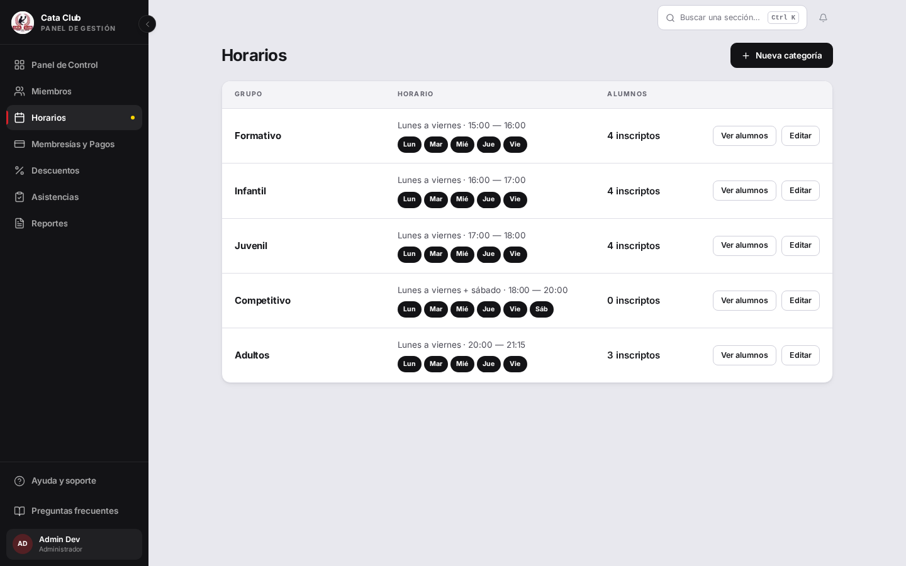
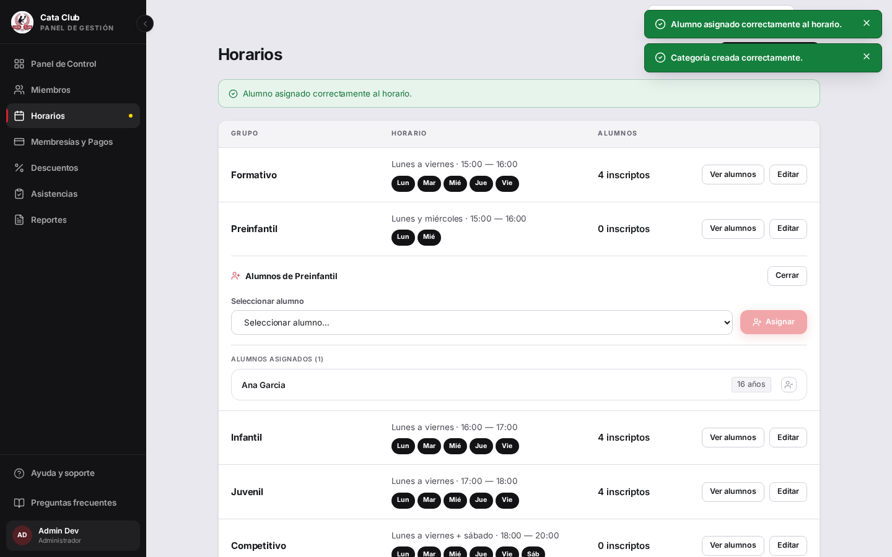
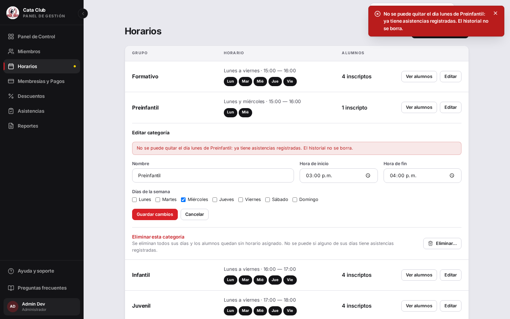

# Fix 24 · Alta, edición y baja de categorías desde Horarios

- **Cierra:** pedido del dueño — "deberíamos crear una tabla mantenible...
  quiero una tabla para que el admin ponga todos sus horarios" y "quisiera
  que se cree directo el horario y categoría, no diferentes".
- **Decisión que lo gobierna:** una sola operación crea/edita/borra la
  categoría (`categoria_horario`), sus días permitidos
  (`categoria_horario_dia`) y sus horarios (`horario_entrenamiento`) en UNA
  transacción; el historial de asistencia nunca se borra.
- **Rama:** `feat/abm-categorias` (sale de `feat/categoria-tabla-manda`)
- **Commits:**
  - `3aae71f` — feat(categorias): make categoria_horario.label unique
  - `d762b83` — feat(categorias): atomic create/update/delete for categoria_horario
  - `ae83f8c` — feat(groups): replace Nuevo Horario with atomic categoria ABM

## El problema

El fix 23 ya había movido la categoría a una tabla real, pero nadie podía
escribir en ella: `CategoriaRepositorio` era explícitamente de solo lectura
y `/groups` no tenía forma de crear una categoría nueva. "Nuevo Horario" no
podía crear nada — las cinco categorías ya tenían todos sus días — y solo
producía el error del candado `uq_horario_categoria_dia`.



## Qué se hizo

**Backend** (`AsistenciaServicio.crear_categoria`/`actualizar_categoria`/
`eliminar_categoria`, `backend/app/servicios_negocio/asistencia_servicio.py`):
tres endpoints nuevos ADMIN-only (`POST`/`PUT`/`DELETE
/asistencias/categorias[/{codigo}]`), cada uno un solo `commit()` que
escribe la categoría, sus días y sus horarios juntos
(`CategoriaRepositorio.crear_con_horarios`/`guardar_edicion`/
`eliminar_con_horarios`). Las cuatro decisiones que pedía el encargo:

1. **Código de categoría**: se DERIVA del nombre (slug sin acentos/espacios,
   `_generar_codigo`), nunca lo tipea el admin. Es inmutable después de
   creado — es la FK de `horario_entrenamiento.categoria`, así que un
   rename solo toca `label`. Colisión de slug se resuelve con sufijo
   numérico (`_2`, `_3`...). `label` es único en la base (migración
   `f1a2b3c4d5e6`), con el mismo patrón check-primero-DB-como-red-de-
   seguridad que ya usa `uq_horario_categoria_dia`.
2. **Quitar un día con asistencias registradas**: se verifica ANTES de
   escribir nada (`HorarioRepositorio.tiene_asistencias`); si cualquier día
   a quitar tiene historial, se aborta la edición ENTERA — ni el nombre, ni
   la franja, ni los otros días se tocan. Sin asistencias, el día se borra y
   su `alumno_horario` se purga (mismo criterio que `eliminar_horario` ya
   usaba por fila suelta).
3. **Cambiar la franja con asistencias pasadas**: SÍ se re-derivan las horas
   de los horarios que quedan — el invariante ya documentado
   ("`hora_inicio`/`hora_fin` siempre se derivan de la categoría") no se
   podía romper con un rename de franja. `Asistencia` no persiste una hora
   (solo `fecha_entrenamiento` + `horario_id`), así que el historial no
   cambia de contenido; el carnet, que lee la franja vía `horario`, refleja
   la nueva automáticamente.
4. **Borrar la categoría entera**: solo si NINGÚN horario tiene
   asistencias — mismo chequeo que (2), aplicado a todos los días.

**Se descartó** una tabla de auditoría de renombres o un `codigo`
editable — el dueño pidió simpleza, y el label ya es único y visible.

**Agregar un día a una categoría con alumnos** (cuidado duro del encargo):
se backfillea automáticamente — todo `persona_id` ya inscripto en cualquier
horario vigente de la categoría queda inscripto también en el día nuevo, en
la misma transacción. La inscripción atómica por categoría (issue #181) no
se rompe.

**Frontend** (`frontend/src/app/groups/page.tsx`): "Nuevo Horario"
desapareció. El formulario ahora es "Nueva categoría"/"Editar categoría" con
nombre (texto), hora de inicio/fin (inputs, ya no derivados/bloqueados) y
los 7 días como casillas (antes solo los "permitidos" de una categoría fija).
Quitar un día con alumnos inscriptos sigue pidiendo confirmación antes de
guardar — pero ahora es UNA sola llamada atómica (`actualizarCategoria`), no
el diff `crearHorario`/`actualizarHorario`/`eliminarHorario` por día de
antes, que podía fallar a mitad de camino. Un guardado que el backend
rechaza (nombre duplicado, historial) deja el formulario ABIERTO con el
mensaje del servidor — no hay nada que resincronizar porque nada se
escribió.

## El candado

`test_actualizar_categoria_quitar_dia_con_asistencias_bloquea_la_edicion_entera`
en `backend/tests/test_categoria_crud.py` — antes de esta rama
`AsistenciaServicio` no tenía `crear_categoria`/`actualizar_categoria`/
`eliminar_categoria` en absoluto (`CategoriaRepositorio` era "solo lectura a
propósito"), así que este test no podía ni importarse. Cubre la decisión más
peligrosa del encargo: registra una asistencia real en un día de la
categoría, intenta una edición que renombra Y quita ese día a la vez, y
verifica que TODO se aborta — ni el nombre ni los días cambiaron.

```
tests/test_categoria_crud.py::test_actualizar_categoria_quitar_dia_con_asistencias_bloquea_la_edicion_entera PASSED
tests/test_categoria_crud.py::test_eliminar_categoria_con_asistencias_bloquea_y_no_borra_nada PASSED
tests/test_categoria_crud.py::test_actualizar_categoria_agregar_dia_backfillea_alumnos_inscriptos PASSED
tests/test_categoria_crud.py::test_actualizar_categoria_cambia_franja_re_deriva_horas_de_horarios_existentes PASSED
tests/test_categoria_crud.py::test_crear_categoria_crea_categoria_dias_y_horarios_atomicamente PASSED
20 passed, 1 warning in 1.07s
```

Suite completa de `test_categoria_crud.py`: **20 passed**. Suite completa del
backend (incluye la guardia estructural de rutas/roles, actualizada con las
tres rutas nuevas): **985 passed, 2 skipped**. Suite completa del frontend
(incluye `GroupsPage.test.tsx` reescrito para el flujo atómico y los tests
nuevos de los dos BFF routes): **172 archivos, 2579 tests, todos passed**.

## La prueba



Verificación manual de punta a punta sobre un stack propio (Postgres +
backend + frontend en puertos libres — 5555/8010/3091 —, sin tocar el QA
compartido de `:3000`/`:8000`): creé "Preinfantil" (Lunes y Miércoles,
15:00–16:00) desde `/groups`, inscribí a Ana García, y le tomé asistencia
real (vía la API de asistencias) para el Lunes. Verificado en Postgres:

```
 id | fecha_entrenamiento |  estado  | nombres | apellidos |  categoria  | dia_semana
----+---------------------+----------+---------+-----------+-------------+------------
  1 | 2026-08-10          | PRESENTE | Ana     | Garcia    | PREINFANTIL | LUNES
```

Después intenté renombrar la categoría Y quitarle el Lunes (el día con esa
asistencia) en la misma edición: el formulario se quedó abierto con el
mensaje exacto del servidor, y ni el nombre ni los días cambiaron —
capturado abajo.



Captura mobile (390×844) con la tarjeta "Preinfantil" ya creada y su alumno:


Se borró todo lo creado destruyendo el stack propio entero (contenedor de
Postgres efímero + procesos de backend/frontend) al terminar — no quedó
ningún dato en una base compartida.

## Lo que NO cambió

- El candado de una fila por (categoría, día) —
  `uq_horario_categoria_dia`— sigue siendo la red de seguridad; el
  formulario lo respeta con casillas (imposible tipear un día duplicado) y
  el servicio dedupea cualquier llamado directo a la API.
- La inscripción atómica por categoría (`asignar_alumno_a_horario`/
  `desasignar_alumno_de_horario`, issue #181) no se tocó — agregar un día
  la extiende (backfill), nunca la rompe.
- `rango_edad` sigue siendo copy de orientación, nunca una regla — no se
  agregó validación de edad en ningún punto de este cambio.
- La página sigue siendo `/groups` — no se creó una pantalla nueva.
- El roster ("Ver alumnos"), la asignación/desasignación de alumnos y el
  panel de asistencia no cambiaron: siguen operando sobre `HorarioEntrenamiento`
  igual que antes.

## Fuera de alcance

- No hay historial/auditoría de quién creó o editó una categoría (mismo
  nivel que el resto del catálogo del sistema — `Descuento`, por ejemplo,
  tampoco lo tiene).
- No se migraron datos: las 5 categorías sembradas siguen exactamente igual
  (mismos códigos, mismos labels) — la migración nueva solo agrega el
  `UNIQUE` sobre `label`, que esas 5 filas ya cumplían.
- El caso "una categoría con horas mezcladas entre sus días" (dato legacy
  previo a este fix, si existiera) sigue resuelto por el selector de grupo
  ya existente (`renderEditPanel`'s chooser) — no se rediseñó ese camino,
  porque el flujo atómico nuevo ya impide que se vuelva a producir hacia
  adelante.
