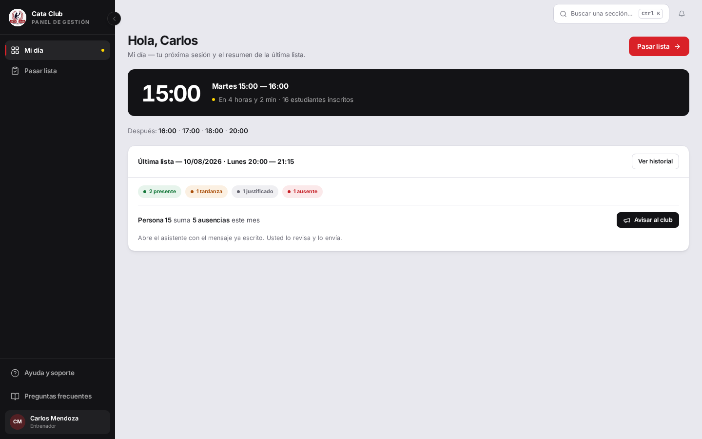
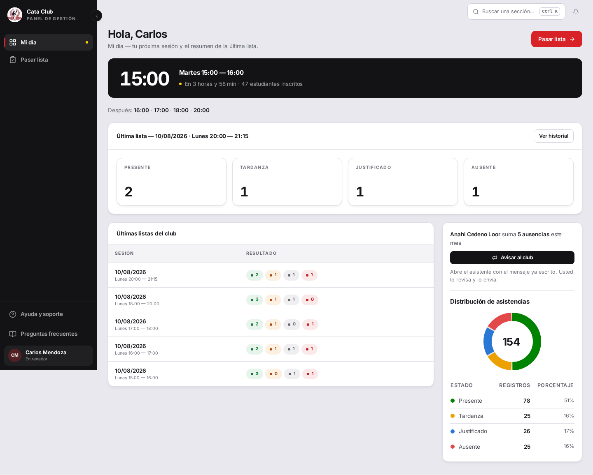
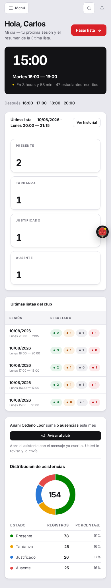
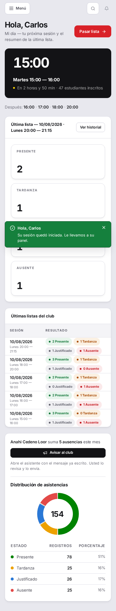
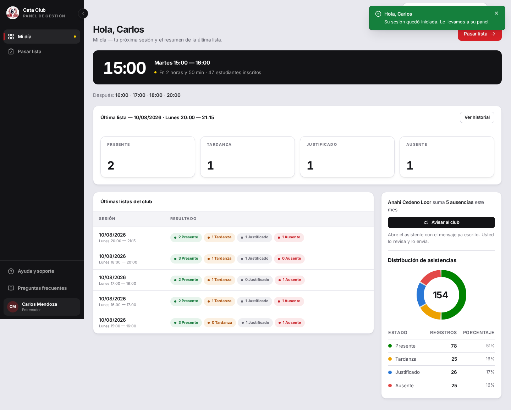

# Fix 08 · Panel del entrenador

- **Cierra:** DSH-2, ASI-4
- **Decisión que lo gobierna:** decisiones-de-negocio-2026-08-11.md §8 — próxima sesión, StatGrid con los cuatro conteos, últimas listas del club sin autor, y el gráfico de torta junto al aviso de faltas crónicas (que además necesita el nombre real, no «Persona 15»).
- **Rama:** `fix/panel-entrenador`
- **Commits:**
  - `2c3a7af` — feat(asistencias): add GET /asistencias/ultimas-listas
  - `309bb6e` — fix(attendance): stop degrading a trainer's roster to "Persona {id}"
  - `75e2ca0` — feat(bff): add GET /api/attendance/recent-sessions
  - `b32dedb` — feat(trainer): rebuild the panel around StatGrid and a used screen
  - `d9521b0` — fix(trainer): show attendance state names, not just badge color

## El problema

El panel del entrenador dejaba más de la mitad de la pantalla en blanco: los
cuatro conteos de la última lista se mostraban como `Badge` sueltos, sin el
`StatGrid` que ya existe en el panel de admin, y no había nada más debajo. El
aviso de faltas crónicas, además, mostraba «**Persona 15**» en vez del nombre
de la alumna — el entrenador no podía saber a quién avisar.



## Qué se hizo

Rediseño siguiendo el patrón de `/dashboard` (admin), de arriba a abajo:

1. **Hero sin cambios** — la próxima sesión, grande, con «Pasar lista» en el
   header (mismo lugar que ya tenía admin desde su propio rediseño).
2. **`StatGrid`** con los cuatro conteos de la última lista (presente,
   tardanza, justificado, ausente), reemplazando los `Badge` sueltos.
3. **«Últimas listas del club»**, tarjeta nueva: las sesiones más recientes
   del club (horario + fecha + los cuatro conteos), **sin autor**. Requirió un
   endpoint nuevo — `GET /asistencias/ultimas-listas` — pero **sin
   migración**: se computa agrupando `Asistencia` por `(horario_id, fecha)`,
   con un join a `HorarioEntrenamiento` para la etiqueta y el orden. No lleva
   nombre de alumno ni de entrenador — el modelo no guarda quién tomó la lista
   (`modelos.py:536`, deliberado) y no hay relación entrenador–horario
   (issue #13).
4. **El gráfico de torta reusado**, no reconstruido: `AttendanceStatusChart`
   de `/dashboard` importado tal cual, alimentado con los mismos
   `monthRecords` que ya se pedían para el aviso de faltas. Comparte tarjeta
   con ese aviso.

**Se descartó** abrir `GET /personas/` a ENTRENADOR para resolver el nombre
del ASI-4: ese endpoint es admin-only a propósito — el DTO expone cédula,
teléfono y fecha de nacimiento (PII real), documentado en el propio router.
Ampliarlo habría cambiado quién puede leer el padrón completo del club, un
efecto mucho mayor que arreglar un aviso. En cambio, `fetchPersonaNameMap`
ahora cae a `GET /personas/{id}` — el mismo acceso por-id que ENTRENADOR ya
tenía otorgado (`ADMINISTRADOR_O_ENTRENADOR`) y que el roster de «pasar lista»
ya usaba — cuando la lectura masiva devuelve 403. Nada de degradar en
silencio: antes, el 403 se tragaba en un mapa vacío y CADA registro que veía
un entrenador caía al placeholder — no una falla rara, el 100% de los casos
para ese rol.

Queda afuera a propósito: la agenda de la semana completa (horarios fijos que
el entrenador ya tiene memorizados) y la columna de autor en «últimas listas
del club» (`registrado_por` en `Asistencia` queda como mejora posterior al
lanzamiento — la decisión distingue *quién dictó la clase* de *quién tipeó la
lista*, y ninguna de las dos se guarda hoy).

**Corrección post-lanzamiento** (pedido del dueño): en «Últimas listas del
club» los cuatro conteos por sesión se leían solo por el color del `Badge` —
un punto verde/naranja/gris/rojo y un número, sin ninguna palabra al lado. El
nombre del estado ya existía (`getAttendanceLabel`, la misma nomenclatura que
usa el `StatGrid` de arriba y la pantalla de pasar lista: Presente, Tardanza,
Justificado, Ausente), pero vivía en un `<span className="sr-only">` —
invisible para cualquiera que no usara un lector de pantalla. Pasó a ser
texto visible dentro del propio badge (`12 Presente`, no solo `12`). Se
probó a 390px de ancho antes de descartar una abreviatura: las cuatro
palabras completas por fila caben envolviendo a dos badges por línea (el
`flex-wrap` del contenedor ya existía para esto), sin quedar ilegibles — se
descartó dividir la columna «Resultado» en cuatro columnas con encabezados
abreviados porque el texto completo visible ya resolvía el problema sin
tocar la estructura de la tabla. `/trainer/attendance/history` tenía
exactamente el mismo defecto (mismo patrón `Badge` + `sr-only`) y se
corrigió igual.

## El candado

**DSH-2** — `backend/tests/test_asistencias.py`:
`test_listar_ultimas_listas_cuenta_los_cuatro_estados`,
`test_listar_ultimas_listas_ordena_las_mas_recientes_primero`,
`test_listar_ultimas_listas_no_expone_autor`,
`test_listar_ultimas_listas_entrenador_puede_acceder`,
`test_listar_ultimas_listas_rechaza_rol_sin_permiso`. Sin el endpoint, las
cinco dan 404/403 contra la ruta inexistente.

**ASI-4** — `frontend/src/app/api/attendance/records/__tests__/route.test.ts`:
`resolves the real student name for a trainer session, not a 'Persona {id}'
placeholder`. Contra el código viejo da rojo con el mensaje exacto del
hallazgo:

```
AssertionError: expected 'Persona 15' to be 'Emily Moreira Pilay'

Expected: "Emily Moreira Pilay"
Received: "Persona 15"
```

Salida real, backend (`TEST_DATABASE_URL` contra Postgres de test):

```
tests/test_asistencias.py::test_listar_ultimas_listas_cuenta_los_cuatro_estados PASSED
tests/test_asistencias.py::test_listar_ultimas_listas_ordena_las_mas_recientes_primero PASSED
tests/test_asistencias.py::test_listar_ultimas_listas_no_expone_autor PASSED
tests/test_asistencias.py::test_listar_ultimas_listas_entrenador_puede_acceder PASSED
tests/test_asistencias.py::test_listar_ultimas_listas_rechaza_rol_sin_permiso PASSED
15 passed, 1 warning in 1.19s   (incluye la guardia de rutas actualizada)
```

Salida real, frontend (`vitest run`):

```
✓ src/app/trainer/__tests__/TrainerPage.test.tsx (20 tests)
✓ src/lib/server/__tests__/attendance-adapter.test.ts (14 tests)
✓ src/app/api/attendance/records/__tests__/route.test.ts (11 tests)
✓ src/app/api/attendance/recent-sessions/__tests__/route.test.ts (5 tests)
Test Files  4 passed (4)
     Tests  50 passed (50)
```

**Corrección post-lanzamiento** — `frontend/src/app/trainer/__tests__/TrainerPage.test.tsx`:
`shows each recent session's counts with visible state names, not only
color`, y `frontend/src/app/trainer/attendance/history/__tests__/TrainerAttendanceHistoryPage.test.tsx`:
`carries the four state counts in the row itself, with a visible state
name`. Sin el fix, dan rojo porque el nombre del estado solo existe dentro
de un `.sr-only`:

```
AssertionError: expected <span class="sr-only"></span> to be null

- Expected:
null

+ Received:
<span
  class="sr-only"
>

  presente
</span>
```

Verde después del fix (área completa, no solo los dos tests nuevos):

```
✓ src/app/trainer/attendance/__tests__/TrainerAttendancePage.test.tsx (82 tests)
✓ src/app/trainer/attendance/__tests__/attendance-utils.test.ts (74 tests)
✓ src/app/trainer/__tests__/TrainerPage.test.tsx (21 tests)
✓ src/app/attendance/__tests__/attendance-utils.test.ts (40 tests)
✓ src/app/trainer/attendance/history/__tests__/TrainerAttendanceHistoryPage.test.tsx (13 tests)
✓ src/app/trainer/__tests__/trainer-day-utils.test.ts (37 tests)
✓ src/app/attendance/__tests__/AttendancePage.test.tsx (11 tests)
✓ src/components/ui/__tests__/Badge.test.tsx (6 tests)
Test Files  8 passed (8)
     Tests  284 passed (284)
```

Suite completa del frontend (`vitest run`, sin filtro): `Test Files 162
passed (162)` · `Tests 2456 passed (2456)`.

## La prueba




Ahora se ve el `StatGrid` con los cuatro conteos, la tarjeta «Últimas listas
del club» con cinco sesiones reales del club, el nombre real de la alumna
(«Anahi Cedeno Loor», no «Persona 15») y el gráfico de torta junto al aviso.




Cada conteo de «Últimas listas del club» ahora dice su estado (`12
Presente`, no solo un punto de color y un `12`) — a 390px de ancho las
cuatro etiquetas completas envuelven en dos badges por línea, sin quedar
ilegibles.

**Medido a 1440×900**, contra el botón «pasar lista» que abre el contenido
(no una captura estática): el contenido terminaba en y≈370 antes (**59% de
la pantalla en blanco**, peor incluso que el 43-47% que había medido la
auditoría); después el contenido ocupa y termina en y≈1124 — **0% en blanco**
en el pliegue inicial, con scroll natural hacia el resto de las listas. Muy
por debajo del 11% del panel de admin que se tomó como referencia.

## Lo que NO cambió

- El hero y el CTA «Pasar lista» en el header: sin cambios, ya estaban
  alineados con el patrón de admin desde el rediseño anterior de esta
  pantalla.
- El roster de «pasar lista» (`/trainer/attendance`): sus nombres ya salían
  bien por otra ruta (`AlumnoHorarioDetalleDTO.persona_nombre_completo`); no
  se tocó.
- `Asistencia` sigue sin `registrado_por`: la distinción entre quién dictó la
  clase y quién tipeó la lista queda registrada para después del lanzamiento,
  no se resuelve acá.
- La agenda completa de la semana: fuera de alcance a propósito, decisión
  explícita del dueño.
- `/trainer/attendance/history`: solo se le tocó la etiqueta de texto de los
  cuatro conteos (mismo cambio que la tarjeta de arriba). Los filtros, la
  paginación y el link «Corregir» quedaron intactos.
