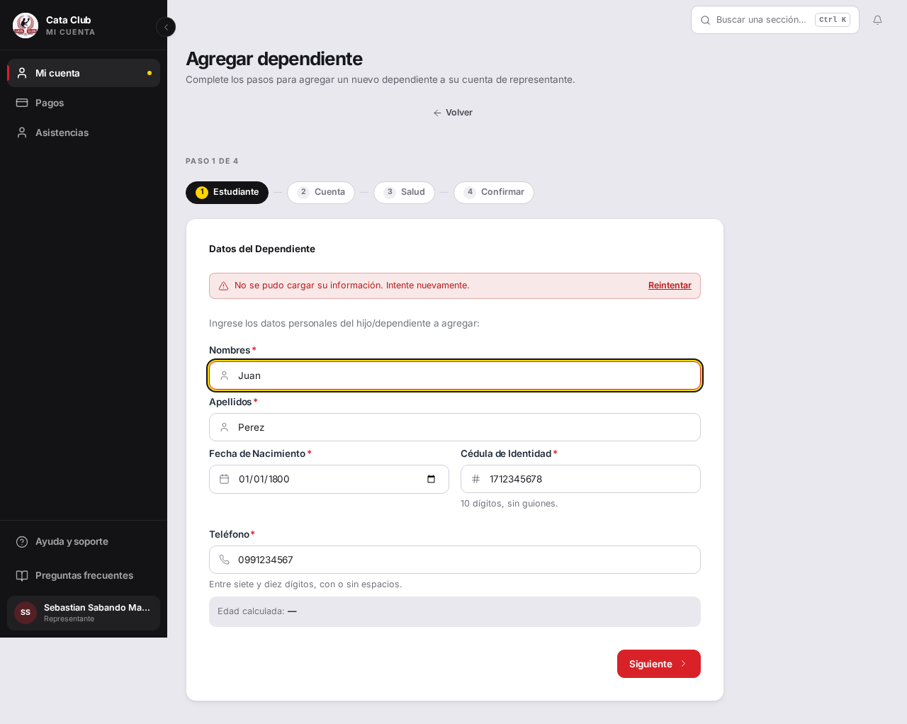
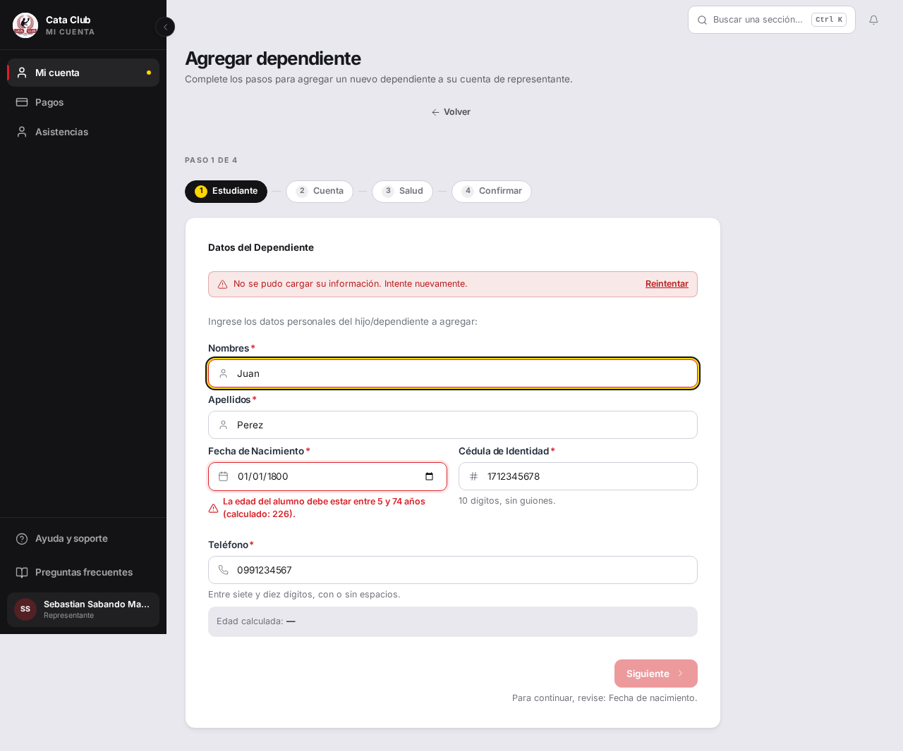

# Fix 11 · Tres cabos sueltos

- **Cierra:** ASI-2 (cabo suelto del seed), INS-8, INS-1
- **Decisión que lo gobierna:** `docs/decisiones-de-negocio-2026-08-11.md`, sección 2 — «Justificado» es una marca sin motivo; el cabo suelto que sí se ata es que el seed escribe justificativos que la app nunca escribe ni muestra.
- **Rama:** `fix/cabos-sueltos`
- **Commits:**
  - `fe66d83` — fix(seed): stop inventing asistencia justificativo data
  - `023cfb7` — fix(student): reject an impossible birth date on step one
  - `6c95e77` — docs(qa): warn that qa-up cannot exercise the email path

---

## a · El seed escribe 82 justificativos que la app nunca escribe ni muestra

### El problema

`backend/scripts/seed_dev_bulk.py` llenaba `asistencia.justificativo` con
«Cita médica» y `asistencia.estado_justificativo` con `true` en cada fila
JUSTIFICADO (~82 en el dataset grande). Pero el dueño decidió que «Justificado»
es una marca sin motivo: no hay ningún flujo, ni de entrenador ni de admin,
que pida o muestre ese texto. El resultado era un entorno de pruebas que
mentía — un auditor reportó como defecto que esas columnas estuvieran vacías,
cuando en realidad estaban llenas de datos inventados por el propio seed.

### Qué se hizo

Se sacó la escritura de `justificativo` y `estado_justificativo` del seed;
las filas de asistencia quedan con esas dos columnas en `NULL`, sin tocar
`estado` ni el resto del registro. No se tocó `asistencia_servicio.py` ni los
schemas: esas columnas siguen existiendo en el modelo y la app real puede
escribirlas el día que alguien decida construir el flujo — lo único que
cambió es que el seed dejó de inventar datos que la aplicación no ofrece.

**Conflicto de rama a resolver en el merge:** `backend/scripts/seed_dev_bulk.py`
también tiene un commit reciente en `fix/seed-inscripcion-atomica` (inscripción
atómica por categoría), que no está en `origin/main` y por lo tanto tampoco en
esta rama. Ese cambio no se tocó ni se recreó acá — al mergear ambas ramas va
a haber que resolver el conflicto entre la escritura atómica de esa rama y la
remoción de justificativo/estado_justificativo de esta.

### El candado

`test_main_no_inventa_justificativo_ni_estado_justificativo` en
`backend/tests/test_seed_dev_bulk.py`.

**Rojo, antes del fix** (revirtiendo solo `seed_dev_bulk.py`, con el test ya
escrito):

```
FAILED tests/test_seed_dev_bulk.py::test_main_no_inventa_justificativo_ni_estado_justificativo
======================== 1 failed, 1 warning in 17.10s =========================
```

**Verde, después del fix:**

```
tests/test_seed_dev_bulk.py::test_main_no_inventa_justificativo_ni_estado_justificativo PASSED [100%]
======================== 1 passed, 1 warning in 17.29s =========================
```

### La prueba

No hay captura — es un dato de base, no una pantalla. El candado de arriba
es la prueba: crea un motor SQLite en memoria, corre `seed_dev_base.py` +
`seed_dev_bulk.py` completos, y verifica sobre las `Asistencia` resultantes
que ninguna tiene `justificativo` ni `estado_justificativo` distintos de
`None`, sin importar el `estado` de la fila.

### Lo que NO cambió

- El modelo (`backend/app/dominio/modelos.py`) sigue teniendo las dos
  columnas — es infraestructura que puede usarse en el futuro si el club
  cambia de decisión.
- `asistencia_servicio.py` sigue aceptando y persistiendo esos campos si un
  cliente de la API los manda explícitamente (nadie lo hace hoy — el
  frontend no ofrece ningún formulario que los escriba).
- El resto del comportamiento del seed (representantes, membresías, pagos,
  inscripción en `AlumnoHorario`) no se tocó.

---

## b · INS-8 — el aviso de edad llega al final del formulario

### El problema

En `/student/add-dependent`, paso 1, escribir una fecha de nacimiento
imposible (el caso auditado: `1800-01-01`, 226 años) no bloqueaba
«Siguiente». La persona avanzaba por los cuatro pasos completos y recién al
confirmar el backend respondía 400 con «La edad debe estar entre 5 y 74 años
(calculado: 226)», perdiendo todo lo cargado.



### Qué se hizo

Se agregó una regla de validación al campo `fechaNacimiento` del paso 1 en
`frontend/src/app/student/add-dependent/add-dependent-utils.ts`, contra los
mismos límites reales del dominio que usa el backend
(`EDAD_MINIMA_ALUMNO = 5`, `EDAD_MAXIMA_ALUMNO = 74` en
`backend/app/servicios_negocio/persona_servicio.py`) — no se inventó ninguna
cota nueva, y no se tocó el rango de edad de las categorías (esa es copy de
orientación, decisión ya tomada, INS-6b).

Se descartó reusar el `calculateAge` de `enroll-utils.ts` (ya importado en
esta misma pantalla para el resumen): ese helper limita el año a 1900–2200 y
devuelve `NaN` fuera de ese rango, así que con año 1800 el helper compartido
directamente dejaba de reportar una edad — el candado lo agarró en rojo por
esta razón exacta antes de que se corrigiera. Se escribió un cálculo de edad
local, sin esa cota artificial, porque el caso auditado depende de que el año
imposible siga produciendo un número real (226) y no un `NaN` silencioso.

### El candado

Dos tests en
`frontend/src/app/student/add-dependent/__tests__/add-dependent-utils.test.ts`:

- `rejects an impossible age on step 1 instead of letting the wizard reach the backend (INS-8)`
- `rejects a fechaNacimiento below the minimum domain age (EDAD_MINIMA_ALUMNO = 5)`

**Rojo, antes del fix** (con la implementación revertida y los tests ya
escritos):

```
 FAIL  add-dependent-utils.test.ts > ... rejects an impossible age on step 1 ...
 FAIL  add-dependent-utils.test.ts > ... rejects a fechaNacimiento below the minimum domain age ...
 Tests  2 failed | 33 passed (35)
```

**Verde, después del fix:**

```
 ✓ src/app/student/add-dependent/__tests__/add-dependent-utils.test.ts (35 tests | 34 skipped) 2ms
 Tests  1 passed | 34 skipped (35)
```

### La prueba



Con la misma fecha (`01/01/1800`), el mensaje «La edad del alumno debe estar
entre 5 y 74 años (calculado: 226).» aparece junto al campo, «Siguiente»
queda deshabilitado y el pie del formulario dice «Para continuar, revise:
Fecha de nacimiento.» — antes no aparecía ninguno de los tres.

### Lo que NO cambió

- El rango de edad de las categorías sigue sin validarse (decisión ya
  tomada, INS-6b) — esta regla es distinta: son los límites reales del
  dominio, no la orientación de una categoría.
- El `calculateAge` de `enroll-utils.ts` no se tocó; sigue usándose tal cual
  para el resumen del paso 4 y en el wizard público de inscripción.
- El backend sigue validando lo mismo en `registrar_persona` — este fix es
  puramente de UX (falla antes), no reemplaza esa validación.

---

## c · INS-1 — el entorno de QA no puede probar el camino del correo, y nada lo dice

### El problema

`Makefile:144` define `QA_SERVICIOS = db redis mailpit backend frontend` a
propósito, sin `celery-worker` ni `celery-beat`, para ahorrar memoria. El
correo de recuperación de contraseña se manda con `.delay()` (Celery), así
que en QA la tarea se encola en Redis y nadie la consume — se verificó
`redis-cli LLEN celery` → 8 tareas encoladas. **No es un bug de producto**:
`celery-worker`/`celery-beat` están en `docker-compose.yml` y en
`docker-compose.prod.yml`, y en producción el correo sale. El problema es que
el entorno de QA no lo dice en ningún lado, y dos auditores independientes lo
reportaron como bloqueante de producción.

### Qué se hizo

Se eligió **avisarlo en la salida de `make qa-up`**, junto al resto de los
datos que ya imprime, en vez de sumar los workers a `QA_SERVICIOS`.

**Por qué este camino y no el otro:** el propio `Makefile` ya documenta que
`QA_SERVICIOS` deja afuera los workers a propósito, porque «el QA de
pantallas no necesita tareas programadas y cada worker cuesta memoria»
(`Makefile:142-143`). Sumar dos contenedores permanentes a un stack que se
levanta y destruye seguido para poder probar un solo flujo (recuperar
contraseña) invierte esa decisión de costo para todo el mundo, todo el
tiempo, a cambio de cerrar una trampa que un aviso de una línea cierra igual
de bien: nadie va a volver a reportar como bloqueante de producción algo que
la propia herramienta le dice en la cara que no se puede probar ahí.

### El candado

No aplica test automatizado — es una línea de salida de un target de
`make`. La prueba es la salida real del comando:

```
$ make -n qa-up
...
echo "  Alumnos del dataset grande: contrasenia alumno123"
echo "  AVISO:     los correos no se envian en este entorno (falta el worker de Celery, QA_SERVICIOS los deja afuera a proposito para ahorrar memoria)."
echo "  Destruir:  make qa-down"
```

### La prueba

No hay captura — es salida de terminal, no una pantalla. La salida de arriba
es la prueba.

### Lo que NO cambió

- `QA_SERVICIOS` sigue sin `celery-worker`/`celery-beat` — la decisión de
  costo de memoria se mantiene.
- `docker-compose.yml` y `docker-compose.prod.yml` no se tocaron: los
  workers siguen ahí para `make dev` y para producción.
- `qa-reset` no reimprime este aviso porque no reimprime el bloque de salida
  de `qa-up` — solo resiembra. Si hace falta el aviso también ahí, es una
  decisión aparte.
