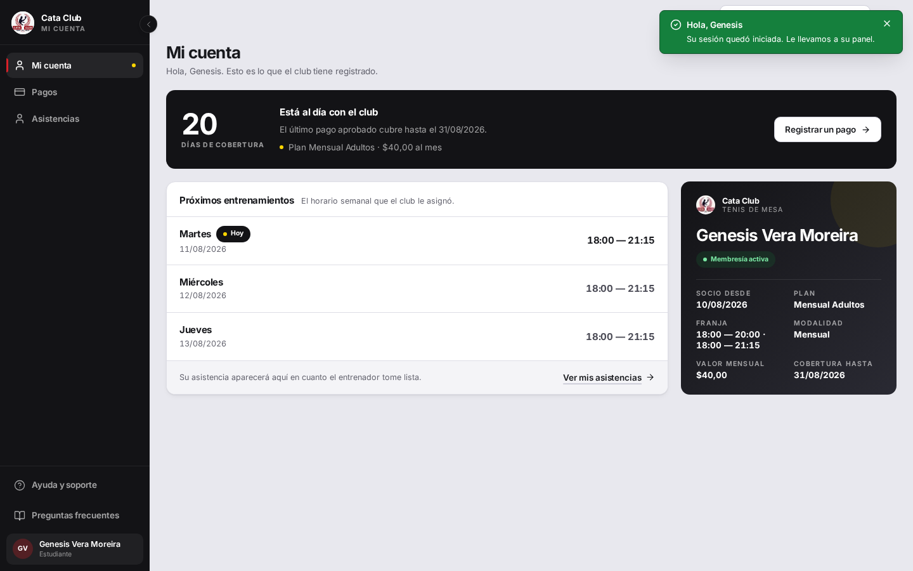
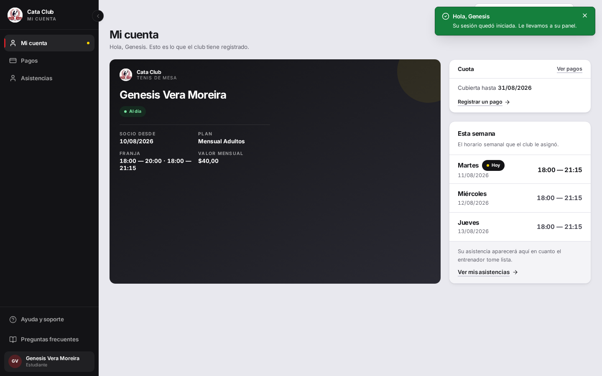
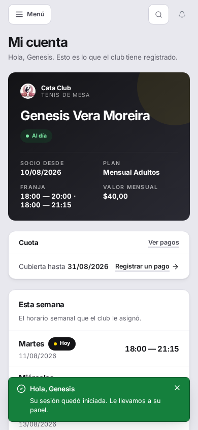
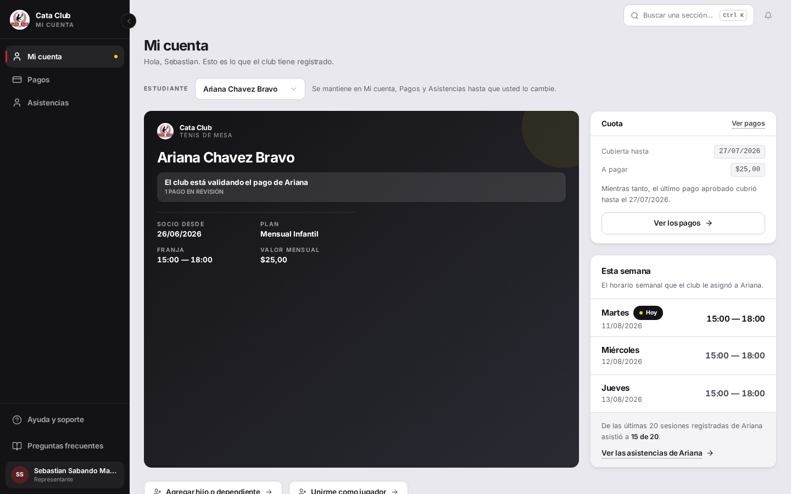
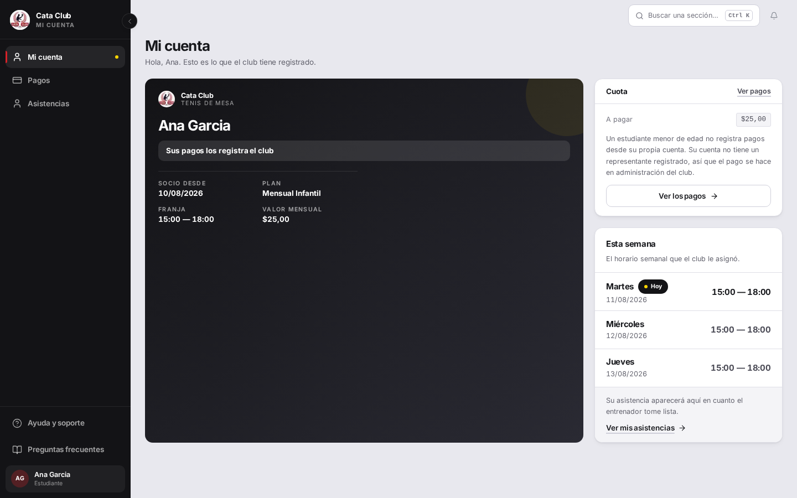

# Fix 12 · Rediseño de «Mi cuenta»: el carnet manda

- **Cierra:** rediseño de `/student` según la Propuesta 2 de las tres maquetas
  presentadas («El carnet manda»)
- **Decisión que lo gobierna:** el dueño eligió la Propuesta 2 después de ver
  las tres, con un problema propio anotado en la maqueta — «pesa mucho cuando
  no hay nada que resolver» — a resolver como parte de la implementación, no
  a ignorar
- **Rama:** `feat/mi-cuenta-carnet`
- **Commits:** (pendientes — rama sin commitear, ver mensaje final del agente)

## El problema

La pantalla de antes abría con una banda de pago a todo lo ancho, seguida de
los próximos entrenamientos en la columna principal y el carnet reducido a
340px en una barra lateral — un adorno, no el motivo de la pantalla. Además,
la banda y el carnet decían prácticamente lo mismo dos veces (el estado de la
membresía por un lado, el estado de la cuota por otro), y ambos pesaban igual
sin importar si había algo que resolver o no: una familia al día veía la
misma pantalla cargada que una familia con la cuota vencida hace dos semanas.




## Qué se hizo

El carnet pasa a ser la columna ancha de la pantalla (reutilizando
`PAGE_RAIL`, el único patrón de dos columnas del sistema, solo que ahora el
carnet ocupa el lado 1fr en vez del riel de 340px) y lleva el estado de la
cuota como una banda sobre sí mismo, no como una tarjeta aparte. A la derecha,
apiladas: la tarjeta «Cuota» (cubierta hasta, a pagar, el botón) y «Esta
semana» (los próximos entrenamientos, con el más próximo resaltado — la
misma lógica que ya existía, solo renombrada y reubicada).

Debajo del carnet, en un grid fijo de dos columnas (no `auto-fit`: con el
carnet ahora ancho, `auto-fit` habría repartido los datos en cuatro o cinco
columnas en vez de dos), los cuatro datos que pide la maqueta: Socio desde,
Plan, Franja, Valor mensual. "Modalidad" y "Cobertura hasta" salen del
carnet — la primera porque la maqueta no la dibuja, la segunda porque pasa a
la tarjeta Cuota, que es donde vive la fecha de cobertura.

La banda del carnet **reemplaza** la vieja insignia de `Membresia.estado`
("Membresía activa/pendiente/vencida"): las dos podían decir cosas distintas
para el mismo caso (un admin puede marcar una membresía `INACTIVA` sin que
eso diga nada sobre si la cuota está pagada), y la maqueta dibuja una sola
banda. Ahora las dos tarjetas de pago (carnet y «Cuota») leen la misma
`describePaymentSituation` que ya existía — una sola fuente de verdad, nunca
dos redacciones del mismo estado.

Descarté reescribir el carnet sobre `MemberCard` (el componente genérico de
`/profile`): el carnet de `/student` ya es una variante propia, con
documentación extensa sobre por qué cada campo es real y de dónde sale
(`franja` derivada de los horarios asignados, no del plan; sin número de
socio inventado). Fusionarlo con `MemberCard` — que solo conoce
nombre/correo/rol/fecha — habría significado inventarle a `MemberCard` una
API mucho más ancha solo para este caso, sin beneficiar a `/profile`.
Extender el carnet ya existente, en vez de construir uno nuevo, es la lectura
que le doy a «no hagas un carnet paralelo».

### El problema anotado en la maqueta

La dirección elegida: la banda **cambia de peso**, no solo de color.

- **Urgente** (vencida, por vencer, nunca pagada): la banda es una franja
  ancha con ícono, roja, con la cifra que antes lideraba la banda vieja
  (`14 días vencida`).
- **Al día**: la banda se comprime a la píldora pequeña que antes usaba la
  insignia de membresía — un punto verde, una palabra («Al día»).
- **Otros estados sin urgencia** (pago en revisión, menor sin pagos propios,
  sin membresía): mantienen la franja completa pero en tono neutro, porque
  todavía necesitan explicar algo (quién paga, por qué no hay botón) — la
  compresión es específicamente para «no hay nada que resolver», no para
  «no es urgente» en general.

La tarjeta «Cuota» sigue la misma regla: se comprime a una sola línea
(«Cubierta hasta 31/08/2026» + un enlace de texto, sin fila «A pagar» y sin
botón grande) únicamente cuando el estado es `covered`. El espacio que cede
lo toma «Esta semana» de forma natural, sin necesitar redimensionarla a mano.

## El candado

`StudentPage — the carnet earns its space when the cuota is up to date` en
`frontend/src/app/student/__tests__/StudentPage.test.tsx`: los dos casos,
vencida y al día, se comparan por atributos (`data-urgent`, `data-tone`,
`data-compact`) y por contenido (la tarjeta compacta no tiene fila «A pagar»
ni botón grande). Si alguien vuelve a mostrar la misma banda completa para
ambos estados, el test se pone rojo.

```
✓ StudentPage — the carnet earns its space when the cuota is up to date > renders the full-weight strip and the full Cuota card when the cuota is overdue
✓ StudentPage — the carnet earns its space when the cuota is up to date > renders a compact pill and a one-line Cuota card when the cuota is up to date

 Test Files  1 passed (1)
      Tests  37 passed (37)
```

## La prueba








Lo que antes no se veía: el carnet ocupa la columna ancha y llena el alto de
la fila (nada de canvas vacío debajo), la banda cambia de tamaño según haya
algo que resolver, y en el caso «al día» la tarjeta Cuota se reduce a una
línea mientras «Esta semana» gana el espacio que esa tarjeta cede.

### El espacio en blanco, medido

Mismo método que el panel del entrenador: por cada captura de 1440×900, la
fila más baja con contenido real (fuera de la barra lateral), y el
porcentaje de canvas vacío por debajo de esa fila.

| Estado | Antes | Después |
|---|---|---|
| Cuota vencida | 27,2 % | 11,1 % |
| Al día | 30,6 % | 24,2 % |

El caso «al día» sigue con más margen que «vencida» — es la consecuencia
directa de comprimir la tarjeta Cuota cuando no hay nada que resolver — pero
baja igual frente al antes, porque el carnet ahora llena su columna en vez
de quedarse en 340px.

## Lo que NO cambió

- `ManagedStudentPicker` (el selector de estudiante) — intacto.
- `AgeUpConfirmation` y la lógica de qué alumno se muestra — intacta.
- Los dos accesos de siempre (agregar hijo, anotarme como jugador) — mismo
  lugar, mismo comportamiento.
- La ruta BFF (`frontend/src/app/api/student/route.ts`) y su adaptador
  (`student-adapter.ts`) — **no se tocaron**. Ver la nota siguiente.

## Nota — un bug preexistente en el ambiente de QA, no de este fix

Al levantar el `pnpm dev` propio contra el backend de QA, `/api/student`
devolvía 500 para **cualquier** cuenta (antes y después de este cambio):
`TypeError: historial is not iterable` en `student-adapter.ts::buildRecentSessions`.
El backend de QA ahora devuelve `/asistencias/persona/{id}` paginado
(`{items, total, skip, limit}`), y el adaptador en `main` todavía espera un
arreglo plano — un desfase de versión con el ambiente, no algo que este
rediseño causó (rompe la pantalla vieja igual que la nueva).

Apliqué un parche local, **no commiteado**, solo para poder sacar capturas
reales contra QA (`historial = Array.isArray(raw) ? raw : raw.items ?? []`
en `route.ts`), y lo revertí antes de terminar — `git diff` contra
`origin/main` en ese archivo da vacío. No lo dejé en la rama porque es
exactamente el archivo que `fix/rendimiento` está tocando; avisé en vez de
resolverlo.
